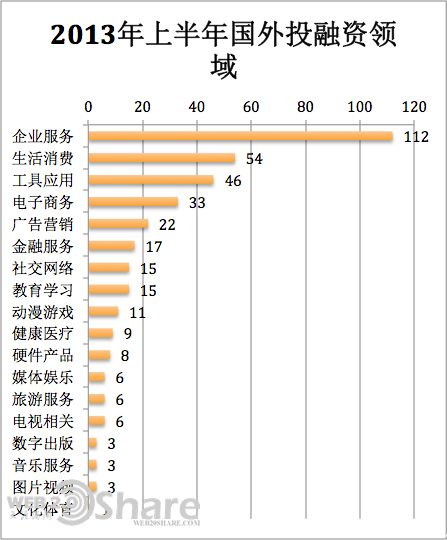
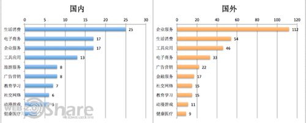

## 一、国外 2013 年上半年投融资领域分析

统计样本为 2013 年上半年国外对外披露的投资收购项目，简要分析目前国外投融资趋势：

初步分析：

2013 年互联网领域上半年（截止至 2013 年 6 月 28 日）国外披露的投资项目共 375 个（不包含种子轮和天使轮），各个类别的项目数量如下：

2013 年国外投融资领域关注度较高的领域：企业服务（112）、、生活消费（54）、工具应用（46）、电子商务（33）、广告营销（22）、金融服务（17）、教育学习（15）、社交网络（15）、健康医疗（9）

国外面向企业的服务数量非常之多，占到总投资项目的近 1/3，主要的细分领域包括：企业技术服务；数据分析服务；企业移动解决方案；基本上涵盖了面向企业服务的方方面面。

一方面，美国 2B 市场巨大。而在中国能点出来的老一辈只有用友、金蝶等，新一辈的如海康威视、大华电子等。差距还是很明显的，并且这些公司都和政府管理特别需求有一定关系。另一方面，2B 业务需要更多耐心，对创业者和投资者的心态是考验。这一点甚至在美国都存在，对中国创业者来说，选择 2C 也就可以理解了。另外一点是国外面向企业服务的巨头也很喜欢收购这些面向企业服务的初创企业。

生活消费领域也是比较热门的领域，主要的细分领域集中在：家居装修（6）；汽车相关（5）；招聘服务（5）；商家服务（5）；订票服务（3）；点评服务（3）；宠物服务（2）；

工具类应用中，比例最高的是移动端上的工具应用，说明在移动 APP 这一块，很多创业者越来越关注特定人群的在移动端上的需求；

电子商务领域中，国外在这个里面设计类闪购电商是一个热点。其他基本上是垂直领域的电商项目。

广告营销领域中，主要的细分领域在三个方面：一是移动广告服务；二是跨平台的广告服务；三是图片视频内广告服务。

金融服务中，主要集中在三类：一是 P2P 借贷平台；二是各类众筹服务平台；三是各类金融交易平台（比如股票交易平台、投资交易平台等等）

社交网络服务主要集中在移动社交服务上面，不同的产品形态和人群定位的移动社交产品还是占据了比较高的比重。

教育学习领域项目也较多，基本上通过互联网的方式在逐渐改变原有的教育方式，视频成为教育学习领域主要的内容载体。

动漫游戏领域的主要的投资项目主要集中在移动游戏领域，智能手机数量的不断提高，在这个领域还是有着比较大的市场空间，另外也有一些移动游戏营销平台。

健康医疗领域国外的尝试也比国内更加大胆，很多项目的尝试都能进入实用的阶段，而相比国内，可能更多因为医疗相关的进入还是有一定的门槛。

## 二、国内 2013 年投融资领域分析

统计样本为 2013 年上半年国内对外披露的投资收购项目，简要分析目前国内投融资趋势：

初步分析：

2013 年互联网领域上半年（截止至 2013 年 6 月 28 日）国内披露的投资项目共 118 个，各个类别的项目数量如下：

2013 年国内投融资领域关注度较高的领域：生活消费（25）、、电子商务（17）、企业服务（17）、工具应用（13）、旅游服务（8）、广告营销（8）、社交网络（6）、、教育学习（7）、健康医疗（3）

其中：生活消费领域的投资项目主要集中在：汽车相关服务（租车及汽车服务）：10 个；日租短租项目：3 个；生活消费社区：2 个；生活消费领域企业服务：2 个；婚庆相关服务：1 个；酒店预订：1 个；美发服务：1 个；

电子商务领域投资项目也较多：一是垂直领域的电子商务项目（如红酒、鲜花、家纺家居、啤酒）；另外还有 B2B 的找钢网；闪购服务；按月订购、导购类服务等等；

企业服务领域的投资项目目前从投资项目来看比较分散：包括企业云存储、商务会议服务、订餐服务商、技术/模式识别、数字化教学和商务系统解决服务商、企业管理软件和企业安全服务等等；

工具应用类项目中，8 个项目中有 7 个都是基于移动端的工具应用，这个领域也值得关注。

广告营销中：有两家 RTB 广告公司；一家移动广告服务商；还有三家分别为：第三方广告技术服务，大数据智能服务和面向大中型企业的数字营销服务；

旅游服务中：两款游记类旅游 App、两个旅游媒体社区、一个旅游酒店公寓预订、另外一个则是自由行产品服务；

## 三、国内外 2013 年投融资领域差异分析

国内外投融资 Top10 领域比较:

共性的方面：热门领域都是集中在生活消费、电子商务、企业服务、工具应用、社交网络、广告营销、教育学习、动漫游戏、医疗健康

差异在于：国内旅游服务目前的关注度还是比较高，但是国外这一块目前的关注度却不高；从关注度的角度，国外企业服务的数量较多，也和企业服务在国外相对发展比较成熟，上市的面向企业服务的公司也叫多，很多面向企业服务的公司都以被收购的方式退出，而国内面向企业的服务目前还是集中在基础服务方面。国内外生活消费领域（O2O）目前关注度都较高，汽车服务是目前热度都较高的领域，国内目前生活消费领域的项目相比较更集中在少数的几个细分领域，而国外在这一块的尝试更多。

## 四、投资领域价值初步判断

对于方向的一些判断：

生活消费领域和企业市场是两个很大的市场，目前国内市场上被投资的市场还只是零星的几个领域，可以对这两个领域的细分领域做深入的挖掘；从国内的市场环境而言，生活消费领域有着更多的机会。

电子商务垂直领域也是一个可以深入挖掘的方向，目前初步判断毛利率较高的垂直电子商务领域还有很大的机遇；B2B 的垂直电子商务可以关注。

移动应用从工具切入获取大量的用户，未来再在商业上面进行突破，工具类应用应该也是目前移动端上创业者比较好的切入点，当然前提是对于用户需求和市场空间的判断；

广告行业领域 RTB 广告逐渐成为关注的热点，图片视频广告服务、跨平台广告服务也都值得关注。

游戏领域的机会还是在移动游戏领域！
