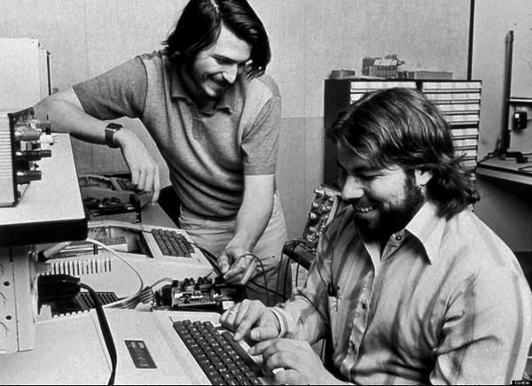

人们通常认为在硅谷存在着一种偏见——这里只青睐工程师。事实上，硅谷只是“崇尚实干，反对空谈”，在这里执行远比空想重要。所以你才会反复听到 MBA 创业无用的言论，因为 MBA 更擅长行政和管理（偏说），而非设计、编程和产品数据研究（偏做）。当然，反过来并不能说明工程师创业就一定能成功。事实上，我们很难想象一支创业团队里会没有工程师的身影，同时，也很难想象一支全然由工程师组成的团队。

随着大环境的更迭，创业团队所需要的技能一直在发生变化。20 年前，创建一个产品的科技成本是巨大的，这就决定了在创业前期，你的团队必然是清一色的工程师，直到你的项目完成了巨额融资，你才会进行营销方面的工作。然而在进入 21 世纪后，创建产品的成本正在逐步缩小为零，主要的成本几乎只剩下时间。作为一个全能开发者（full-stack developer），你可以应付软件层面的各种问题：不论是 web、移动端或是原生系统。随着科技成本的缩减，如今的创业团队所面临的最大困境不再是创建产品——而是如何在产品出现后第一时间进行推广，搞定用户体验，并尽快将它们交到用户手中。

这也许就能解释了为什么史上许多最成功的科技公司在创业初期都由两个人组成——一个是 builder，另一个是 seller。（如 Jobs 和 Wozniak、Allen 和 Gates、Larry 和 Sergei 等）

假设两个创始人是最合理的组合，那现在这个组合需要具备怎样的属性才能增加他们成功的概率呢？

创始人 A 一定是一个全能开发者，这里我就不需要多解释这个角色了，你看看“社交网络”中半夜三点还在疯狂编程的小扎就明白了：在工程学上的天赋、激情和求知欲的完美结合，让伟大的产品在他的手中诞生。

### 全能营销创始人

创始人 B 看起来就像是 A 的翻版——一位同样能帮助产品开发的工程师，不同的是，他比 A 更擅长与潜在顾客和投资人进行交流，另外，他从未间断过营销技能的研习。

在过去几年间，硅谷对于一位出色“营销人”的定义正发生着翻天覆地的变化。这里的公司曾经一度只专注与产品开发，忽视了产品推广，于是：要么许多创业公司的产品太差而不受人待见，要么许多好的产品不为人所知。就像 [Dave McClure](http://twitter.com/davemcclure) 这个月初在 Twitter 上抱怨的：

所以一个全新的概念应运而生——[全能营销人](http://www.geekwire.com/2013/commentary-startup-marketing-minds-aka-fullstack-marketers/)（full-stack marketer）。同全能开发者一样，他能自如应付各种任务如：编辑 PS 文件、渲染 UI/UX 迭代、进行产品销售定位、回邮件、向用户随时随地展示产品，等等。

一个只能做传统销售的创始人已经无法生存了，如今我们所定义的“销售”，可以借着产品的设计和用户体验来完成，而全能营销人必须要懂得如何进行设计。拥有一位懂得设计的销售型创始人，就会消除产品和营销之间的隔阂，缩短创意和执行之间的时间。
