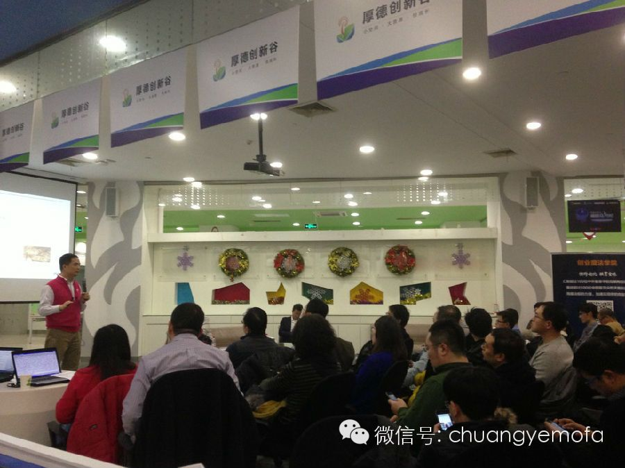

他是清华大学计算机科班毕业的老校友和清华校友总会互联网与新媒体协会会长；

他是中国互联网领域最早一批的资深从业者；

他是著名互联网电视新媒体平台悠视网董事长；

他是中国第一支新媒体版权基金的发起人和推动者；

他是中国天使投资圈子里最闪亮的明星天使投资人；

他还是创业魔法学院新上任的校董和创业导师！

他是李竹，一个性格温和谦逊而商业触觉极其敏锐犀利的明星天使投资人！

*（根据英诺天使基金创始合伙人、厚德创新谷执行董事、中关村 2013 年十大明星天使投资人李竹在创业魔法学院 2014 年第二期互联网创业公开课演讲“我为什么投资你——投资人对创业者的选择标准”整理）*

我觉得创业人一定要正，连长王江刚才说的是产品，大家知道，跟航班管家类似的产品还有一些，但是这些产品到现在数据可能还有些优势，但是远远比航班官管家甩在后面，连长刚才分享的历程大家应该用心去想为什么，他不仅仅是提供一个数据，如果把航班管家看成是只提供航班数据，我能订一下座位，绝对不是这样，实际上提供的是一种服务，服务是需要创始人在所有应用场景里边继续思考的。

今天时间比较宝贵，我讲讲人，就讲讲创始人本身，我讲的题目是《我为什么投资你》，因为时间比较短，不能完全展开讲，将来在创业魔法学院里我会准备一个比较详细的课程来跟大家分享。

首先，介绍一下我自己，我跟王江一样，我们出身都是创业者，跟大家一样，我有两次创业，第一次创业是中关村起来时候赶上一个尾巴，90 年代初，比较幸运的是我们当时创业了三四年时间，正好清华同方上市，把我们合并在里边，实现了第一次创业的套现。

第二次创业又赶上第二波互联网高潮，百度上市，百度上市之后 VC 加大在中国互联网的投资力度，当年我们在做互联网电视，网站上线两个月拿到一千万美元，这是在当时的情况下。去年开始，我自己开始我另外一个梦想，天使投资，我做天使投资实际上已经十多年了，从同方出来以后就开始稀稀落落的做一些投资，到现在投资了超过 60 家早期公司。我在很多公司当董事，跟各种各样创始人打过交道，总的来说，我认为人是最重要的。

### 创始人是核心资产，是公司的核心资产

为什么说创始人是公司的核心资产呢？它就像一个人一样，首先要有人做发动机，去驱动它，像人的心脏，商业模式来勾画，资源也是在人的手上，事情都要人去做，如果公司的创业人可以，往往更容易成功。

我观察到一个现象，一个公司的基因基本上在创始人的身上能够发现，而且 6 个月的时间这个公司的基金基本就定了，如果你们是公司的创始人，在 6 个月里面，找什么样的人合作，找什么样的人作为拍档，这决定了公司的未来，决定未来能走多远。

在我自己的创业历程中也有非常深的体会。另外，从创始人来说，我觉得有两个基本的事情是要做到的：

第一，他的学习能力，学习能力一定要强。大家知道美团的王兴，也是清华校友，只要有时间，他就会在网上通过各种各样途径看硅谷在发展什么事情，学习那边成功的一些商业模式，所以，他从开始的校内网，后来又做了饭否，后来做了美团，其实都能在美国找到类似的模式。你可以从你周围的拍档身上学习很多东西，当你要找拍档时候，一定要找互补的，甚至某方面能力比你强的人，学习能力决定了公司的高度，如果你这个人认为我自己非常牛，谁都没有我强，如果有这种心态的话，如果你要去创业，一定要挑战自己。作为创始人来说你要不断学习，这决定了公司的高度。

第二，作为创始人，尤其是创始人，找人的能力非常关键。我还举王兴的例子，当时做美团时候，我当时非常不赞同，我说：“王兴，你的擅长其实是在互联网上，是在产品、是在用户体验，而不是在线下做团购。”走到现在，美团在团购方面遥遥领先，几千人的团队管理的非常好。我当初忽略了一点，王兴找人的能力，我认为他找了两个比较关键的人，一个是校内网的创业伙伴王慧文，他比较擅长跟外界沟通，包括市场、包括跟外面合作者的谈判和管理，如果跟王兴交流过的人知道，王兴某种程度上是偏内向的，王慧文当时已经在创业了，怎么办呢？美团融资之后，把这个公司合并过来，为了要这么一个人把这个公司合并过来了，他有这样的胸怀，他敢花这个代价找这个人。另外，他我在后面 B 轮融资时候引进了几个投资人，其中一个是阿里巴巴的人，当时在阿里巴巴做尽职调查的人现在是他公司的 COO，美团铺开以后他发现线下大规模团队的管理是需要一个有经验、运营能力非常强、执行能力非常强的人，他现在找到了这个人，王兴自己把他的精力花在产品、花在后台架构、花在用户数据库建设上，美团信息系统结构是所有团购网站里最好的，你在里面团购了一次，可以通过邮件、短信、社交媒体再次找到你，找人的能力非常重要。作为创始人来说，你要了解自己、找到拍档再上路，当然，如果觉得你自己不够，可以来学习，创业魔法学院实际上就是提供这样一个平台，提高你自己。

另外，我自己投这么多公司以后，我的投资理念是以人为本，刚才说了，人是最核心的资产，这是我的认识，我自己也是按这个做的，红杉投资是投赛道的，看哪个方向是未来的趋势他就投哪个方向，其实我认为我还是投赛手，我们投资的是早期的创业人、早期的创业项目，跟红杉投一期还是不一样的，会把趋势和团队结合起来看，大趋势下的好团队，我们关注赛道里面的好的赛手。

### 我投资上偏好的类型

第一点，要有完整的团队。我举过一个例子，刚才我说了美团的例子，什么叫完整？如果说早期的创业公司你觉得你哪个方面是短板，你想通过原来这几个人学习来提高自己，弥补这个短板，不如你找到一个在这方面更擅长的人，这是我看到的一些成功的创业团队的经验，这样才能跑的更快，你丧失了时间，你自己获得了经验，这个并不是创业团队完全需要的。

我刚才说了，我们可以找一个这样的人进到团队里，你再向他学习，完整的团队要去找人。另外，真正叫团队的一定是有决心，心在一块的才叫团队，最关键是大家的理念是不是一样。在美国，管理者可以上台讲我要做什么事情，有人举手说我们一块干吧，聊着聊着可能就一块创立一个公司，中国的文化不一样，找到理念相同的人，不光说我找一个能力认可的人就行了，至少要谈三次、五次，甚至更多次，如果一旦想找这个人做拍档，你要花很多时间想办法跟他相处，没话找话、没事找事，在这个过程中观察他，看看理念是不是一样，如果有创业决心，理念一样，然后大家走到一块，这才叫团队。关于完整性，股权结构要合理，这样团队才叫完整，如果股权结构不合理，团队迟早也会散掉。

第二点，喜欢并且沉浸于事务的细节。你要做这件事情是不是你自己想做的，还是说我认为这个东西能赚钱，所以我去做，这是完全不同的。刚才连长王江的分享，他是不是已经沉浸在他所做的产品当中，他平时就天天在想这些事情，想这些用户的使用场景，中间找到一些微创新，而这些微创新其实是 copy 别人难以察觉、难以发现，你可能看到两个在同样方向上往前走的公司，经过一两年之后差距非常大，往往跟你的团队里面有没有热爱这个产品、有没有以这个产品当做自己生命、当做自己孩子的人有非常大的关系。我跟创业者谈的时候，如果我感到了这种气场，那我就会投资他，这是一种信念和气场，他回答你的问题，他会对相关的上下游、周边都非常了解，行业是什么情况，这种了解不是靠上网查查东西得到的，而是他的思考。比如问你这个东西怎么推广，每个人的回答会不一样，选择一件事情，你要喜欢这件事情，你愿意去做，甚至是细分行业里的一件事情。

过去两年里美国最好的孵化器 YCombinator，看起来他做的这些事情并不大，但是在细分行业里都有相当的用户，甚至投资了一个用 APP 管理羊群的，这也是他的一个创业项目。创业人一定要喜欢自己所做的事情。

第三点，一定要有契约精神。上市或并购的发生是因为经过了几十年，在所有的创业过程中形成了一套规则，这个规则的体现首先是创业者跟投资人签订的这份协议，协议里面的含义是什么，这里面的内容就可以讲一个上午，将来一定要有这么一门课，因为我就是这么过来的，经过我多少次电话会议才明白这里面的含义，财富在这个过程中如何的流转已经形成了一套约定俗成的规律，在这套规则里，跟踢足球一样，不能犯规。

有一个很大的互联网公司，现在已经上市了，曾经就出现过违背契约的事，跟原来的投资人之间发生了很大的矛盾，让他用一个不合适的方式退出了，导致他在后面好几年里都融不多钱，幸运的是前两年互联网高潮又起来了，行业热浪来了以后他拿到一笔钱，后来上市了，创始人在这个过程中有深刻的反思。

契约精神，首先是你跟投资人的关系，你跟投资人的约定。比如第一轮投资时你说你给我投了两百万，占 10%，结果过 6 个月，公司发展的非常好，当时给的价格太便宜了，我想办法要回一点，这种想法绝对不能有，因为任何一个决定都是在当时的状况下做的，当时是合理的，大家要认帐，如果想拿回来，其实有其它方式，按照规则可以增发期权，团队做的贡献很大，可以增发期权，期权跟股权不一样，是有价格的，但是体现了对契约的尊重，这种人第一次创业了，即使失败了，第二次还会有人投。契约精神也体现在你跟你的下属上，创始人大部分是老板，跟下属说什么时候，一旦说了，就一定要做到，浑身散发着契约精神的人才能成功。所以我们的基金叫英诺基金，一个是 Innovation，创新；另外一个含义是“英雄出手，一诺千金”。我认为创业者都有希望成为英雄，但是一旦出手了就要一诺千金，在这个过程中跟你的合作伙伴和团队都要有信誉。

第四点，坚韧、有活力和想象力。做的事情是你喜欢的事情，做这件事的过程中会碰到很多困难，如果是创始人，公司如果出现问题，肯定是最后一个走的，而且成功的企业其实都是创始人从很多次低谷里拉出来的。暴风影音的创始人叫任峰，他从暴风影音出来以后找到我，说想创业，但是他不能再做视频事情，因为跟原来公司有同业竞争，他说我想做游戏，实际上他从来没有做过游戏，我看中他这个人，所以给了他钱。这个公司最后做了两三年，最后做到什么程度呢？确实走了一些弯路，公司钱烧完了，原来几个创始人一个一个离开了，基本上在两个月之内，大家觉得公司没有希望，当时我们让他搬到悠视网边上，给他走点后门，让他在那办公，不用付场租了，他自己拿钱给大家发工资，就这样坚持了两个多月，当时游戏出来的时候 5 个月突破一千万，最后被其他公司合并，取得了成功，我们也取得了十几倍的回报。在这种情况下他还能坚持下去，因为他相信自己做的事情，创始团队最后只剩他一个人，我们把公司卖掉时候他拿到钱了，又找到几个一块创业的兄弟，说这几年大家挺不容易的，把钱分给大家，这是一个典型例子。

另外一个在页游里做的比较领先的公司——游族，上市估值 38 亿人民币，去年利润达到 3 亿人民币，这个公司是我投资的又一个游戏公司。当时公司有两个创始人，我投资之后股份最大的创始人走大了，后来继续往前走，中间过程中另外一个技术拍档又走了，游族还继续往前走，2009 年成立的公司，创始人在整个创业过程中会碰到很多这样的事情，如果创始人没有这样的心理准备，你的合伙人离开，这是最大的打击，下面员工走没有关系，如果在这种情况下你还能把公司从低谷里拉出来，重新打造你的团队，这就是坚韧，这样的人就会成功，天道酬勤。

前段时间出来一本书，其实最好的组织形态是反脆弱组织，什么叫反脆弱组织？360 其实就是这样的反脆弱组织，不断的有各种各样的，跟人体一样不断有各种细菌感染你，但是你的抗体都把它克服掉了，比那些所谓做好了准备、非常强大、谁来了都不怕的公司还要强，这是最高的组织形式。大家在创业的过程中不要怕各种外力各种波动，你要永远鼓励你的团队能扛住这一波，这时候你会发现公司和团队的能力又上一个台阶，因为你又经历住了一次考验，所有成功公司正是这样，经历一次又一次考验之后才成功。

第五点，我喜欢投性格外相、善于沟通的人。首先，我跟你谈的时候能不能把我说动，如果说不动我的话，你拿不到钱，肯定也说不动其他投资者，公司怎么发展，在现在互联网创业环境里，没有谁能够不依靠资本而成功的。另外一点，我刚才说了，创始人非常重要的能力是找人，你要说服你的拍档，说服你的团队跟你走，跟你走你指明的方向，创始人要拿主意，你能说服他们，能说服合作伙伴，能说服投资人，能说服我，那么我相信你也能说服以后的投资者，当我推荐别人来给你投后面的资金的时候，当我信服你能继续发展做大的时候我会非常放心，我不用担心你的沟通能力。大家知道，海底捞公司招聘员工时候有个标准，就是招外向的人，为什么呢？外向人往往可以改变，他可以跟别人沟通，他可以进入海底捞，这是完全不一样的，在我投资的案例里，完全的技术男做 CEO、没有找到合适拍档的最后事情发展的都比较慢，虽然产品做的也还不错。

### 我不投的公司类型

首先，只有一个创始人的公司我们不会投，或者你有几个创始人，但是某个有比较大股份的创始人还有另外一摊事，在你这兼着，这种情况都不投，如果创始人团队里有一个人还有一摊事，他给这个团队带来的是负能量，如果一旦这个事情输掉，他输掉的东西很少，他会在乎吗？他会有多在乎？不管他嘴巴上怎么说，他真的在乎他就会全时跟你一起做。

第二，如果创始人说投资到位才创业，如果这样的话，我告诉全职工作的人另外找一个拍档，然后我们再看项目。

第三，股权过于平均，没有领头羊，这样的公司往往走不远，产生争吵、产生动摇是不可避免的，但是一定要有个人出来做领头羊。

第四，通过尽职调查发现不诚信的。我觉得早期的团队没有必要隐瞒什么，如果刻意的包装自己，说了一些夸大或者不真实的话，不管产品流量，还是自己过去的经历，如果我们知道了，我们会不敢投资你，人的诚信重要。

第五，不用微信、微博的一律不投。为什么呢？因为我们是在做互联网行业的投资，如果随便化时代来临的时候，你都不使用这样的东西，我怎么敢肯定你对现在的用户体验会有深入的了解。

第六，已婚还喜欢泡妞的也不投。其实是有经验教训的，因为我投你以后我不知道是不是你，你跟老婆不离婚，另外一半股份给你老婆了，这种情况非常多，尤其是没有上市的时候，这时候后面投资人都会对这个事情提出质疑，第一轮签协议时候不会涉及这方面事情，如果走到 B 轮时候，涉及到比较大的资金时候，尽职调查里都会有一条，夫妻关系如何？从我的角度来看，如果连对家庭都可以不忠诚，你怎么能忠诚于投资人呢，投资人其实跟结婚的关系是一样的，他们把他们的信心、把他们的希望寄托在你身上，拿钱跟你一块玩儿，不管从品质来说，还是从现在的游戏规则来说，都不欢迎这样的创始人。

第七，打德州扑克上瘾的，还有打麻将上瘾的。偶尔跟朋友 Happy 可以，但是千万不要上瘾。玩德州扑克时候会碰到一些公司的创始人，他们其实知道这个规律，他们会悄悄地跟我说哥们别跟别人说我跟你打牌，跟赌博相关的游戏一定会占用你的精力，也许以后创业成功以后玩德州扑克时候会感受到它的魅力，每年体育比赛奖金最高的就是德州扑克，但是，如果你们要创业，要杜绝类似的活动。

今天我把我作为天使投资人喜欢的和不喜欢的告诉大家，也告诉大家从我看到的创业者里有哪些做的好的或者做的不好的东西，大家要想下一步怎么提高自己，如何找到创业拍档，其实这都是有方法的，有网络的方法，有线下的方法，我看了这么多公司、投了这么多公司以后已经看到了一些有效的办法，因为今天时间有限，下次如果有机会的话，我很愿意再跟大家分享。
