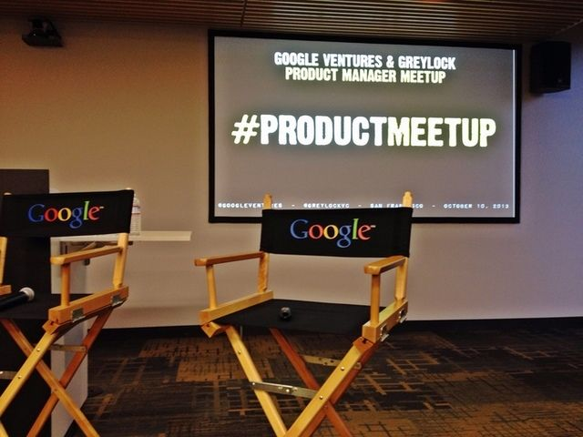

在科技界，受人瞩目的往往是工程师和设计师。他们最直接地创造了令人惊叹的产品，比如说 Instagram, Gmail, Twitter, Android, iOS，或其他软硬件和服务。并不是什么魔力从头到尾指引他们，而是产品经理（PM）担起了这个重任。

正是这些业界的无名英雄和专家完成了产品在生命周期内的每一次改动，他们领会 CEO 和管理层们的商业思路并在开发阶段付诸执行，他们确保产品策略正中用户的下怀。

### 是 PM 告诉你，什么是应该做的

这周早些时候，Google Ventures 的 Ken Norton 和 Greylock Partners 的 Josh Elman 联合发起了一个 PM 交流会，旨在分享经验和交流专业技巧。

Norton 说 PM 在过去被很多人给过不同的定义，但最近逐渐被接受的说法是它是一段生涯，而不仅仅是你所投身的工作。这从他从事 JotSpot 和 Google 的产品研发得到了印证，其中包括 Google+, Mobile Maps，Calendar 和 Google Docs。他举了很多科技公司都在提高其 PM 重要性的例子，尤其是风投公司 KPCB 开展的关于产品人才选拔的奖学金活动，还有 Google 的 Associate Product Manager 项目，是由现 Yahoo CEO 梅耶尔当时在职时发起的。

到底做 PM 需要什么样的素质呢？人人都能做的了么？

Norton 说必须要懂技术，但并不一定意味着你要是计算机专业或者编程很在行。他们需要能和工程师以及设计师用专业语言沟通，以确保对方相信 PM 知道自己在说什么。

2005 年，Norton 写过一篇关于“如何招聘产品经理”的文章，其中提到要找有强大专业背景的聪明人，有过人的产品感和综合多角度的观点的能力。

Norton 和 Elman 都相信 PM 是帮助执行公司愿景的。或者说，他们是轻量级 CEO，只不过用影响力而非权威来完成任务，因为他们并没有对工程师或设计师的直接管理的权利，也没法开掉不帮你完成产品的刺头儿。

### 这不仅仅只是份工作

PM 并不是坐在不同团队查看是否完成当日进度的人。他们要深刻理解市场需求，竞争对手是谁，用户想要什么，帮助市场和销售团队更好的瞄准目标。

Elman 写过一个“PM 的职责”的帖子，其中他提到核心能力是“明辨该与不该，并且乐于倾听早期用户的反馈”，更重要的，轻量级 CEO 不仅仅为达到用户期望负责，并且要符合创始人或 CEO 制定的公司全局策略。他还要知晓所有重要产品的动向，因为他处在与科技一线公司竞争的前沿。

### 成为出色 PM 的要素

交流会中提出了出色产品经理所需要的技能，来自 Google 的 Johanna Wright, Firespotter Labs 的 Craig Walker, 和 Wealthfront 的 Adam Nash 对此进行了回答。

Nash 答道，除了关注用户，还要用设计思路来考虑问题，明白什么能实现什么不能实现，还要有领导并解决全局问题的能力。PM 帮你提升领导力并认识你自己。Nash 还强调这并不是用自己的力量来完成所有事情——他还把这看做一个弱点。这需要灵感、眼光、分析能力，并且需要时刻谨记这需要团队的力量。

还有，要做到出色，还需要明白整件事的蓝图。优秀的产品经理“赢”了，不仅意味着产品出炉，还要确保在长远的将来，这个团队要解决相关的一系列问题。这并不是稍微努力一下或者去掉不好用的功能就行的。

Walker 在 Nash 关于团队力量的观点中更进一步，他说道 PM 需要非凡的人际相处能力，这是必须的，因为毕竟要跟工程师、设计师还有各种人格的人沟通。要能激发团队在同一状态并且最终推进直到产品上线是非常重要的。

> *如果你不能让项目里的工程师信服，那也无法说服别人来加入团队，同样也无法说服市场。*

直觉也是一大利器。Wright 说产品经理必须对三件事在行：了解产品和用户，持续验证想法的任性（即使大多数人没什么信心），和其他人协同工作的默契和能力。

### PM 的职业未来

作为一个产品经理，在完成了一个项目之后，还该做些什么呢？有没有清晰步骤指引你在职业道路上持续上升呢？这是个很多 PM 陷入并且 Norton 和 Elman 想要解决的一个困境。

不难相信产品经理会逐渐升迁成为管理层甚至成为自己公司 CEO。当然也别忘了也有在风投公司的可能。

这就很好理解为什么 Google Wentures 和 Greylock Partners 会组织这样一个交流会了。Elman 说，在投资领域，提供的将不仅仅是支票，待投公司也对 VC 能提供什么样资源感兴趣。这两家都有强大的资源，Google Ventures 有创业实验室而 Greylock 有强力的创业背景。同时他们也对 PM 有很高的识别度。

不管对 PM 的未来猜想是如何，有一点是确定的，那就是他们处在企业战略，用户反馈，研发管理，市场嗅觉的交叉点上。就像之前说的，这不是一个你偶然进入的领域，而是渴望投入的。
