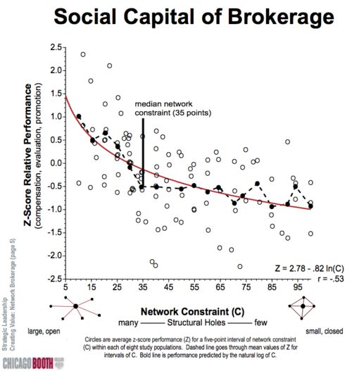

研究人际关系学的学者，普遍认同“[弱连带](http://sociology.stanford.edu/people/mgranovetter/documents/granstrengthweakties.pdf)“关系是人际关系中最有价值的部分，也是衡量一个人是否成功的指标。强连带关系是指最密切的关系，如同事，同学或亲属关系，而弱连带关系指的是第二层关系，或者用 LinkedIn 的语言来说叫做”二度人脉“。当谈到弱连带关系的时候，我们往往狭义的理解为“朋友的朋友”，然而我最近在福布斯上读到一篇 [关于社交网络科学](http://www.forbes.com/sites/michaelsimmons/2013/12/03/why-being-the-most-connected-is-a-vanity-metric/) 的文章，这篇文章引发了我关于弱连带关系和人际关系学的一些思考。目睹了上百个创业项目，再经过了一些反思之后，我认定最好的创业团队是那些能均衡“速度”，“创造力”和“弹性”这三点的团队。同源（成员的出身，背景和价值观相似）团队在速度方面较出色，多样化的团队则胜在创造力和弹性上。

### 关于速度

[Max Levchin](http://www.36kr.com/p/205300.html)（Paypal 的联合创始人，创业奇才）不同意多样化的团队对早期创业团队利大于弊的观点，因为他认为速度对创业团队是最重要的，而多样化的思想会导致分歧，而分歧会阻碍想法的产生和执行。这个观点和下文要提到的人际关系学中的“簇”（同源人群，一群出身，价值观和能力差不多的人，通俗来讲就是圈子）理论对应。

实力强的团队在速度上一定是表现出色的，而同源团队看起来在速度上也有优势。但是请注意，很多创业团队的失败原因是资金短缺，而资金短缺正是因为他们运行的太快了。原因很简单，如果你的团队在致力解决一个没人想要答案的问题，你们做的越快，死的也越快。所以对创业团队来讲，速度只是成功的必要条件而非充分条件。

福布斯的文章中对“簇”的特点总结：一个簇中有大量共通的密切关系，在簇内的想法传播的速度很快，在簇外的想法却很难传播进来。这种情况下很容易产生集体盲点，如果团队的工作中存在集体盲点，就可能导致整个团队做无用功。

### 关于创造力

芝加哥大学布斯商学院的社会学教授 Ron Burt 认为弱连带关系是极有价值的，不仅因为弱连带关系能扩展一个人的社交圈，还由于弱连带关系可以将一个簇中的信息传播到另一个簇中。这使得簇之间的引介人成为传播新思想和推进互补合作的主力，而新思想和互补合作正是创业团队的关键。因此，相比于同源团队，一个多样化的团队能够及时的发现并处理盲点，避免盲点导致的失败。

### 关于弹性

大多数创业团队因为资金短缺而死，我想剩下的死因也只剩下意见分歧了。在 [《反脆弱》](http://book.douban.com/subject/24838618/) 一书中，Naseem Taleb（他也是《黑天鹅》的作者）描述了一些“从失序中得益”的现象（“杀不死我的，使我更强大”）。创业团队正符合这种情况。分歧，混乱和困扰在大多数早期创业团队中都是家常便饭。在早期就呈现出多样化的观点，态度和社会关系会使创业团队很早就进入“从失序中得益”的阶段，这通常会减慢团队前进的脚步，但从长远来讲却是对团队有大有好处的。
