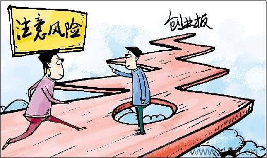

【IT 时代周刊新媒体中心点评】成就事业，就要先做好失败的心理准备。失败并不可怕，可怕的是不敢面对失败，一蹶不振。很多创业成功者，都是失败过两次、三次甚至多次的人，他们如今敢于讲出自己的失败原因，让更多的创业者规避风险，提高成功率。

下面这篇文章总结了 10 类公司为代表的失败案例，他们有明星公司、内部创业和孵化公司，也有无人问津、很少被人知道的草根公司。从它们身上我们又能得到哪些教训?应该会给想创业的人不少启发。

### 1、团购网站阵痛：24 券、拉手网等

从 2010 年开始的团购、到 2013 年有些格局初定，在美团网高调宣布单日 (2013 年 12 月 31 日) 销售额突破 1 亿元的背后，有多少团购网站关闭、黯然落幕。在 2013 年的失意者包括 24 券、拉手网等，当然还有各地大大小小的团购，毕竟“千团大战”是昙花一现。

24 券是曾经的团购大佬、常年位居销售额 TOP10，在 2012 年下半年开始外部面临业绩压力、内部面临和股东的矛盾，最后在 2013 年 1 月正式关闭网站。

拉手网是同时期的另外一家团购巨头、销售额曾多次位居 TOP3，也是从 2012 年下半年开始，先是创始人吴波离职、在 2013 年重新创业; 然后是拉手网取消 IPO、内部裁员、业务调整和布局 O2O 等，拉手网的 2013 年也是阵痛之中。

团购领域的创业，太值得我们反思，短短 3 年，多少资金、多少人力，失去理性的跃进背后，终归承载不了现实的残酷。

### 2、短租阵痛和水土不服：爱日租

和团购一样，短租是另外一个急上急下的细分领域，用生动的例子告诉我们创业不要盲然跟从、国外的模式不是可以简单复制的，尤其是需要和线下打交道的。

爱日租曾是国内短租市场的明星公司，由德国 Rocket Internet 投资设立，这家机构一贯的风格是快速复制成功的互联网项目、然后将其投放到市场空白的国家和地区，运作到一定规模后再将其高溢价卖出。承载着 Airbnb 模式的爱日租在中国市场曾高打高举，终归“水土不服”在 2013 年 7 月关闭网站。

### 3、不合理的终归不会长久：街库网

存在的是合理的，不合理的不会长久存在。互联网领域中，O2O 是个艰难的行业，即便互联网影响线下领域越来越深入，但仍在很早期，如果创业公司再浮夸、不实在，基本上失败是必然的。

街库网是个典型的公司，从 O2O 出发致力于为线下本地生活服务商家提供综合营销和推广服务，并在 2012 年 5 月高调宣布获得 1 亿元 A 轮投资、2013 年 2 月宣布获得 2 亿元 B 轮投资，最终在资金链断掉、创始人扯皮、不断减缩业务和裁员的过程中关闭网站，真让人唏嘘不已。

### 4、模式不会支撑公司的发展：袜管家

所有的公司都要回归到生意的本质，互联网不是概念、模式堆积起来的，但不可否认的是，一波波的互联网创业公司中，总会将自己与某个概念、模式关联起来，最终这些公司很容易成为先烈或垫脚石。

袜管家可以作为例子来看，该公司成立于 2010 年，刚开始主打包年或包月订购服务，按照约定的周期、为用户快递商品; 而后推出“在线撒娇”功能，让女性用户邀请合适的对象为自己的购物车买单; 后面又推出“袜子包年无限装服务”，类似于自助餐，用户可以一次购买、全年不限量地领取袜子……不可否认的是，袜管家极具想象力，做了很多创新或人性化的探索，但终归在实际的销量、电商最为重要的现金流中倒下来，2013 年 5 月关闭了服务。

### 5、生命周期 4 个月的公司：牛窝网

这是 2013 年度 IT 桔子所收录的公司中，生命周期最为短暂的公司：2013 年 6 月牛窝网在上海成立，据称获得 3 亿元投资;8 月份官网还显示大力招商，通过大尺度的广告营销、业内挖人;10 月份牛窝网就宣布关闭，从开始到结束仅仅 4 个月时间，一时让业内瞠目结舌。

家居建材 O2O 领域，有多少机会，事在人为。2013 年我们看到美乐乐家居年交易额达到 20 亿元、酷漫居获得天图资本 1 亿元 B 轮投资，再对比牛窝网，不想说这个行业没有机会，只能说难度很大、步履蹒跚、稍有不慎就失败，尽早决定关闭也好。

### 6、坚守 6 年的磨砺：亿佰购物

前面讲到生命周期短暂到 4 个月的公司，这里介绍发展和摸索了 6 年的公司——亿佰购物，成立于 2007 年，是一个信用卡分期购物服务商，曾获得“2011 年 21 世纪中国最佳商业模式奖”，在成立之后很快就获得戈壁投资 1000 万美元 A 轮投资，而且每年的销售额也都在亿元以上，不过潮退之后、才知道谁在裸泳，2013 年亿佰购物先后被曝出拖欠供应商货款、拖欠消费者商品等，最终在 6 月份关闭服务。

### 7、不是每次转型都能成功：西米网

一家典型的 (或者说更多的) 互联网创业公司是这样的：草根团队、起步资金很少、没有 VC 投资、不断调整和转型业务、活下去……并非我们所看到的媒体报道的很容易拿到投资、很快速地成长等。

西米网是一家典型的创业公司，2008 年从 8000 元起家做零食电商、小成本运作、很快做到一年 700 万元的收入，然后扩张中出现成本控制问题，包括开设实体店、自建仓储物流等，在现金流无法支持成长的时候 2011 年 10 月西米网宣布谢幕和转型。在 2012 年西米网重生，转型做午餐外卖，不过并没有成功，在 2013 年关闭该业务，创始人转型做 Blueface 蓝颜面膜、进入一个新的行业，西米网的域名也再也打不开。

### 8、再赚钱的领域也有失败者：5 分钟、天空堂等游戏公司

游戏行业，生动地诠释着“创业如游戏”，即便在这么赚钱的行业、在这个带来最多财富新贵的领域，2013 年也有不少游戏公司黯然关闭。

五分钟曾是社交游戏的新贵，“开心农场”玩法的首创者，后面没有把握住 QQ 空间和微博等社交游戏平台的机会，从 2012 年到 2013 年面临着很大的困境：裁员、业务转型失败、资产清算等，最终在 2013 年 1 月正式关闭。

北京天空堂科技是一家网页游戏公司，2012 年 11 月刚获得数码视讯 1760 万元的投资，不过 2013 年就面临很大的困境，游戏《轩辕群侠传》、《精灵王国》先后关闭服务器停运，出现停业欠薪的问题。

2013 年最为火热的手机游戏也如此，除开 Gree 中国公司关闭外，创业公司这块也有不少公司关闭，尤其是在手游运营成本不断增高、巨头渠道垄断越来越严重的时候，也会有洗牌的阵痛。

### 9、大公司孵化创业的难处：皆喜网、盛大创新院等

体制内创业并不容易，不过国内互联网大公司仍在不断通过内部孵化的方式、进行新业务的开拓和发展，期待“大象也能飞起来”，但大多数情况下、大公司真的很难孵化出创业公司。

皆喜网成立于 2012 年，是人人网旗下的一站式婚礼筹备服务平台，在 2013 年 7 月停止运营。此前人人旗下停止的项目包括风车网。

盛大创新院成立于 2009 年，肩负着盛大新业务探索、孵化金鸡的使命，可惜 2012 年 -2013 年也面临着很多困境，奇遇、乐众 ROM、微酷等项目不断关停和调整，在 2013 年也黯然落幕。

### 10、传统公司进军互联网的痛楚：半边天、爱顾商城、飞虎乐购、万家摩尔等

互联网和传统行业的融合，是这几年互联网创业新公司的主旋律，很多传统公司开始大力进军互联网，推出各类新服务，尤其是在零售、电商等领域，遗憾的是，这不是那么容易的，互联网思维并非一朝一夕。

2013 年很多传统公司在互联网业务遭遇着困境：永辉超市旗下的生鲜电商网站“半边天”上线不足百日便悄然下线; 富士康旗下的电商网站“飞虎乐购”也进入清算阶段，面临倒闭; 华润集团旗下的网上商城“万家摩尔”宣布停运; 海尔集团与英国零售商 Argos 联合组建的电商网站“爱顾商城”宣布解散，正式运营不到 3 个月……

在现在这个时间点，我们盘点 2013 年的失败公司，并非谴责，也不是要做事后诸葛亮，只是想记录、不想让我们遗忘或者淡忘，毕竟从失败案例中所学到和领悟到的，远远比学习成功案例更为有效，也更为深刻。（责任编辑/萧诃）
