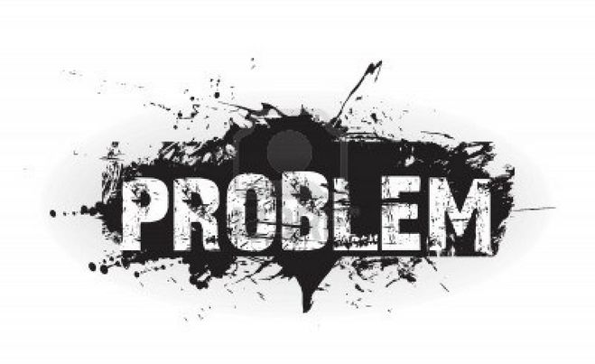

*这篇文章刊登在风投机构 [First Round Capital的官方博客](http://firstround.com/article/Theres-a-00006-Chance-of-Building-a-Billion-Dollar-Company-How-This-Man-Did-It) 上，讲述了 [两周前以10亿美元的估值被收购](http://www.36kr.com/p/206673.html) 的意外天气保险公司 The Climate Corporation 的起起伏伏，以及创始人 David Friedberg 对创业的思考和他对如何打造一家价值超过 10 亿美元的公司而给出的建议。*

[David Friedberg](http://www.crunchbase.com/person/david-friedberg) 正在从 Google 下班回家的路上，不巧遇到雨天被糟糕的交通堵住。路旁边有一家为游客提供自行车租赁服务的商店，由于下雨很早就关门了。第二天 Friedberg 也注意这家商店还是由于天气的关系很早关门，他就想“有几天这家商店老板甚至没有来，没有人会在雨天想要骑自行车游玩，这样的生意很糟糕”。

但他又往深处想“这家商店是否赚钱很大程度上取决于有多少天会下雨，这其实是个大问题”，回去后 Friedberg 做了一些调查发现全世界 70% 的生意都会被天气所影响，就这么一个简单的数据让他有了一个 idea：为商家提供天气的保险服务。

当时 Friedberg 根本没有什么关于保险行业的知识，也不了解天气。但最后他还是在 2006 年创立了这家保险公司－Weatherbill。这个月月初，[Friedberg把它卖了10亿美元](http://www.36kr.com/p/206673.html)。

现在 Weatherbill 早已更名为 [The Climate Corporation](http://climate.com/)，一家为美国成千上万的农民们提供意外天气保险服务的公司，在硅谷算是一个很成功励志的故事。但获得这样的成功，过程中充满艰辛，Friedberg 在 2011 年的 Standford Entrepreneurship Conner 的演讲上讲述了到底难在哪里，以及他学到了什么。

### 千万不要说“我想要创立一家初创企业”

对于 Friedberg 来说，任何值得做的事情都是为了去解决某一个问题。单纯地想要创立一家公司的欲望并不足以支撑你走到最后。他说过：

> 说你想要创立一家公司或者你想要成为一个连续创业者，在我看来就和说你想要跳下一架飞机差不多。为何你想要每天去做一些风险很高经常遇到挫折和失败、没有足够的薪水、并且可能这样持续数年下去最后只是找到一个值得解决的问题呢？

这个问题的唯一答案就是因为你很有激情，总是想要改变世界。但你必须从某一个问题开始，一个影响到人们生活的问题，试图去找出解决的办法，这就是 Friedberg 对 Weatherbill 的想法。

Friedberg 不仅看到了天气带给像自行车租赁这样的商家的麻烦，他还参透了其中可能的商业模式，为了帮助那些被天气影响的商家的生计，这样的信念一直支撑着他走下去，走过了很多年惨淡的市场反馈，走过了无数投资人的拒绝。

> 看一看这个数字，创立一家价值超过 10 亿美元的公司的概率是 0.00006%。即使是通过融资并最后出售公司或者是上市，能够达到 10 亿的价值所需的时间，业界的中位数为 49 个月。业界创始人回报的中位数差不多是 30 万美元，那在这 49 个月内，差不多每位创始人每年的报酬为近 7.3 万美元。而创业领域中你最后失败的几率是近 67%，所以这几个数据就能看出，如果你创立一家公司的动力是最后的金钱回报的话，你最好还是去 Google、对冲基金等，选择那些有稳定收入的公司吧。

正如你所看到的，Friedberg 是一个相信数据的人，在工作中他总是会去搜索能帮助他完成任务的数据。为了在创业中学到必需的知识，为了在无数次考验艰辛中活下来，你必须有自己的信念。

那么，你是从什么开始的呢？一个问题？还是…

### 和运气无关

> 当你觉得你走运时，和运气没有关系，你走运是因为你之前不知道会发生什么。而事实是，如果你知道将会发生什么，那这就不是运气。这创业这种环境中，你的目标难道不应该是一直知道将会发生什么并且一直想要避免未知的发生吗？

这其中一个基本的前提是，如何看待创业：思考那些你所不知道的，然后尽量去了解那些未知。如果这是你创业中保持的思路，那你每天才会真正找出那些隐藏的问题。当然，这样说有些理想化，但却是值得这样去尝试。每一种公司或是生意都有一些天生的风险，事实上，你不知道的东西会很多，比如：

- 你所处的市场在往什么方向发展？你周围的竞争对手有什么优势？
- 人们会买你的产品吗？你如何定价？
- 你能尽量降低你的运营成本以最大化利润空间吗？
- 你真的有为人们的生活注入价值吗？他们的回头率高么？
- 我需要招聘工程师以开发出一个更好的产品吗？

这都是一些你在创业早期会遇到的风险和不确定性，但你能越多地意识到这些问题，就能越有可能地尽早去解决它们，这样你才能保证你最后的产品是你真正想要的，这样你才能为自己的公司真正创造价值。

找到这些未知的方法有很多，比如做一个问题表格，左列是未知的问题，右列是已知的事实，中间则是把左列未知的问题转化为已经的策略，让你的投资人或者公司顾问把左列全部填满，之后自己去寻找测试解决的办法，以意识到那些未知的问题并把它们转为已知的事实。

对于 Friedberg 的 Weatherbill 来说，第一个未知便是它的商业模式。由于他的 idea 并不容易实现，光有天气影响生意的想法是不够的。幸运的是，Friedberg 发现天气是可以被统计建模的，所以这就支持了他关于赔偿天气影响以第三方的角度来承担损失的保险服务的思路是可行的。

而他的商业模式中更重要的一点是：天气保险中并没有索赔或是损失赔偿要求，因为天气是很容易监测的。为了检验他的理论是否正确，他做了一个原型并自己从 200 个天气监测站够买了前 30 年的天气纪录数据，加上之后他开发的一个定价公式，他觉得这已经能够帮助他在硅谷拿到 30 万美元的种子投资。所以，他立刻辞去了在 Google 的工作，卖掉了他拥有的 Google 股权。

然而，他并不知道融资到底有多难。在 Sand Hill Road（门洛帕克市的沙丘路，硅谷著名的风险投资商一条街）上到处兜售他的公司，但却被一次又一次的告知他的商业模式过于不实际，风险过高，他想要进入的市场太广了，他需要重新改善他的计划。所以之后他只能靠一些天使投资人和几个上市后的 Google 同事的帮助，开始了他的创业。似乎，事情开始上路了。

> 2007 年公司开始后，我们就进入了 24 小时 7 天实时作战状态，睡眠已经是种奢侈品，但我们坚信上线的网站能够帮助世界上 70% 的生意对抗天气，希望他们会站出来说这才是他们想要的东西。而事实是，没人站出来。

所以问题到底在哪？有限的天气数据？他们已经从 200 个天气监测站扩张到了 400 个。他们开始参加各种天气行业的研讨会，咨询能源公司关于天气衍生品市场的情况，并和潜在的客户接触。

*未完待续…*
