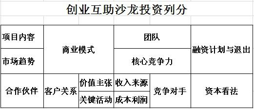

创业互助沙龙 QQ 群专题第一期活动讨论完满结束，十分感谢创业互助沙龙创始人辛霞女士为我们分享《如何做好融资商业计划书 PPT》，QQ 群内气氛活跃，干货不断。下面我们一起来学习如何做好商业计划书 PPT。

### 一、投资人最关心的五个问题

五个问题分别是：“你是谁？”、“你的项目是什么”、“你解决了什么问题?”、“你能做到啥程度？”和“为什么是你？”。

**“你是谁？”**：这个环节可以放在最前面或者最后面，主要是你或者团队介绍。

**“你的项目是什么”**：这个环节，很多人都会犯错误，因为大家都沉浸在自己的项目、产品中，于是这个环节说了很多，其实就一两页说清楚解决谁的问题就好了，谁，就是你产品的目标人群，他们存在什么问题，稍加解释即可。

**“你解决了什么问题?”**：在这个环节，大家又会出现小漏洞。那就是把市场想当然，往往没做过市场的人，认为市场很简单，没做过技术的人，认为技术很容易实现一样，想当然的情况出现后，就会被批的一塌糊涂。

**“你能做到啥程度？”**：这个环节，就是摆你的资源，你有什么，凭什么你有，别人没有，或者说你有的比别人高明的地方。这个是，很多人又会展现井底之蛙态势，这时候，没有看到自己的技术或能力其实市场已经存在很多了。现在分析来看，怎么写 PPT 不难，而是能把自己做的事情，分析清楚才是最难的，PPT 格式很简单，就那么几页，一般 10 到 20 页足矣，需要 20 页以上，已经过了天使阶段了。有句话说，低头走路容易，抬头看路惊慌，创业者一旦陷入这个环节，非常危险。但是确实创始人最了解自己的项目，只是对市场需求以及自己的非产品之外的能力把握不好，因此才会出现写的时候无从下笔或者写的与实际需要脱节。

**“为什么是你？”**：就是你要你客观分析，你自己的优势以及壁垒，有什么人能超越你，你在他超越你之前如何提高门槛。

盈利模式在你解决了什么问题环节或者在为什么是你环节都可以根据需要体现。

我们必须承认，我们对市场的判断和对竞争对手的判断永远存在差距。但是也不能阻止我们做事业的决心，为此我们作为创始人必须是这个行业的专家。如果不能做到专家，势必突破不了投资关甚至合作伙伴关。

再到后面就是所谓的投资金额，以及估算财务部分了，这个要根据每个项目来定。

### 二、创始人俱乐部的剖析框架

下面给大家分享一个我们创始人俱乐部的项目剖析框架，顺便请日后参加创始人俱乐部的群友，按照这个表格做准备。这个表是百康门诊的投资人，侯秋生设计的。

**项目内容**：就是介绍你自己项目以及产品部分。

**市场趋势**：就是你所处行业的发展状况，你的项目或产品所处位置，你要有一个清晰的认识，在群共享里有一份 EXECL，里面有结构可作为分析市场用。

**合作伙伴**：你的项目所依存的上下游。

**商业模式**：这个问题就大了，不同的项目商业模式完全不同。简单的说就是你的项目如何运营的，如果赚钱的。

**客户关系**：你的目标客户群，和你的产品现在到了什么程度，已经在用，需要推广，还是…..，根据项目来分析

**价值主张**：这是个关键问题，但是很多创始人忽略了，这个问题决定你的项目或产品的生命周期，这也是品牌文化的内涵。

**关键活动**：你为这个项目，究竟做了哪些必须事情，做到什么程度，效果如何以及原因。

**团队和核心竞争力**这个不用说了。**收入来源，成本利润**，这也不用说了吧。

**竞争对手**：这个功课一定要做足，不然你竖的门槛不够高，很快就红海了。具体怎么分析，详细见群共享中的 EXECL。

**融资计划与退出**，初级项目暂时不用考虑，但是如果直接到 A 轮的项目就需要了。　　

**资本看法**：很简单，就是你的项目见过什么投资人，投资人对你的项目的理解和建议。

### 三、“行业分析工具模板”和“行业竞争对手列表”使用

**行业分析工具模板**

行业分析工具模板是楼模式设计的，用来分析投资项目所用。这个标准模式，是帮你理清思路的过程，但是困难的是创业者最多犯错的地方是，囿在自己的思维体系里出不来。

**行业竞争对手列表**

**市场细分定位**，这个是重点，要清楚你所处的行业，以及你所在产品的具体位置。这个就像我们开车，我们起码要知道自己的方位，以及要去哪里。

**背景**，行业背景，自己公司背景

**产品**，这个创业者都知道自己的产品是什么

**服务**，有的人就不清楚了，每个行业的回答都不同，创始人自己用心体会了，例如，产品电商代运营，服务：代理传统企业网络

**服务**：代理传统企业网络销售每个行业解释都不相同

**其他**，代理费，提点，佣金

**用户**：传统企业，合作伙伴，天猫等各类平台

**商业运作方式**，商家提供品牌，产品，供应链我方提供拍摄，商城装修，网络销售，客户服务，共同商定，产品商城定位，以及各类活动等

**目前业绩**，就是已经取得的销售成绩

[行业分析工具模板](assets/创业互助沙龙QQ群专题第一期《如何做好融资商业计划书PPT》干货分享/file-496.0000.ppt)

[行业竞争对手列表_20121107r1](assets/创业互助沙龙QQ群专题第一期《如何做好融资商业计划书PPT》干货分享/file-78.5000.xls)

### 四、问答环节

**问题 1**：我在深港一带，投资人去哪里找？我刚刚开始一个项目不久，目前在测试市场反应的阶段，想拿到市场反应的数据后找天使。

回答：深圳很多投资机构，但是中国的天使真的不多，我们创业互助沙龙也在甄别真正的天使投资人过程中，但是每个投资人投资方向不同。建议成为我们的会员，我们帮你解决这个问题，创始人可以安心做好自己的产品。

**问题 2**：有没有什么方法，可以快速找到市场的空白点。

需要你对你所要找的市场足够熟悉，以及对目标消费群的熟悉。

**问题 3**：市场行业细分怎么细分才合理？

具体要看哪个行业了，基本上所有行业都有的。例如以前照相：90 年以前，傻瓜相机，照相馆，拍摄身份照；2000 年前，数码相机出现，于是各种打印速洗出现；现在，老式的照相馆没有了，出现的是电商的视觉营销，婚纱摄影一直存在。所以细分十个变动航海业，经常变动的。

**问题 4**：团队什么资质才能得到投资人青睐。

好项目是前提条件。
