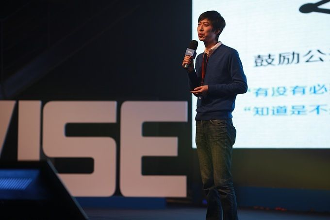
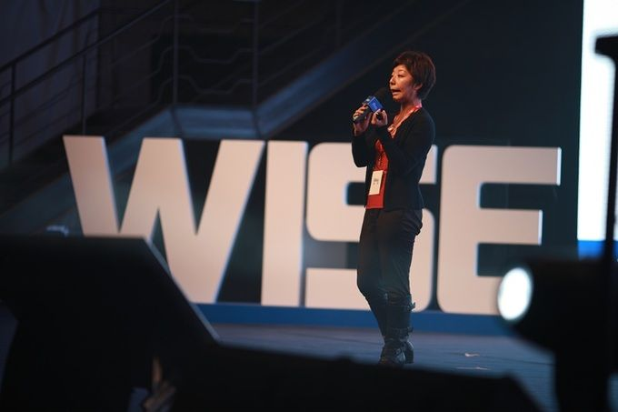
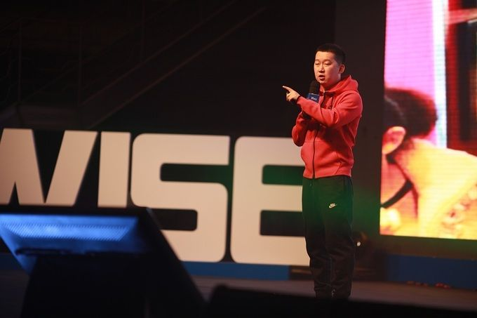

今天 WISE 大会第一场活动是 36 氪 + 创业知识汇。决胜网创始人戴政、黄太吉创始人赫畅、大成律师事务所高级合伙人李观保、友盟 VP 蒋桦和明道 CEO 任向晖这五位嘉宾给大家分享了在创业团队建设、融资和行业市场等方面的经验，下面是一些总结。

### 团队篇

**决胜网创始人戴政：O2O 创业要组建水泥人和鼠标人搭配的团队**

戴政是前去哪儿网副总裁，现在在做“教育界的去哪儿”决胜网，具体可见我们之前的报道。

为创业项目组建团队，其实大家会先看你选择做的什么市场。现在互联网创业基本上都开始做 O2O 了，单纯做纯互联网、移动互联网相关的，VC 会觉得不太落地。因为纯互联网项目，大家们都会看你和 BAT 的潜在竞争，如果这个领域如果 BAT 进入会怎么样。而 O2O 当中的那个 "to"，BAT 都不太会介入。就拿教育举例子，BAT 他们都在横着做，比如说做一个直播间做一个平台，他们还是要解决流量的出入口，而真正往“to”的方向去做的时候，BAT 会比较难。

现在建议团队组建时，注重 O2O 中的那个 "to"，大家一定要很好地搭配，需要有一个互联网人加上一个很好的传统人。与此同时也要求创始人自己得非常懂这个行业，你才能去说服别人你们怎么能攻下这个市场。第二点就是要找能力互补的合伙人，就是双方是在不同领域的 No.1，而不是同一个领域当中的 NO.1 和 NO.2 的人。如果合伙人都来自于一个领域，比如双方都擅长市场，那两个人最后一定会出问题。

而创业中在招那些优秀人才时，有一点很重要，就是要求创始团队能对自己的愿景描述非常清楚，中间可以会遇到什么问题，会有怎么样的退出方式等等。这才能吸引优秀人才加入。当时 2005 年底我们一起要做去哪儿的时候，当时创始团队就讲得非常清楚，知道公司在两年后、五年后都能发展成什么样子，甚至聊过未来有可能被百度收购。

**明道 CEO 任向辉：成功的团队协作是什么样的？**

一个成功的协作有这么四点特征，时点无差、能力无差、责任无差和目标无差。这和球赛类似，好的协作就是你知道在什么关键时点和位置，把球传给不同的能力匹配的队友。但目标无差这个部分有些不同，就是所有人都知道球赛目的是赢球，但是在经营企业的过程当中，有时中长期目标容易被忽略，往往只着眼于短期目标。如果在协作中遇到无法协调的矛盾，那可能就需考虑是否团队有目标差距上的问题。

而要实现成功协作需要这么六点，开放沟通、聚焦任务、忽略形式、数据集中、去中心化和闭环优化。比如开放沟通，它其实就要求做到沟通透明、允许自由对话和允许人人广播。过去大家用邮件或 IM，这类沟通工具有个特点就是你得先指定对话人/收件人，我们调查过虽然很多公司邮箱账号都能有群发到全体的权限，但一般都是只有 CEO 或 HR 才常发这种邮件。这种工具就不太利于创业公司的透明沟通。

而关于去中心化这点，很多企业在小的时候不觉得，稍微大一点，老板就会感到有去中心化的压力了。去中心化在企业协作里面几乎等同于分散决策。要做到能允许分散决策，允许失控，你要制定一些比较简单的基本规则。我总结了三点，一是要确保目标是可衡量的，就是决策人做完决策后，如何判断目标达成与否，是得可衡量的；二是分解后的任务都得有单一责任人；三是在整个过程当中，所有的过程必须记载下来。因为失控的后果是可能失败的，当你失败的时候，你是需要复核并去思考改善的。

### 融资篇

**大成律师事务所高级合伙人李观保：融资前要弄清楚的投资条款**

我们创业者在跟投资人谈的时候，投资人经常会给创始人一个回答，我这些条款都是行业惯例，所以你就别改了。我给创业者的建议和提醒就是投资条款你是可以和投资人协商的。所谓合同条款，什么叫合同呢？双方达成一致才叫合同，所以说这个合同在没有最终签署之前，都是可以双方协商。尽管有一些行业惯例，但是只要双方一致，也是可以修改的。

哪种股权结构是合适的？我们常见的有三种方式。第一种是平起平坐式的，合伙人股权比较分散，在这种情况下它会有一个不利的地方，没有任何一个人有绝对的话语权，对将来公司的治理结构会产生非常严重的影响。这种股权结构会成为投资人在出资时的顾虑。第二种是，一言堂式的，各种亲人家属持股，会类似一个家族企业。这种情况下对公司的多元化发展也是不利的，这也是投资人不太愿意看到的。第三种是比较能吸引投资的股权结构，就是一股独大式的结构，团队里面有一个老大，其他人都听他的，在这种情况下，投资人认为是比较优化的结构。

比较合理的股权结构就是一个团队有一个老大，各合伙人间有一个股份的约定，在某一些人、某一个人提前离开的时，他的股份不会被带走。在团队创业的时候，我们一般会推荐签一个股份的释放协议 (Vesting)。就是说每个合伙人的股份都是分年释放的，比如说我锁四年，如果你工作了两年，不好意思，那 50% 的股份就没有了，这样的情况下我还可以拿这 50% 的股份吸引新的有能力的团队成员加盟。

另外还有一部分比较重要的是要预留期权池。一般投资人在投你的时候，如果公司还没有拿出期权的话，投资人很可能要求你拿出一部分的期权，而且这期权是从创始人团队里面拿的。对初创企业来讲，你很难拿高薪吸引优秀人才，毕竟公司现金流可能会有困难，这种情况下拿员工期权留人是非常重要的条款。关于员工期权有个小建议，就是建议团队可以把员工期权分发做得有仪式感一点，隆重一点，比如做成一个期权证书而不仅仅是一张简单的纸，这样会让员工更有认同感和归属感。

### 行业和市场篇

**友盟 VP 蒋桦：移动互联网在往垂直领域渗透**

友盟目前覆盖的智能设备达 5.9 亿了，现在观察到一些新趋势。一是移动互联网向传统行业迁移，不同垂直领域的应用都看到了用户使用时长上的增长。比如金融理财领域的应用有 147% 的用户使用时长增长，商务办公类有 85% 的使用时长增长，健康医疗类则有 80% 的时长增长。

除了使用时长外，不同年份的明星 app 的变化也能看出移动互联网向垂直领域渗透。比如 2010 年时，明星 app 有 camera360 和 365 日历等工具；2011 年有美图秀秀还有蘑菇街美丽说等电商导购社区；2012 年则是娱乐社区类的唱吧，生活服务类的嘀嘀打车和视频类的应用。到了今年，则是大姨吗、Zank 和课程格子等，他们分别服务女性、同志交友和学生群体这些细分群体。

第二个趋势就是手游。2013 算是中国手游年。从 2012 和 2013 年的数据变化看，人均游戏时间增长 66%，人均游戏启动频次增长 50%。而在手游中，轻度游戏绝对还是最多抢占用户的游戏时间。棋牌类、动作街机和益智类游戏，这三类相对轻度游戏，它所占的时间，已经照顾了大概 80% 的用户的整体时间。

友盟还有数据显示现在每月仅有 30% 的 Android 用户会尝试新应用。这可能会是今后创业者会面临的大挑战。

**黄太吉赫畅：真正颠覆传统行业就在于改变成本结构**

我以前也是做互联网的，在百度、去哪儿和 Google 都做过，后来自己也创业过两家广告公司。我之前都是互联网经历，现在却跑来卖煎饼果子，看起来是根本驴唇不对马嘴的事。但我老爸教我做人的道理就 8 个字，宁当鸡头不当凤尾。之前我们这帮人在互联网圈里混，感觉好像机会很渺茫，如果我们下来卖煎饼果子，也许我们就是这个行业里面最懂品牌、最懂营销的。

我们常说颠覆传统行业，但我认为真正颠覆就是改变成本结构。过去的餐饮行业房租占比大概 10% 到 15% 是差不多的，甚至有超过 15% 的，我们的房租占比可以压到 6% 以下，今天这就是改变成本结构，你开在哪里就不重要了。因为我开在哪里都会有人来，因为我有品牌，大家认同这样的体验感就会来。现在黄太吉每天大概要卖出 1 万个煎饼果子。

未来的世界或者说未来的中国可能有五个最大的趋势。人民币升值；中国的经济必须向服务型经济转型；当我们有那么多的就业压力的时候，服务业要消耗掉大量的就业人口；中国的人均 GDP 现在只有美国的十分之一，再过几年就 GDP 总量变成世界第一的时候，人均 GDP 总量翻一点；今天如果中国还不能去把自己从世界工厂变成世界市场的话，我们的经济转型就跨掉了。

而中国有 14 亿人口，美国有 3 亿人口，但是根据 2012 年国家的数据报告，中国的餐饮行业整体产值是 2.7 万亿人民币，美国 3.7 万亿，所以只有 25% 的人口但是他创造了我们可以增长大概 70% 的餐饮总量。再基于以上五点，我们认为在未来的五年之内，中国的餐饮市场总量会从 2.7 万亿膨胀到至少 10 万亿人民币。在 10 万亿的市场里面，我们 (黄太吉) 只需要千份之一的市场份额就可以了。

在最后问答部分，赫畅关于“如何管理 90 后员工”的回答比较精彩。赫畅认为这种管理心态并不是最优的，就是会把自己看成和 90 后是割裂的，带着一种优越感。当这个信息的时代，扩展到今天的这个程度的时候，当我们觉得 90 后难管的时候，真正的核心问题是我们自己的信息获取量太小了。90 后的信息获取量远远大于我们，我们觉得没法跟他沟通，其实 90 后觉得可能还没法跟你沟通呢。在和 90 后团队相处时，一是保证平等，二是你得给他机会。这个机会不只是获得财富或上升的机会，而关键是你给不给他学习的机会。

更重要的是，很可能再再过 10 年、20 年，这个世界上就没有员工的概念了，这是一个去中心化、去组织化的社会。这是一个工业经济时代向互联网经济时代过渡的时代，今后可能一个人不会再隶属于一个组织，你可以同时做很多事情。

所以我们今天要管理 90 后的时候，我觉得要把管这个字儿去掉，你是要理他，大家互相之间有反应才能形成一个整体，这个世界上谁还管谁啊？没有管的了，组织是协作的，不是过去的金字塔形式的，什么叫组织？就是信息不对称的分配方式就叫组织，过去是老板掌握最多，员工掌握最少，今天不是这样子的了，今天是员工掌握最多、老板掌握最少。
