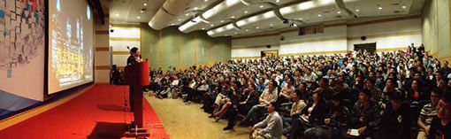

2012 全球创业周中国站“创业课堂”全国高校巡讲活动日前已全面启动，本次活动由全球创业周中国站组委会、上海市大学生科技创业基金会主办，《创业家》杂志联合主办，全国各校创业类社团承办。邀请创业导师至在全国 60 所高校展开创业课堂讲座，培育学生创业精神及正确的创业观。、

11 月 20 日，全球创业周中国站“创业课堂”高校巡讲河南农业大学站活动获得圆满成功。

以下为河南农业大学嘉宾演讲实录：

### 我能创业吗？我要从哪里开始？怎么做我才能成功？

孙健：今天我给大家带来我自己的一些意见和看法。我不觉得我在给大家做演讲，我只希望把我以前曾经历过的故事和大家一起分享一下。我觉得成功是有元素的，所以我今天的主题叫成功元素。现在听讲座的各位，我觉得大家都有同样的问题。一：我能创业吗？二：我要从哪里开始？三：怎么做我才能成功？

### 成功就是坚持，而且是不懈的坚持

孙健：“好，现在我开始跟大家的做一个互动。这个人有人认识吗？他，就是麦当劳。麦当劳就是他做的。那么牛啊？我也觉得他很牛。那么我现在想跟你说，麦当劳其实原来根本不是他创建的，麦当劳是两个犹太人创建的，麦当劳兄弟。然后这两个兄弟一天到晚在那儿苦心的经营，有一天，这个大叔找到那两个兄弟，买下了麦当劳的一个经营权，当时同时和他一起买下这个经营权的还有一个荷兰人。哦对，那个荷兰国家啊，不是我们这个河南的。（笑）荷兰猪、荷兰豆那个国家的荷兰。然后，当时两个人一块儿都在做这个，那个大叔先是脑子比较死，一门心思只想做这个麦当劳，于是乎退出了他的店，只做他的加盟店。那个荷兰人就很聪明。不中啊，这牛肉，是别人给我养的，这钱没挣着，不中，我还得开个养牛场。这面包都是别人送给我的，不中，我还得开个面包房。一天一天，一直这么做下去，这时大叔才求着跟那个荷兰人说：‘我们一起要怎么样’所以，我今天想跟大家说的第一点是，成功就是坚持，而且是不懈的坚持。”

### 学会不停地扭转你的思路，随时调整你前进的方向

孙健：“有谁知道巴奴火锅是怎么成立的？杜中兵在 12 岁就去矿上挖矿了。他那时候就在煤矿里拿着背篓天天背煤。后来有一天觉得，哎呀，不中了，这岁数大了个子高了，钻煤洞都钻不过了。然后就开始去帮别人拉煤。没有钱，他很穷。他告诉我，那时候他经常穿的解放鞋上面两个大脚趾头都在外面。他去帮别人运煤，给他提供板车，后来几年是拖拉机，最后发现，呀，这赚不了钱啊，赚是赚了赚的很慢啊。

事实上，我可以跟你说，他前面几次没有挣到钱，因为，他一直到帮别人运煤，他还穿着这双鞋。那双鞋，现在还在他家里。那天，还专门拿了个照片给我看。他帮别人运煤的时候没有本钱，没有人相信他，我们大家都知道，运煤怎么运，我先从煤的产地里去买一车煤，然后把煤运到港口啊或者是再运到到企业，运进去了然后别人给钱。老杜没办法啊，咋办呐，老杜说，那这样，我是土生土长的本地人，你把煤赊给我，我拿我的车，我拿我的房，我拿我的父母在你这做抵押，回来我给你钱。就这样，他开始了他第一次运煤，运了大概有五六年，他跟我说的，干这种活干了五年，嗯，家里有钱了，这次是挣到钱了。挣到钱了以后，就开始喜欢吃美食啊。这家伙以前很爱吃的，你们可能没有人知道巴奴火锅怎么来的。那我在这里私下跟大家说一下，巴奴火锅，它的原创，其实是来自于重庆德庄。最开始，老杜自己没有创业这个平台的，他是在重庆做了一家重庆德庄的加盟店，那时候做店长多舒服啊。重庆德庄派来的人给派个活，他就天天在那儿收收钱就行了，这小子不学好，学坏！好赌，赌着赌着把店都快输没了。结果有一天，他幡然醒悟，脱离了这个营销系统，创建了巴奴火锅。后边成长的路我就不再细说了，这个，时间太长了。

### 找对方法，在失败的时候，学会站起来重新开始

所以，我现在想跟你们说的第二个就是，学会不停地扭转你的思路，随时调整你前进的方向。不管你是运煤也好，挖煤也好，哪怕你去赌钱也好。不要相信自己一次都能够成功，经过我们的大量研究和申请，事实上创业者成功的几率可能连千分之一都不到，万分之一还比较靠谱，没有谁是一次就能创业成功的，请大家一定要注意这一点！

现在跟大家分享第三个故事，分享之前我想请大家猜一下我的体重，你们觉得我想在有多重？150？155？160？好，其实我现在体重是 155 斤，你们相不相信我的体重在两年前是 230 斤？你们相不相信两年前我跑高速从来不用手？用什么……？肚子！这是真的，这个肥胖困了我很多年，我试了很多很多方式，减肥药、只吃水果、跑步……你们所能想到的所有方式我都有尝试，但是，我发现用过这些方法后，我更胖了……（笑）我就不停的思考，我该这么减肥，终于有一天，我找到方法了，我用了一年的时间减了 53 斤，今年四月份我体重是 180 斤，到现在我是 155 斤，不要问我是怎么减下来的，我是不会分享的。跟你们说这个主要是想跟你们分享创业者的第三层，找对方法，在失败的时候，学会站起来重新开始。你们问我的问题，你们想知道的答案，只要把这句话想清楚，一切就没有问题了。创业是一件很艰辛的事，没有你们想象的那么简单。

### 想创业的人，在这里我要给你们的几点建议

**第一点，一定要保存好自己的团队**。创业不可能一开始就能成功，很容易就失败了，但是你创了业，你的团队不要出现失误，一定要保证你和你的团队一直都在。独木难成舟，项目可以死，团队永远在。

**第二点，学会说不，把时间留给关键的事**。我一个朋友在东区开了一家酒庄，其实她是我一相亲对象，一次我去他们公司，我下午两点钟到的那个地方，一直到六点钟她都没有时间接见我，我就走了。第二次去，我下午五点去的，等到七点四十五，终于跟我见了一面，我就跟她说，你们公司出现问题最关键的是你的时间安排有问题，你把所有琐碎的事情都揽在自己身上，所以作为一个决策者，你要把时间放在关键的事情上。

**第三点，不要搞乱你在公司内的关系**。办公室恋情只存在于影视片里，而且在公司内部不要安排你的亲属，因为你与他们的关系，会影响你的判断力，搞清楚你与你手下的关系，你们是雇佣关系，你们是合作关系！

**第四点，懂得尊重和责任**。你要跟你们公司的员工处理好关系，懂得感恩，多说几句谢谢，我就很善于跟我们公司的员工沟通，平日里经常举办一些活动，旅游、聚餐等等，因为你的一切成就都来源于你手下员工的努力，一定要肩负起你所承担的责任。

**第五点**，三一重工的梁稳根曾经跟我分享过一句话：“**钱聚人散，钱散人聚**。”你公司的利润部分，你要尽可能多的拿出来跟你的员工跟你的股东分享。

只要你把以上几点完全都做到，那么创业只是一件很冲动的事，创业就是一种生活方式，最后我想跟说一句话，其实就是耐克广告里的一句话：如果你准备好了那就“just do it”。
