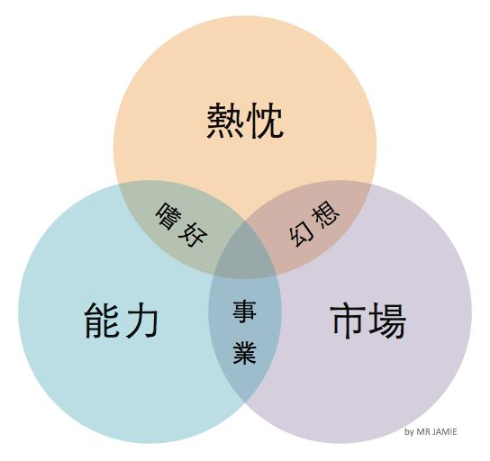
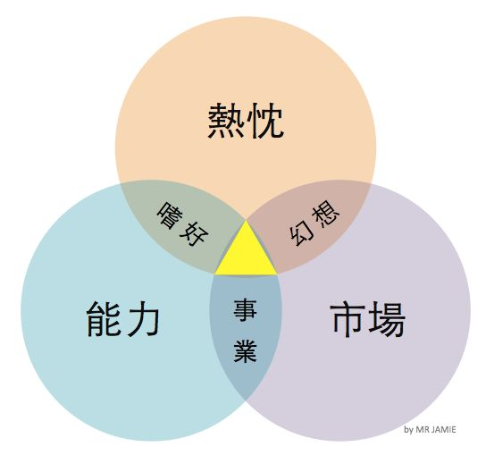

在 [appWorks](http://appworks.tw/)，我常拿這個圖跟創業者們解釋「找 Idea」的心法。

左下角的是「能力」，也是最簡單的一環。我們對自己有什麼能力，沒有什麼能力，通常有相當程度的認識。能力同時也是最容易取得的，這世界上大部分的技能，只要我們願意花 [一萬個小時](http://mrjamie.cc/2012/04/20/talent/) 去學習，雖然不一定能夠變成世界冠軍，但成為 Top 1%，甚至是 Top 0.1%，都是相當有可能的。

在上面的則是「熱忱」，也就是我們能持續有興趣，不辭辛勞，也想要做的事情，也想要完成的任務。熱忱是比較深層的心理需要，它有時候不是那麼明顯，必須要接觸了某個事情一段時間，才會發現我們對它很有熱忱—求學過程中的我，非常討厭作文。但過去四年，我卻發現每天寫網誌跟大家分享創業與網路，是我真誠感到有意義的工作。

最後是「市場」，也就是人們願意付錢請你做的事情。對絕大多數人而言，市場是我們理解最少的。這個世上有成千上萬種行業，每個行業都有不同的消費者、客戶組成，還有各種大大小小幾千年累積下來的明規則、潛規則。消費者的品味與習慣不斷在變動，行業規則也不斷在變動，每家公司在行業內所佔有的份量也不斷在變動，因此市場是一個非常非常難確切掌握的東西。

接著我們必須了解這三個圈圈的交界處。

首先，熱忱常常會驅動我們去學習某些能力，但如果這件事情與市場沒有交集，那頂多就只是一個「嗜好」。有些時候我們會對某些所謂商機有很大的熱忱，但如果那不是我們能力所及的範圍，則頂多是一個「幻想」。最後，當有一件事情我們能夠做得很好，而且市場願意付錢給我們，雖然我們對它並不是超級感興趣，這還是有可能成為一個小生意，甚至做成一個「事業」。

大家常說創業初期所謂「[無知的樂觀](http://mrjamie.cc/2012/06/18/informed-pessimism/)」，其實就是落在「幻想」與「嗜好」這兩個區塊。一種人是一頭熱的看到市場裡的機會，卻沒有認知到追逐這個機會所需要的能力。另一種人則是很熱心的用很厲害的技術在做自己想出來的產品，卻沒有認知到它並不被市場所需要。

最後，最神奇的事情，就是當你找到熱忱、能力與市場的交集，我所謂的「創業金三角」的時候。在這裡，你的熱忱會驅使你去理解市場還欠缺什麼，接著推動你去學習滿足這些需要所必備的能力。最後當你成功的滿足這些客人，看到他們開心的表情，那又會讓你的熱忱得到養分，推動你繼續努力下去。這形成一個生生不息的正向循環，也是創業者能夠長期成功最重要的引擎。

當然，在到達金三角之前，你必須先往內認識自己，了解我的熱忱到底是什麼，這往往需要經歷很多的嘗試與體會，才能夠逐漸明白。你更需要往外認識市場，了解人們各種各樣的想要與需要又是什麼，在市場裡面又有哪些比我能力更強的公司，以及哪些將會阻礙我發揮我的能力的規則與結構。

這兩個探索肯定是沒有效率的，所以出來創業你應該準備好，光是找到一個「對的 Idea」，可能就需要三年、甚至是五年的時間。
