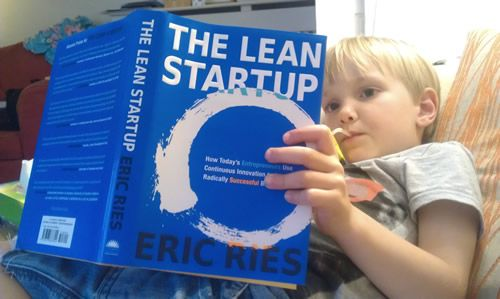

过去的两周里，我疯狂的 7×24 小时昼夜不停的编程，就像是一只坐在过山车上没有下来，一直在开发一个激荡在我大脑里和血液中的创意。这个创意出现在我开车去一个咖啡馆和一个客户谈一个合同时。这十分钟的路程让我搁置了这天的合同，最后让它搁置了两周….

我的第一次创业的那个项目让我花去了整整一年去开发，最终只得到了很少的客户。我不会让这种错误重演。

我一直想为这些在生育高峰期出生的人们做个东西，但却一直没有动手去做。下面是我的“顿悟”：

父母，以及所有他们的亲属朋友都有成百上千的照片放在他们的手机里，他们希望能把它们轻松的打印出来送给家人或朋友，但这需要如此这般那般的过程惊吓了他们。他们宁愿发送电子版的照片。如果他们只需要提供一张照片和一个地址，我替他们打印并邮寄，会怎样？就是这样！

我迅速的用 Ruby on Rails(很显然) 开发出了所有程序。下面是我使用的 API。每一个都是对于最终结果至关重要：

- 我使用 Lob 来实现物理打印和发货。他们是一个 Y-combinator 投资的创业公司，有非常棒的 API 能实现这个。[https://www.lob.com/](https://www.lob.com/)
- 我最初使用 Twili 的多媒体信息服务 (对于短信集成功能，他们是很显然的选择)。但很快我认识到 Twilio 并不支持图片信息，于是我继续搜索，找到了 Mogreet。我从他们那里找到了我需要的服务 (他们的客服支持非常的周到)。[http://www.mogreet.com/](http://www.mogreet.com/)
- Paypal 里有两个我需要的功能：微支付和预批准。这样，小于 12 美元的交易只有很少的费用。预批准功能可以让我向客户发送支付请求，不必每次都确认。通过他们的支付 gem，我非常轻松的集成了支付功能。
- 最后，我使用 AWS S3 来存储图片。在把它们放到云存储中前，我需要把它们裁剪成 4” x 6”大小，使用 imagemagick 很轻松的完成了这些。

这个应用上线后，24 小时里我收获的订单比我那个花一年时间开发的创业公司所有的订单都多。

我不知道这个产品会将我带往何处，但我学到了一个非常有价值的教训，就是，以最快的速度让你的产品跟客户见面。虽然你的网站有缺陷，管它呢！如果用户不喜欢你的创意，不使用它，又有谁会在意你的登录页没有跳转的正确的页面？就要现在去让自己直接在客户面前出洋相！

下面就是这个产品。我很乐意向有兴趣的朋友开源它的代码。

[http://www.pigeonpic.com](http://www.pigeonpic.com)
