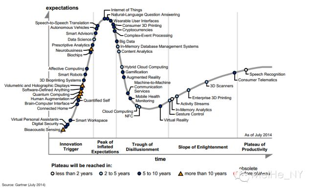
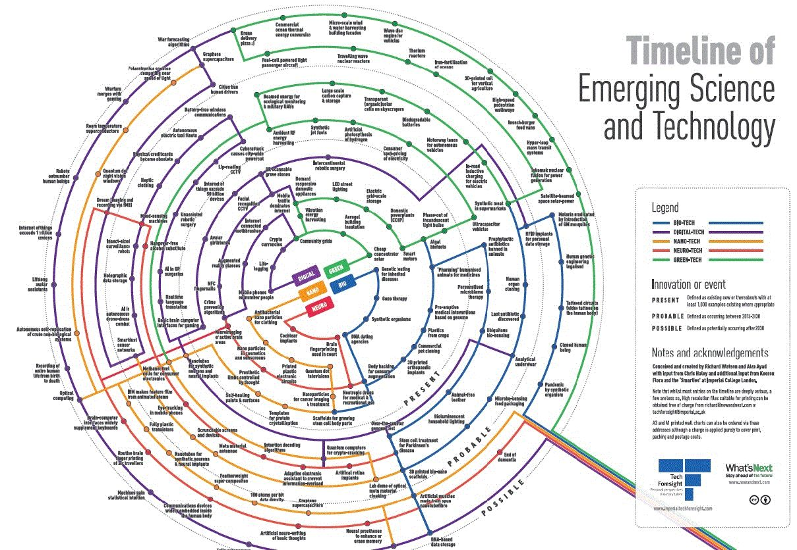

今年和去年对比显示，物联网、自动驾驶汽车、消费级 3D 打印、自然语言问答等概念正在处于炒作的顶峰。而大数据已从顶峰滑落，NFC 和云计算接近谷底。

科技总是日新月异，著名 IT 咨询机构 Gartner 近期更新了一年一度的“新兴技术炒作周期图”，而帝国理工学院的“科技前瞻”小组也推出了“新兴科学技术时间轴”，都对各类新兴技术做了分类和技术成熟时点的判断。

Gartner 的“新兴技术炒作”周期，是把各类技术按照技术成熟度和期望值分类。横轴上分为“创新萌芽 Innovation Trigger”、“期望最顶点 Peak ofInflated Expectation”、“下调预期至低点 Trough of Disillusion”、“回归理想 Slope ofEnlightenment”、“生产率平台 Plateau of Productivity”。

越往左，技术约新潮，越处于概念阶段；越往右，技术约成熟，约进入商业化应用，发挥出提高生产率的效果。纵轴代表预期值，人们对于新技术通常会随着认识的深入，预期不断升温，伴之以媒体炒作而到达顶峰；随之因技术瓶颈或其他原因，预期逐渐冷却至低点，但技术技术成熟后，期望又重新上升。

今年和去年的图对比显示，物联网、自动驾驶汽车、消费级 3D 打印、自然语言问答等概念正在处于炒作的顶峰。而大数据已从顶峰滑落，NFC 和云计算接近谷底。

去年的“移动机器人”改名成“智能机器人”，去年的“虚拟助理 Virtual Assistant”改名为“虚拟个人助理 VirtualPersonal Assistants”，皆因后者的范围更大。

今年新增的技术包括“数据科学 Data Science”、“Software-definedanything”、“Smart Advisors”、“Connected Home 智能家居”、“DigitalSecurity 网络安全”、“Smart Workplace”、“虚拟货币 Cryptocurrencies”和“Hybrid Cloud 混合云”。

总结下来我们发现，人工智能被演绎成许多技术应用 (Autonomous Vehicle, Virtual PersonalAssistants，Brain-Computer Interface，HumanAugmentation，Prescriptive Analysis、Smart Workplace、Smart Robot 等) 并将在 5-10 年后起到巨大的颠覆性影响。

而伦敦帝国理工学院的“科技前瞻 Tech Foresight”小组推出的“新兴科学技术时间轴”，是将新兴科技按类别和成熟度排列成靶状圆环。圆环的内外圈代表三个时间温度：内圈是“当下”，即 2014-2015 年；中间的圆圈是“很有可能”，也即 2015-2030 年可能实现；外圈是是“可能”，也即 2030 年以后才有可能实现。技术分为 5 个类别：信息技术、生物技术、纳米技术、神经技术和清洁技术。

图中所示的技术罗列如下（中文翻译不能保证正确）

**生物技术 - 当下：**

对于先天性疾病进行基因测试、基因疗法、合成有机物、基于 DNA 的交友/婚姻介绍、入侵身体以增强感官、用 3D 打印技术生产的骨科植入物、商业宠物克隆、源于作物的塑料、基于基因的主动医学介入、为制药培育人源化的动物

**生物技术 - 很有可能：**

预防性抗生素禁止用于动物、个性化的微生物疗法、无处不在的生物感应器、非源于动物的皮革、非处方基因测试、对帕金森氏综合征进行干细胞治疗、3D 打印的生物纳米支架、生物发光的家用灯具、为个人数据存储嵌入射频识别技术、发现最后的抗生素、人类器官克隆、

**生物技术 - 可能：**

引入转基因蚊子以消除疟疾、人类基因工程合法化、纹身电路（人体上的视频纹身）、克隆人类、合成有机物所带来流行病、用纳米纤维制造人造肌肉、基于 DNA 的数据贮存、微生物感应的食品包装

**神经技术 - 当下：**

耳蜗植入、大脑指纹用于法庭、益智药用于医学或休闲使用、由思维控制的假肢、活跃大脑区域的神经成像

**神经技术 - 很有可能：**

思维控制的轮椅、手机对眼球移动追踪、解码意向的算法、适应性电子助手避免信息超负荷、人工视网膜植入、不会宿醉的酒精替代品

**神经技术 - 可能：**

侵入植入的神经设备、大脑 - 电脑界面广泛使用并取代键盘、航空旅客使用大脑指纹、通过 fMRI 对梦成像和记录、通讯设备广泛嵌入到人体、基本想法的人工神经编写、用大脑假体提升或消除记忆、终结痴呆

**信息技术 - 当下：**

移动电话数量超过人口、生活记录、加密货币、智能牙刷、现实增强眼镜、预防犯罪算法、NFC 指甲、可扫描条码的墓碑、能面部识别的中央摄像头、阿凡达女友、用于游戏的大脑 - 计算机基本界面、跨洲机器人手术

**信息技术 - 很有可能：**

实时语言翻译、量子计算机用于解密、分析内衣、AI 用于全科医生手术、无辅助机器人手术、物联网超过 500 亿个设备、能读唇语的中央摄像头、网络攻击导致整个城市范围内断电、不用电池的无线沟通、自动驾驶出租车车队、实体信用卡过时、触觉学衣服、情绪感知器、昆虫大小的侦查机器人、全息数据存储、AI 用于无人机 - 无人机战斗、智能尘埃传感器

**信息技术 - 可能：**

侵入已经植入的神经设备、城市禁止人类驾驶员、预测战争的算法、商业飞机由智能手机劫持、战事与游戏合并、机器人数量超过人类、物联网超过 1 万亿个设备、终身阿凡达助手、记录人类从出生到死亡整个生命、完全自主的战场机器人、量子电脑用于材料设计

**清洁技术 - 当下：**

廉价太阳能聚集器、绝缘气凝胶建筑、振动能量采集、社区电网、能回应指令的家用电器、LED 路灯、电网级储能、家用电站（冷热电联供系统）、智能电表、藻类生质燃料、100% 淘汰白炽灯

**清洁技术 - 很有可能：**

超级电容车、消费端实时定价、氢的人工光合作用、合成飞机燃料、周围的射频能量采集、束能量用于生态监测和军事无人机、大规模的碳捕捉和碳贮存、摩天大楼上的透明（有机）太阳能电池、生物可降解电池、自动驾驶汽车的专用车道、电动汽车行驶中感应充电、超市出售合成肉

**清洁技术 - 可能：**

行波反应堆、燃料电池驱动的轻型客机、无人机运送披萨饼、商业化海洋热能转换、微型风能水能收集建筑外墙、汽车波转子发动机、钍反应堆、给海洋施以铁质肥料、3D 打印土壤用于垂直农业、高速人行道、昆虫汉堡食物车、超回路大众运输系统、用托卡马克核聚变发电、卫星束太空太阳能

**纳米技术 - 当下：**

用于衣物的抗病毒纳米粒子、化妆品和遮光剂中的纳米粒子、塑料打印的电子电路、量子点电视、癌症成像和治疗的纳米粒子、用于培育人体干细胞的支架、蛋白质结晶的模板、自我修复的漆点和表面、用于合成神经元和合成神经植入物的纳米管、消费者电子产品中的甲醇燃料电池

**纳米技术 - 很有可能：**

人工电磁材料天线、可碾压的屏幕和设备

**纳米技术 - 可能：**

IBM 用动画原子做成动画片、全朔料的晶体管、下一代超轻型合成材料、每比特数据有 100 个原子密集、石墨超级电容、生态系统单层自我复制、量子点夜视窗、室温超导体、旋光仪使计算接近光速、实验室演示人工电磁材料隐身、自主数据密集。
