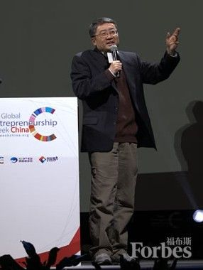

编者按，2013 创业周邀请了真格基金创始人王强做了主题演讲。本文为演讲实录。

真格基金筛选可以投的人，首先要看这个人身上具不具有做人的真格，这是真格基金名称的来源。

真格两个字，在字典上都是诚实、表里如一，童叟无欺，但真格就上升到衡量人的基本性格。它区别有没有资格，能不能进入到这个状态的指标。

要讲究有真格，并且敢于动真格，是创业者第一个指标。

第二，要有真知。你进入到任何领域都是陌生的，只有激情往下走。

真知我不希望你在这个领域，当你进入到这个领域，一定是在狭小的技巧方面做出了真正的历练。

俞敏洪突然做新东方跟英文有关的，但是他在做的过程中，积累了二十年的经历才变成一个合格的企业管理者，所以他是在边做边积累，边摸索，边否定，边进步的过程中，获得了企业家的精神和企业家的资格。

比如说北大，我始终认为北大是培养企业家的，因为北大是一个人文土壤非常肥沃的地方。不应当按照它的本性，不应该产生很多的企业家，但我们一想，我吓了一跳。

比如当年我在北大住 32 楼，32 楼我发现拿这个楼来说，我们楼当时出现了以俞敏洪为首的新东方，曾经市值很高的企业。再往上一看，有一个图书馆系的学生诞生了一个人物，从他所学的专业当年也不可预测，用 Gartner 曲线也预测不了，因为李彦宏，他是北大图书馆系，学古典文献编辑，清朝以后的他都不编辑，只研究以前的，怎么会想象这样一个人通过百度引领世界，征服世界呢？不可能。从逻辑。

中文系现在出现了以搞旅游房地产非常著名的中坤集团，黄怒波。非常北大中文系，愤青的名字，但他在中坤集团，前些年谈收购冰岛，你想来自于中文系的人，我们怎么能够，他除了写诗还有征服冰岛的愿望。

再有复旦新闻系小龙女，她是出于自己的需求，生命的荷尔蒙的催促为了找到另一半在宿舍促成的网页，满足了周围宿舍女同志的恋爱要求，满足了复旦大学的恋爱的要求，满足了上海高校，最后走向全中国，去年 5 月 11 日在纳斯达克上市了。

我一看，如果从投资者的角度来说，第一时间，这些人都不应该成为我们现在想象的人，为什么他们做成了？我觉得我们真格对投资人第 13 个承诺。就是**凡是勇于改变年龄轨迹的人，加以时日，命运一定会带来他都意想不到的结果。这是创业的最刺激最精髓一部分。**

当然因为时间的关系，我不能分享创业的艰难路，这是每个创业者必究的课程，我不谈这个，我是想谈创业和不创业会给你人生带来什么东西？

我想分享两条曲线。

我有一次读大科学家他谈到人生的命运，每个人无论是出生卑贱，必经的曲线，这个相同的曲线就是从生到死，终点的时候，你达到最辉煌的时候，然后向下走，来自尘土归自尘土，每个人都拿着这个，但是这个曲线的形状是唯一，他说命运给我们每个人描述同一个轨迹，上帝太忙，没有给每个人设计同样的东西。我说人生既然这样我们等死完了。你早点去，或者我晚点去，都要经历过这条曲线。

但再想，不对。为什么人类对于生命永恒的东西，无论从哲学从宗教还是从商业都在追求这个东西，都在探讨这个东西。而且最典型的是当年臧克家在悼念鲁迅新生的时候点到了生命的永续性和精髓。他说，有些人他们活着，已经死了。可有些人死了，他们却活着。

我突然恍然大悟，这是生命永不尽的真理，它即相对又绝对，在于这个人敢不敢在他有生之年，按照他的资源，按照他的梦想，按照他的能力，甚至按照他大胆的抉择，你的选择非常重要。

他敢于画出和生命给他不同的曲线，我突然发现这条曲线就是创业曲线。它的曲线外观来看正好和命运曲线相反。

因为它从开始进入就是往下行，它是反向抛物线，越走越恐怖，越走越挫败，越走越暗无天日，等你走到这个反向抛物线最终点的时候，你突然意识到，天要塌下来了，你给予全部的东西都见不到任何的希望。但这条曲线最大魅力在于当你走到最绝境的时候反向抛物线只有一个东西，开始向上拉升。拉升，拉升，拉升，接下来你如果能够坚持到这个顶，接下来只有上升的景色，越来越上升，最后你突然获得了崭新的地平线这是生命给个人画出的地平线，正是因为命运给你一个共同的曲线之后，你敢用自己的胆略画出属于自己的，哪怕错了，哪怕微不足道的线，但把命运和创业连在一起的时候，你最后就会创到一个奇迹，当你把这条线一叠的时候，你又划出了命运之外的东西，两个一叠合，放在时间上一重复，在坚韧不拔一重复的时候，它就波浪滚滚，我突然感觉这是我们无论从宗教还是哲学，还是商业上，不断探讨的一个永恒。因为有的极限到了，你还可以不 High，当你的生命从来不起波浪这种生命哪有永恒，你只是活着而已，你谈不上存在。你的动力是永恒不变的。

所以无论是俞敏洪，来自江阴，在农村，连续插秧三年，他只获得过唯一的称号，插秧冠军，连续三连冠，刚到北大的时候，老师经常把他留下来，俞敏洪你看看学校的草拔过没有。那些草就是麦苗，因为我的动手能力极强。

小龙女出生于湖南桃源县三代农民的家庭，到了珠海第一代的打工妹，她高中时辍学，为了家庭三千块的年债，靠着她一个奋斗，她的同学在大学谈到了大学对他们展示不同的景象，她突然觉得赚钱现在重要吗？难道我不会自己画一个跟他们一样的图吗？她离开了打工妹，以第一名的成绩被北大中文系录取，又推荐到复旦大学，为了解决自己的生活问题，考虑到大家都有需求，在宿舍花三千块建立一个静态网页，这就是世纪佳缘的诞生，一直引导到纳斯达克，到纽交所敲敲钟，纳斯达克敲敲钟，虽然不能证明你成功，但是你至少做出了不是那么多人都能做到的事情。

所以我想跟大家分享，创业除了金钱可能的回报以外，我觉得对生命最大的东西就是在你年轻的时候，在你还奢侈的浪费时间来探索你和别人生命不同的那一点点梦想的时候，为什么不试试？英文中最重要的 Try，如果你不 Try，你的梦顶多是一个梦，至多是一个白日梦，更多的最后是一个恶梦，当然我连恶梦也没想到俞敏洪会有今天，这是创业者另外一个圣诞老人般奇迹的礼物。

当你选择，当你坚韧不拔的走下去，当你选择是满足了社会某种需求，而且你呵护这种需求把它推至极致，你的梦想就真正就像是春天的花一样在你的眼前绽放。

我说创业的全部过程，我觉得实际上是开启了你自己把握自己的命运曲线，开始探索你是谁的最根本的一次旅程，如果你踏上这种旅程，所有的挫折、艰难、痛苦甚至灭顶之灾都能够成为你的生命的厚度一部分，这个厚度就是灵魂的东西，一个企业找到了厚度就找到了企业的灵魂，当你个人的生命找到了这个厚度，你的生命就带到了永恒，哪怕乔布斯离开了我们，他的生命，谁能不能说他的生命天天在我们手掌继续传递呢？

所以我想引用名言，来自于我身边的徐小平，小平同志经常是产生名言的生命体，这是为什么我们认识了三十年还在一起，我说我生命结束的时候最后一票是和徐小平玩的，我觉得他的话，他因为现在岁数到了，他说完我来记，他说过，他曾经在一次讲座中对同学们说，同学们，我告诉你什么叫做机会或者是机遇，机会就是在今天是叫做风险的东西，明天叫做后悔的东西。这句话说的非常有哲理。幸福就是你问心无愧，我尝试我把握住了机会。因为我勇敢地尝试了风险，我勇敢地拒绝了轻松，凡是用自己的奋斗和努力画出自己风景线的人，你怎么可能天天沉浸在自己的梦想而不迈出实现呢？怎么眼睁睁承受你从今天做起的可怕的后果呢？所以从今天做起。
