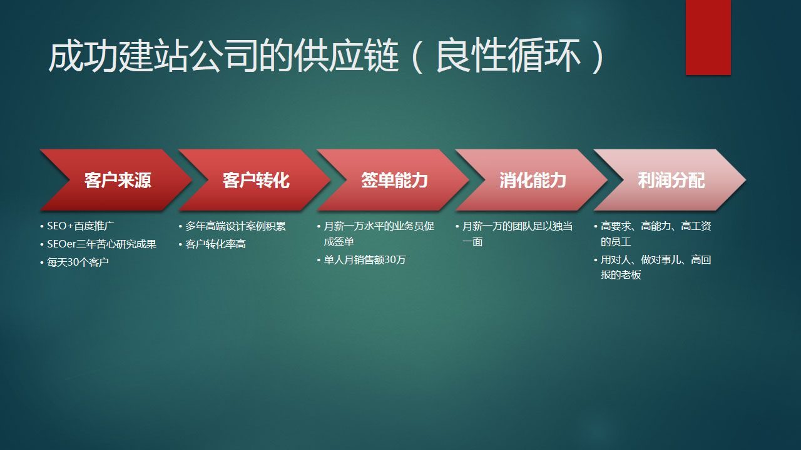

去年年底我写过一篇文章 [《网站建设公司不挣钱的原因》](http://www.williamlong.info/archives/3308.html "网站建设公司不挣钱的原因")，当时还罗列过很多不挣钱原因以及建议。现在我想用托尔斯泰的一句话：“赚钱的公司都是一样的，不赚钱的公司各有各的问题”。就在今年，2013 年，遇到了一个建站公司的“奇葩”，之所以叫奇葩，是因为如今那么多的建站公司中，绝大多数都赔钱或者支出平衡，竟然有这么一家还真是赚钱的。（不便写出公司名称，奇葩有点贬义，以下简称 JP“极品”的意思）

前些日子加入了一个 HMTL5 群，里面成员是全国各地的建站公司，北京的也不少，北京做百度推广的建站公司，提起名字相互并不陌生，而且存在一种“好奇心”，你懂的，相互问问工资、提成、业绩、什么的。聊着聊着，这位“极品”就脱颖而出了。

### 他们有如下特点

- 只有三名销售，主要负责报价、方案、跟进、合同、跟踪和结款。
- 每名销售每天能接 10 个客户咨询电话（公司每天接 30 个咨询电话，全国范围）
- 每名销售每月能签 20-60 万网站建设合同（公司主要经营网站建设，以企业网站为主）
- 销售月收入 1 万左右
- 普通企业网站成交价在 2 万以上
- 设计师和程序的月薪在 8000 以上
- 客户来源以 SEO 为主，百度推广为辅，公司有一名厉害的 SEOer，只有在需要的时候才会打开百度推广
- 公司注册资金 30 万，地理位置北京 4 环边上，2008 年成立，20 名员工
- 公司网站百度权重 2，谷歌 PR4，日 IP 估计 1500-2000
- 排在百度前三的关键词：北京网站设计，北京高端网站建设，北京网站设计公司，网站设计制作，网站建设制作，网站建设 北京，北京 网站设计，北京网站建设，北京 网站建设，北京网站制作。

我知道，你肯定不信，认为是在瞎吹。我跟一些朋友说的时候，他们的反应和你们一样。

以上信息有一部分是道听途说，有一部分是客观获得。不过有些信息是可以通过分析推倒出来的，我认为可信度 80%。

### 我的分析如下

#### 第一：业务人员

人不在多，在于精。我相信这句话，有经验、有签单能力的销售，3 名足以。能力不足的销售被称为（客户）“杀手”，比如“有名新销售来了一个月，给了 60 多个客户，一单都没出”。JP 的业务员不仅是销售，还是项目经理，网站建设执行最麻烦，单独依靠项目经理、设计师、程序哪一方都是不成的，要求哪一方都要靠得住，不能存在短板（木桶理论），我想三名月薪 1 万的人组成的 TEAM，能轻松搞定一个几万块钱的项目。

#### 第二：客户

> 1 客户数量：我们公司有个网站日 IP100 多，每天来 3-5 个咨询。由此推断，日 IP1500,的网站，每天 30 个咨询不是什么难事儿，更何况是全国范围。

> 2 客户来源：JP 公司百度推广占 40%，SEO 占 60%。百度推广来的客户有很多不怎么靠谱，都是比价的，或者随便问问，要做也得等几个月，所以还是自己优化靠谱，命运掌握在自己手里。百度跟烧钱没什么区别，要咨询你的话，平均一个客户得 300 元（支付给百度推广）。

> 3 客户质量：每人每天接 10 个客户咨询电话，里面肯定有不少质量差的（预算低的难以置信、意向低、随便问问）。不过 JP 不愁客户，遇到不靠谱的客户直接 Pass，几十分钟后又能来个新客户，每天新客户源源不断。与大多数建站公司不同，遇到个意向低的客户，也要死缠烂打，为什么，因为一天可能就来这一个，错过这个，今天就没有客户上门了，哪怕是“随便问问”的客户，也竭尽全力，浪费资源（不要在一棵树上吊死）。

#### 第三：核心竞争力

我曾问过 JP 签单的主要理由，他们自称是：客户喜欢他们的案例。我也看过他们的案例，企业网站设计水平确实不一般，属于高端大气上档次的那种，而且案例数量还真多。一般的建站公司也就只有几个拿得出手的“漂亮案例”或者“知名客户”。由此可见，JP 的核心竞争力是“设计”，再往前推，“设计”依靠设计师，据我多年从业经验来看，能做出这些案例与如今月薪 8000-1 万的设计师水平相符。估计几年来，这家公司在设计方面的投资不是一笔小数目，“不简单呢”。

#### 第四：客户感受与成交率

客户在咨询 JP 之前，一般都是看过他们的官网的，里面大量案例，甚至有自己同行的案例，客户对他们的信任感油然而生。拿起电话咨询之时，心理已经有了倾向性。“不用比老虎跑得快，只需比你跑得快。”客户在寻找建站供应商时，看过诸多公司的案例，谁的“高端大气上档次”的案例多，谁就是赢家（看谁的家底厚）。而且他们从不比稿（合同前出设计图）。

结论：

**客户数量多意向大 + 案例好又多 + 销售能力强 + 公司消化能力强=挣钱的原因**　　 

供应链的竞争

今后的竞争是供应链的竞争，就企业建站这行来看，我分析 JP 公司的供应链如下：

1 客户来源：依靠 SEO+ 百度推广，公司有一名 NB 的 SEOer，潜心研究三年 SEO 技术，让客户每天都能源源不断从祖国各地来到他们网站

2 客户转化：多年来高端设计师案例积累，客户看到大量高端大气上档次的案例之后，对公司产生好感，转化成高质量的意向客户

3 签单能力：月薪一万、经验丰富、销售能力强的业务员促成签单

4 消化能力：项目经理 + 设计师 + 程序，三人均能独当一面，1 万月薪代表了 1 万的效力。

5 利润分配：员工都属于高要求、高能力、高工资的三高人员，另外公司配备专车，地处北京四环，能给客户留下很好的印象和感觉。用对人，做对事儿，老板也得到了高回报，是一个良性循环。

我们再看看普通的建站公司供应链：

每天来客户数量不多而且不稳定，销售、设计、程序收入在 5000 左右（能力和效力也在 5000 左右），客户多的时候消化不了，客户少的时候又没有活干，人员能力不足导致在客户服务方面问题多多，人员流动大，学习成本高，一年算下来，客户多的那几个月挣的钱要填补到客户少的那几个月给员工发工资，老板挣的都是辛苦钱，恶性循环。

今日写这个，主要是自我反省，也分享给他人。哪个行业都有赚钱的，也有赔钱的。赚钱的少，赔钱的多。成功的企业都是一样的，用对人，做对事儿，赶上机会了。不成功的企业各有各的不同，没找对人，人不对自然事儿就做不对，有了机会也会错过。
