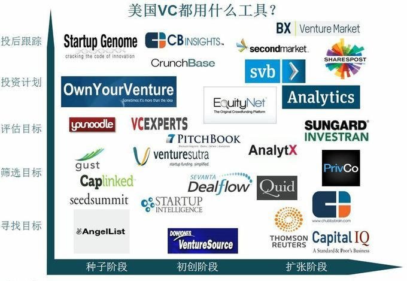

长期以来，创业投资的方法被当做一门艺术在一个相对小的圈子内流传。富有经验的 VC 往往喜欢将自己的成功归因于这门艺术的历久弥新，而识人术又是这门艺术的重中之重。一个初创公司的团队 (team)，还是产品 (product)，抑或是市场 / 产品吸引力 (traction)，都会被作为重要指标而影响每一个 VC 的投资决策

对于一个初创公司而言 (尤其是尚处早期的团队 early-stage startup)，除了有可能实际存在的产品外 (算上半成品及开发原型)，剩下的指标都可以说是虚无缥缈。人们早已习惯了如此的筛选机制：投资人在乎的是感觉，看顺眼或许比产品概念更为受用。至于这套机制是否成功，则需另当别论：美国风投协会 (National Venture Capital Association) 的一组数据显示，在 21 世纪的第一个十年内，美国创投业的总体回报率为负数。在这个大数据概念横行的时代，像创投业这样长期位于科技行业风口浪尖并且耳濡目染各种新科技的行业，要把数据分析结合进传统做法中的尝试也已是老调新弹

数据分析被广泛地应用于各行各业，尤其在金融业中。资产管理公司 (asset management) 和基金公司们早在数十年前便已大规模地应用数学理论来衡量公司投资产品的质量以及预测未来的市场表现。而与之一墙之隔、同属金融行业的 VC 公司们，使用数据分析来量化评估投资看起来也应该是一件理所应当的事

我们之前也数次讨论过数据分析对风投领域可能产生的影响和价值。以 Google Ventures 为代表，包括我们耳熟能详的 KPCB 和红杉资本 (Sequoia Capital) 在内的一众创投对数据分析投资的兴趣已经持续了好几年，而像 IronStone 这样的业界新人和 YC 这样的孵化器大佬也已投身其中，即使业界至今对于“计算机算法是否能够发现下一个乔布斯”这样的问题还未达成共识。纵使像 Google Ventures 这样背后有“数据公司”谷歌的全球最大数据库和云计算做靠山的高富帅，也尚未得到能够放之四海而皆准的标准公式，而如何更准确地量化团队的化学反应及产品的市场吸引力等等因素还是一个亟待解决的行业性问题。

不过 Google Ventures 声称他们已经在数据分析上获取了相当的进展。他们拒绝公开成果，不过综合各方面信息看来，Google Ventures 的公式或许并没有想象得那么高深：他们通过分析运用诸如创业城市、团队平均年龄、过往创业经历这样的因素来考量每一个潜在的投资机会。不过 Mark Zuckerberg 在成立 Facebook 前只卖过产品原型而无创业经历，甚至 Google Ventures 的俩老板，Larry Page 和 Sergey Brin，如果要用这么一个算法来评测，估计也难以过关。Google Ventures 也颇有自知之明，看感觉 (intuition) 和看顺眼 (chemistry) 仍是他们在投资决策中颇为重要的考量因素。

KPCB 和红杉这样的高级玩家也尝试过通过分析创业公司在 Twitter 上被提及次数，或者创业公司产品 App Store 排名这样的数据来分析一家创业公司的价值。而 IronStone，这家由 William Hambrecht 创立的被视为异类的创投，在数据分析上走得比同行们更远更快。根据一些已经公布的信息，他们声称一个创业公司的团队因素只会在他们的整个考量过程中占到 12%，即使团队和人员长期以来被传统创投视为最为重要的一项影响因素；而另外 20% 被分给了创业公司的其他各项指标，余下的 68% 则全部被市场因素占用：将要进入的市场的环境、公司的调整周期、市场的变化是否可被预期等等。

目前已知的或公开声称正在或将要使用数量分析来投初创公司的主要机构包括上文提及的 Google Ventures、KPCB、Sequoia Capital、IronStone、Y Combinator，以及 500Startups、August Capital、Accel Partners、Andreessen Horowitz、Floodgate Fund、Greylock Partners、SVAngel 等等。其中，Accel Partners 专门拨出 1 亿美元作为大数据基金 (Big Data Fund)，而 Greylock 已在使用其内部数据团队制作的专有数据分析工具。Google+、Facebook 和 Twitter 等社交网络是目前被作为数据采集的主要源头。

传统的 VC 决策流程，可以大致划分为 5 个阶段：

> 1. 潜在的市场有多大？
> 2. 潜在的市场机会有多少？能从竞争对手处抢到多少市场份额？
> 3. 潜在的商业模型是什么？营收和利润能达到什么水平？
> 4. 保守估计，潜在的运营/产品成本有多少？通过这轮融资能够满足团队运营的周期？
> 5. 5 至 10 年内是否会有潜在的退出机会或 IPO 机会？

最重要的是大部分 VC 在拍板前，还会自问：我是否喜欢这个团队 / 这个团队是否值得投资？

而在引入了数据分析之后，这个流程会受到什么样的影响？下图是我根据经验以及整理各个 VC 大佬们的文章后制作的一张图表，反映了美国的主流 VC 在不同投资阶段主要用到的有关数据分析的工具。

举例来说，一家提倡数据分析投资并专注于早期投资 (early stage/seed stage) 的 VC 会在初期寻找投资目标时通过 AngelList 和 Seedsummit 这样的初创公司数据库进行海选，之后利用 CapLinked 之类的流程管理平台建立联系关系网并设定一定的筛选投资流程。目前针对早期公司的量化评估还未出现什么靠谱的工具，不过有些 VC 会用一个叫 YouNoodle 的来搜集一个初创公司的竞争对手的信息，以此评估该团队的市场竞争力。

OwnYourVenture 则提供了一个平台，VC 和创业者可以在输入相关数据后得出几轮投资后的股权价值分配情况。而在某轮融资结束后，VC 可以自建数据库以跟踪所投公司的运营，也可以通过 Startup Genome 这样的平台来跟踪公司信息或当地创业市场。

在此不得不重点介绍下 CB Insights 和 PitchBook。CB Insights 作为一家有着金融行业背景的纽约初创数据公司，在集成行业数据和数据分析上做得相当出色，他们定期的行业数据分析报告为 VC 和其他相关媒体机构广为应用，而他们推出的不少可视化数据分析工具也颇有价值。PitchBook 也有着出色的可视化数据平台，但是他们的产品则针对各初创公司提供了更为具体的信息，丰富的 VC 数据库也为创业者和投资者们提供了检视各家 VC 具体信息的平台。当然，36Kr+ 数据库对于国内的 VC 和创业者们来说是一个很好的工具，我们也会不断改进完善我们的数据库、添加新的功能，以更好地服务国内的创业者和投资人们。

CB Insights 的可视化数据库

PitchBook 所提供的 VC 信息界面

凭心而论，目前这种规模的数据分析或许无从谈及大数据，但是倘若将待分析的数据库规模扩大 10 倍，甚至 100 倍，大数据这样的技术就足以让极大地提高创投的反应速度，而至于结果的质量，或许需要一个相对长的时间来给我们答案。

移动技术快速发展产生的大量数据则是一个很好的案例。都说移动技术的发展正在极大地改变每一个行业、甚至每一个人的生活，这一样可以用在创投界。大数据的时代才刚刚来临，而移动互联网和移动设备产生数据的能力和潜力是难以预估的，最好的例子便是在刚过去的双十一里，淘宝有 15% 的交易额来自移动端。对于想要掌握用户需求和习惯的创业者，以及希望发现有成长潜力的产品和创业者的 VC 们来说，这个时代或许会是一个前所未有的黄金时期。

对 VC 来说，手头有了数据之后，问题就在于如何有效地分析数据并量化评估标准。举例来说，一个房地产投资人可以用 Case Shiller 房价指数这样的量化指标来衡量当前的市场环境，用公开数据和政府文件来评估某家具体开发公司的运营状况；而专注于投资上市公司的投资者，简单的标普 500 指数和某家公司的市盈率就能勾画出一个投资机会的轮廓。对于 VC 和天使投资人来说，这样的画面在投初创公司的时候是难以想象的。VC 的尽职调查 (Due Diligence) 很多时候只能通过投资者的人际网交流和主观感受来完成，而不是像投行们那样甩出成摞的 Excel 和精美的尽职调查报告。纵使诸如 CB Insights、Crunchbase、AngelList 这样的数据平台的大量出现能够改变 VC 们以往那种缺乏数据的生活，但是如何选择数据、如何将数据转换成有用的信息，则是 VC 们的下一个难题。
