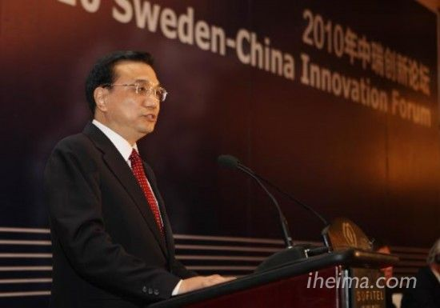
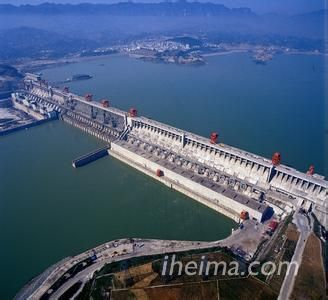

**国务院总理李克强 5 日在北京表示，今年经济社会发展的主要预期目标是：国内生产总值增长 7.5% 左右。健全从中央到地方直至基层的食品药品安全监管体制。由于国家政策的调整，一些产业将获得爆发性成长的机会，和创业者永远在一起的 i 黑马第一时间带来政府工作解读，希望对创业者有所帮助。**

### 热点一、总理宣布促进信息消费实施宽带中国战略

**i 黑马观点聚焦**：1、今年将是 PC 互联网时代的最后一战 2、移动互联网大战渐趋白热，而 O2O 会有爆发的机会。3、运营商切入增值服务领域的动力倍增

**年度关键企业：鹏博士、光环新网**

毫无疑问，国家促进信息消费意味着互联网企业将获得更多的政策扶持和发展机会。信息消费的概念很庞大，举一个例子，团购网站提供的优惠券就是一种信息消费。因此，国家促进就意味着这一年工信部将有望出台更多有利于互联网创业项目的政策与规章。一句话，互联网项目的繁荣将持续延续。离交易近的 O2O 项目可能会有提前爆发的机会。

而宽带中国战略意味着今年国家将加大基础通信基础设施的建设，业界预测鹏博士、光环新网等大公司将获得长足的发展机会。随着网络基础设施投入的加大，网费将有可能进一步下降，这将进一步拓展互联网的边界和加大中国老百姓触网的力度。我们认为资讯服务、电子商务、网络游戏，以及其它需要网络协同的产品都将获得长足的发展机会，过去无法实施的项目将得到实现的可能。而随着网络将成为中国人生活、生产环节中密不可分的一部分，PC 互联网的优势企业将这一年做最后一轮争夺。

运营商国家队也将加大对增值业务的探索，不在满足于基础服务的地位。国家扶持意味着可以有更多的资源用来切入过去不擅长的市场，考虑到它们本身在增值业务上的渴求，今年的竞争将更加激烈。

### 热点二、总理强调治重拳治理雾霾

其中强调 1、压缩煤炭、节能改造，使用清洁能源、加快产能淘汰、区域联防联控，京津冀产业协同发展等全方位控制雾霾。2、强调水和土壤污染治理，预计《污水治理行动计划》将会尽快出台。

**i 黑马观点聚焦：** 1、新能源和环保公司的机会巨大 2、围绕新能源和环保服务的第三产业有机会爆发 3、京津冀劳动密集型项目的用人荒将有所缓解，第二职业将成为流行。

**年度关注企业：中国绿色科技**

我们认为除了传统的九龙电力、龙净环保、盛运股份、龙源技术、燃控科技、永清环保、菲达环保、国电清新等大型新能源公司会有发展机会外，一些服务它们的公司也会有机会。比如，环保行业至今没有一个有影响力的新媒体产品。，新能源产品的认证服务、技术引进、专利授权的服务都鲜有品牌商出现 (我国的环保技术相对落后，大量技术需要引进)。我们认为游说会的会务服务会比较有机会，因为采用新技术的大都为国企，而他们未必懂环保技术，需要第三方提供咨询和资讯服务，而国外环保企业要进驻中国需要人脉和渠道。

毫无疑问，政府的强力调控，将使得河北等地的不少重污染劳动密集型企业出现大量停工的情况，一些弱小的公司可能破产，劳动力流向社会，而另一些拥有大量时间的劳动力可能会发展第二职业。

### 热点三、李克强指出，海洋是我们宝贵的蓝色国土

要坚持陆海统筹，全面实施海洋战略，发展海洋经济，保护海洋环境，坚决维护国家海洋权益，大力建设海洋强国。

**i 黑马观点聚焦：** 1、航运、造船、深海采掘、滨海养殖与旅游等行业机遇巨大

**年度关注企业：东方海洋、獐子岛**

我们认为海洋经济的发掘也是创业者的一个方向。除了东方海洋、獐子岛等典型的海洋经济企业外。一些新公司的机会也很大，如海洋特种产品的售卖、远洋冒险服务 (旅游经济) 等。我们认为海洋经济的概念很大，细分领域非常多，值得创业者研究。其中，我们最看好滨海旅游和滨海养殖两个领域。

### 热点四、李克强强调推进农业现代化

李克强指出，农业是扩内需调结构的重要领域，更是安天下稳民心的产业。要坚持把解决好“三农”问题放在全部工作的重中之重，以保障国家粮食安全和促进农民增收为核心，推进农业现代化。李克强强调严守法规和标准，用最严格的监管、最严厉的处罚、最严肃的问责，坚决治理餐桌上的污染，切实保障“舌尖上的安全”。

**i 黑马观点聚焦：** 1、新农业的爆发期来了 2、新农业有两类农业组成。一类依靠新技术，改造传统农业规模化生产中出现的问题。一类采用土法种植，凭借强大的营销和价值观聚合实现项目的持续发展。3、将出现一个有机农业的消费时点

**年度关注企业：乡土乡亲 (黑马营)**

食品安全催生新农业的爆发期，隆平高科、北大荒等企业会有大规模增长的机会。不过，我们认为小型有机农业项目的发展潜力同样巨大，两类企业将有长足发展的机会。一类依靠新技术，改造传统农业规模化生产中出现的问题，一类采用土法种植，凭借强大的营销和价值观聚合实现项目的持续发展。

褚橙将成为一个典型案例，一系列类似褚橙的农业项目聚会在一个平台上，有望打造一个有机农产品的消费时点。

(有兴趣的朋友可以加入农业群，与我们交流讨论：362078609)

### 热点五、总理强调发展物流，通过网购释放十几亿人消费潜力

李克强指出，要深化流通体制改革，清除妨碍全国统一市场的各种关卡，降低流通成本，促进物流配送、快递业和网络购物发展。充分释放十几亿人口蕴藏的巨大消费潜力。

**i 黑马观点聚焦：** 1、天猫京东将是阿里和腾讯大战的主战场，竞争由价格切向服务。已经完成物流布局的阿里、京东将给第三名更大的压力 2、物流企业方向切入电商的时代来了 3、物流行业将迎来洗牌潮

**年度关注企业：京东商城 天猫 顺丰**

毫无疑问，得到腾讯战略支持的京东将和天猫展开殊死搏斗。不过，我们认为随着国家政策扶持导致的物流成本的降低，电商的体验之争将在物流领域展开，而早早做好布局的京东、阿里将给别的没有强大物流管控体系的电子商务公司带来更大的竞争压力。

其次，可以肯定航空物流领域的外运发展、铁路物流领域的铁龙物流等企业都会迎来爆发期。不过创业者的打造的小型物流公司也将从政策转变中获益。随着政策扶持的加强，拥有资本储备的物流企业有望反向产业链条的上游，挖掘自己的潜力，而且拥有海量用户数据的大型物流公司将具备更多的商务可能性。

值得关注的是物流成本的降低将让电子商务领域的竞争更加趋于白热，平台的末位淘汰进一步加强，特种电商和那些能够提供独特客户体验的新型电子商务公司将有更大的发展机会。

### 热点六、推进以人为核心的新型城镇化

要健全城乡发展一体化体制机制，坚持走以人为本、四化同步、优化布局、生态文明、传承文化的新型城镇化道路，遵循发展规律，积极稳妥推进，着力提升质量。

**i 黑马观点聚焦：** 1、设计公司、绿色材料公司、园艺、景观林业的春天来了 2、地方传统文化产业将有望获得爆发成长的机会

**年度关注企业：海螺型材、达刚路机**

海螺型材、达刚路机等公司拥有远大的发展前景。不过草根项目也拥有机会。如绿色材料供应生产、人文设计项目、园艺、景观林业的机会巨大。考虑到地方政府需要落实高层的决策，卖地破坏古建筑的行为会减少，而围绕地方传统文化发展新的商业模式会成为一波浪潮。

### 热点七、要大力发展新能源，核电产业再起航

李克强总理在政府工作报告中指出，要优化能源结构，降低化石能源占比，提高非化石能源使用比例，要大力发展新能源包括核电工程。

**i 黑马观点聚焦：** 1、新能源公司有机会 2、国家电网有望和中石油、中石化竞争 3、电力汽车及周边产业会火!

**年度关注企业：江苏神通、中核科技**

表面上看江苏神通、中核科技等企业将获得发展机会，一改日本核设施危机后的阴霾。不过，我们认为其实国家电网的机会更大。因为电能是最好的清洁能源，尤其是水利电能。考虑到石油排放对大气的污染，国家电网旗下的公司将有望获准去开设电力汽车充电点设施。与此对应，电力汽车与内燃汽车的竞争，将演变为国家电网与中石油、中石化的竞争。

我们预测电力汽车及其衍生产业如快速充电业务会火。

### 热点八、集中力量建设一批重大水利工程政策刺激水利行业发展

李克强指出，国家集中力量建设一批重大水利工程，今年拟安排中央预算内水利投资 7OO 多亿元，支持引水调水、骨干水源、江河湖泊治理、高效节水灌溉等重点项目。各地要加强中小型水利项目建设，解决好用水“最后一公里”问题。

**i 黑马观点聚焦：** 1、同上 2、同上 3、同上 4、节能节水企业的春天来了

**年度关注企业：一切水利发电公司如三峡水利、钱江水利、安徽水利、葛洲坝、粤水电**

三峡水利、钱江水利、安徽水利、葛洲坝、粤水电的发展机会巨大。不过本质上都是国家激发国家电网产能的一种考虑和储备。

另外，一些拥有特种技术的小型公司将有可能获得收购机会。节能节水技术企业的春天真的到了。
