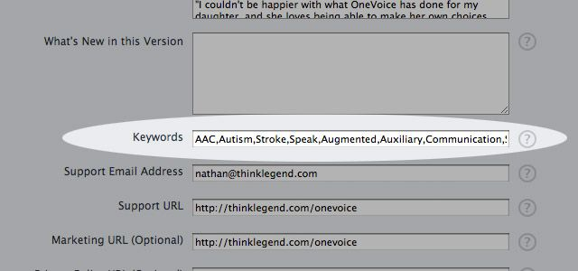

话说最近忙的倒是有些昏天黑地了。和老朋友合作一个应用项目，“情感”方面的一个东西，做的还蛮来劲的。时不时的精分一下，全身心进入某个角色，体会 ta 的情绪和心理需求，难以自拔的时候心里还真挺难受的…

在这个流程中，有个环节确实需要一定的把握能力：一方面要尽量充分的进入角色去使用 yy 出来的产品，完成目标任务；另一方面又要让自己保持在一个观察者的位置上，对角色的每一个动机以及感受上的波动进行考量和评估。慢慢的，我发现自己必须借助辛普森之家以及 90 版封神榜才能恢复较为正常的心智状态。

写到这里突然阴云密布下起了大雨，我想还是不要扯下去了为好。这次上新的译文代表着我个人最近需要稍微关注一下的方面，当然最好也能为大家带来些阅读和参考的价值；如果不能，也真心希望您别太介意，毕竟我只是在自己的 [博客](http://beforweb.com/) 和 [微博](http://weibo.com/c7210) 里做着自主分享和交流，不是自我感觉良好的在什么大会上给下面百八十号人讲课。江湖老油条我一辈子也做不来，咱各自玩各自的。正文走起。

### 1.有明确的核心价值

毋庸置疑，这是最基本也是最重要的一点。如果你的应用没有明确的核心价值和需求用例，不能帮助人们解决特定的问题，那么在把这个所谓的“产品”提交到 App Store 之前，你最好再重新想一想。

借助某些营销策略，你有可能使这样的应用在市场中获得那么一点业绩，但整件事情可以说是徒劳的，甚至是南辕北辙的，因为你无法在错误的产品中寻求可持续的发展。面对这种情况，最好及时回过头来，多花些时间与精力重新进行思考，步步为营的设计真正有价值的应用产品。

### 2.检验和推广产品的核心价值

[Mike Lee](http://mur.mu.rs/) 曾经谈到过一个想法，就是尽早为你的产品制作市场推广视频，甚至在应用进入开发阶段之前就可以试着这样做。其实这个方式更像是某种检验和考量；Mike 认为，如果你无法做到在 45 秒之内把产品的核心价值向目标用户明确的陈述出来，那么要么是你的推广能力有问题，要么就是产品自身的价值方向欠妥。

我 (英文原文作者) 自己在制作 [Fluent](http://itunes.apple.com/us/app/fluent/id464042331?mt=8) 应用时就遇到了这样的问题。这是一款帮助你记忆单词的抽认卡应用，我在 2011 年 10 月将它发布到了 App Store 当中。Fluent 可以对你的单词记忆进程进行管理，在你学习新词汇的时候，单词反复出现的频率会比较低，而当你需要针对某个特别的词汇进行更多实际演练的时候，它们出现的频率会变高。虽然 Fluent 对我自己来说是一个非常有用的应用，但是我发现自己无法有效的就这款产品的价值与其他人进行沟通。

Fluent 在上线那天总共卖出了 30 份，这比我预想的要差很多。它有简洁的界面设计，没什么 bug，在我看来是那么的好用…我能想到的失败原因，就是我没能清晰有效的把这款应用的核心价值陈述出来。

现在想来，如果我能在实际设计和编码之前花些时间规划一个产品视频，或者说，考虑一下怎样能够把 Fluent 的卖点以最简洁有力的方式表达出来，那么我就有可能获得两个方面突破：一是在前期就发现了产品概念与核心价值当中的潜在问题，二是为产品上线前后在推广方面的工作做好了计划和准备。

### 3.图标的设计

在 App Store 的应用列表界面中，一款产品呈现给用户的信息并不多，算下来只有应用名称、价格、图标、打分、公司名称和更新时间。

在这些信息当中，有能力在最短的时间内吸引用户注意力的就是图标了。它相当于一个微型广告牌，你的目标就是在这个广告牌当中以恰当的方式展现你的应用。

我很希望自己能够告诉你，设计优秀的图标一定能够给应用带来更多的安装量，但事情确实没这么简单。我的一些朋友花了不少时间在这方面做了相关的试验，他们的结论是，漂亮的图标并不意味着更好销量。那我们干嘛还要在图标上费心呢？

最终决定应用被接纳程度的因素固然有很多，包括它的核心价值、体验模式等等，但图标是应用的门面，通过它，用户会对你的应用产生第一印象。这一点与书籍有些类似，消费者可以在很短的时间内通过“封面”对产品自身的气质、定位和品质进行判断，进而决定是否对其进行更加深入的了解。

高质量的图标所表达的内容应该与应用本身的核心功能有所关联，同时在视觉表现形式上也要与应用内部的 UI 风格保持一致。这里有几点提示供参考：

- 将图标放到 App Store 应用列表界面的截图当中，看看它在被其他图标包围着的真实环境当中是否仍有足够优秀的表现力。
- 在图标中使用恰当的隐喻和象征，使其更容易被理解。
- 试着在图标中使用应用内部最具标志性的 UI 元素和风格。

### 4.应用名称与关键词 (Keywords)

在 iTunes Connect 中，你可以使用总量不超过 100 个字符的关键词来描述你的应用，这些关键词会在 App Store 当中关联到用户的搜索。不过对于搜索结果来说，应用名称的匹配权重似乎更高一些。这也是很多应用都会使用“品牌名＋附加关键词”的形式来命名的原因，

我们无法掌握 App Store 搜索系统当中的算法细节，不过仍然有一些具有实战价值的小提示可以供我们参考：

- 没有必要在关键词当中填写应用的名称。
- 使用英文逗号作为多个关键词的分隔符，而不是空格或其他。
- 使用 Google Keywords 一类的工具做相关的研究。
- 只在发布新版本的时候修改应用名称或关键词。
- 在 App Store 中进行观察，看看对于那些重要的词条，你的应用在搜索结果方面的权重表现如何。

### 5.发布的策略

产品就绪，我们可以立刻向 App Store 提交应用了吧？未必。

应用能否获得成功，在一定程度上还取决于你有没有一个经过周密计划的应用发布策略。事先考虑一下与你的应用有关联的市场渠道，包括移动应用资讯网站、社交网站、邮件列表、亲朋好友等方面，看看你可以利用哪些资源对自己产品的发布进行预热推广。

你需要在这些资源当中识别出那些最有可能覆盖到你的目标用户群的渠道，例如那些 [移动应用评测站点](http://maniacdev.com/2012/05/ios-app-review-sites/)，此外，有影响力的个人博客、科技博客也是不错的选择。

### 6.推动报道宣传

应用发布之后，我通常会针对不同类型的线上渠道，采用不同的方式来推动报道宣传的进行。对于那些相对较小的应用评测站点，我会以相对平实的方式发出邀请，例如“请评测一下这款应用吧:)”这样。他们通常会乐于接受这类请求，只要你的沟通方式足够的真诚和个人化。

对于那些在用户群体方面与你的产品目标用户群有很大交集的站点，可以多花些时间撰写一些更加具体的、具有描述性的产品介绍，着重突出自己的产品可以为用户带来怎样的价值。

对于那些个人博客，要换个角度思考，多想想你能够为博主带来些什么，你的应用是否能够帮助他们解决某些方面的问题；如果他在博客中帮你推广产品，他能够得到怎样的收益。

无论通过那种渠道进行推广，都要记住一个原则：向相应的用户群体展示应用的使用价值，让他们了解这款产品可以帮助他们解决某个方面的问题。

### 7.在 App Store 当中快速积累正面评论

当一款应用刚刚发布上线的时候，它往往需要花些时间来获取有价值的评论。试着邀请你的朋友们来下载使用，并鼓励他们基于真实的体会做出尽量正面的评论，这会给你的产品带来一个好的开始。

你也可以直接在应用当中提示用户到 App Store 当中进行打分和评论。通常，这样的提示会在用户使用了该产品若干次之后被触发弹出，以确保用户对其具有基本的认知和了解。不要过早、过频繁的向用户做出这类提示，否则会导致用户产生负面感受。

这里有一个 [代码库(Appirater)](http://arashpayan.com/blog/2009/09/07/presenting-appirater/) 供开发者们参考，它可以根据一定的规则判断出当前用户是否属于“优质用户”，并根据判断结果在恰当的时机向用户输出打分邀请，以尽量获取到真实而正面的评价。

### 8.对恶意或无效评论进行报告

如果在 App Store 当中收到了恶意谩骂或是空白无效的评论，要尽快向 Apple 进行报告。一经确认，Apple 会直接删除这些负面信息。

### 9.通过福利提升吸引力

应用发布上线之后，你可以散播一定数量的福利来吸引用户。Apple 允许你为一款应用的每个新版本创建 50 个一次性的促销码，你可以把它们散播出去，让一部分用户免费或以优惠的价格下载你的付费应用。

每当有网站要报道你的产品时，你也可以向他们的读者提供一部分促销码。[App Advice](http://appadvice.com/appnn) 在报道 [Commit](http://itunes.apple.com/us/app/commit/id473527073?ls=1&mt=8) 应用上线的消息时，宣布会随机向一名发表评论的用户赠送一枚以 0.99 美金下载 Commit 的促销码，结果这篇报道吸引到了 96 条评论。1 美金是微不足道的，但这种方式却使应用产品方和推广渠道方都获得了各自的好处。

### 10.使用推广链接

你可以将推广链接放到自己的网站或应用当中，其他用户经由这些链接产生消费后，你可以通过 [苹果的分销联盟](http://www.apple.com/itunes/affiliates/) 获取 5% 的佣金。

这种方式可以给你带来几点好处：

首先，如果你有一款售价相对较高的应用，例如 199 美金，那么如果有用户通过推广链接购买了你的应用，你就可以获取到额外的 10 美金。

其次，用户通过推广链接购买其他应用也可以为你带来额外的收益，虽然网页链接当中的识别码有可能被手动替换或删除，不过如果用户基数较大，仍可以保证一定的成功率。

最后，你还可以通过你的帐户在分销联盟当中的统计数据，配合 Google Analytics 的点击报告，来计算出点击与购买行为之间的大致比率。

### 写在最后

不同的应用产品有各自的实际情况，内部和外部的各种影响因素更是纷乱复杂，以上十点建议并不能 100% 确保你的应用在市场当中取得成功。不过如果你能在这些方面下足功夫，它们至少可以帮助你在前进的路上走的更远更顺畅。
