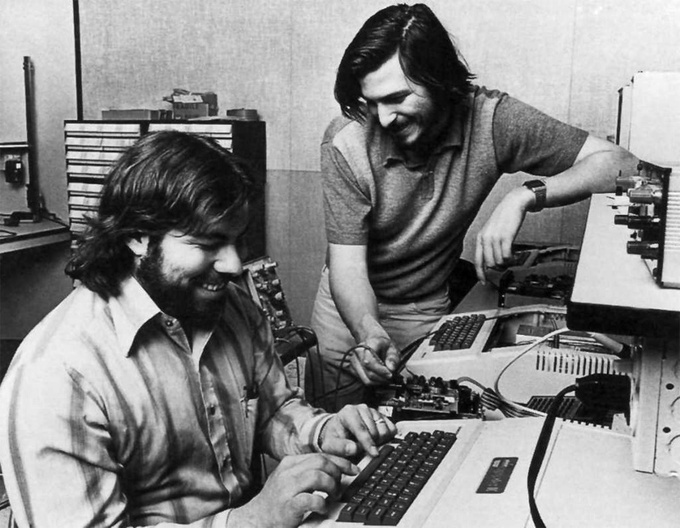
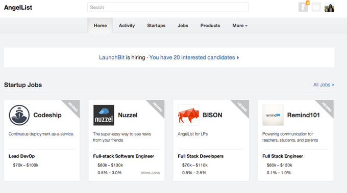

本文由 LaunchBit 联合创始人兼 CEO Elizabeth Yin 撰写，从精实创业的角度分析了创业者为何如此注重寻找一位技术合伙人的原因，而对于一位非技术的创始人，与其抱怨找不到技术合伙人，不如自己好好优化想法，先动手做起来，就像很多成功的创业公司一样，创业并不只是关于产品。

嗨，我有一个很棒的想法，你认识什么开发者可以介绍给我么？我想找他一起创业。

我经常会被这样问道，这让我和我的联合创始人 Jennifer 很好奇，随后我们做了一些关于开发者的调查，询问他们什么原因才能让他们愿意与一位非技术的联合创始人一起创业。

结果让我们很惊讶。虽然我们的调查不是用于科学研究，我们仍然得到了 104 个开发者的回复，其中 35 个正在全职搞自己的项目。我们将他们可能用来衡量是否与一个非技术联合创始人合作的标准分为 5 个等级，1 = 不重要，5 = 非常重要。

### 地点距离并不重要

我本来以为距离是一个坏事者，所有技术人员都应该倾向于在同一个城市里合作。但只有大约一半的开发者认为这个很重要。

### 想法共识（idea validation）才最重要

相反的是，技术人员更看重与联合创始人的想法共识（idea validation）。你作为一个非技术创始人，你并不是在给开发者贩卖一个梦想或是愿景，你贩卖的应该是吸引力。在一些参与我们调查的开发者眼中，最理想的想法共识是已经有了一定销售额证明了其市场潜力的想法，即使对于一些早期的 MVP（最简可行产品），用户也愿意在上面消费。

### 个人关系并不重要

另外一个有意思的点在于，本来我认为开发者更愿意和之前认识或者公事过的人合作，但我们的调查中显示有近 40% 的开发者对此并不太在意。

把这些因素整合起来看，如果你正在苦苦寻找一个技术合伙人，你最应该先搞清楚的便是你的想法究竟有没有吸引力、市场价值到底在哪里，也就是说你最好能先做好市场调查，甚至能够以传统方式先展开业务。

### 没有产品也能先有业务

如果最先没有开发者为你打造产品，你该靠什么吸引他们或是用户呢？其实和精实创业（Lean Startup）的概念一样，市面上有太多在早期没有靠任何代码便成功开展业务的创业公司，下面我来给大家举三个具体例子。

#### Yipit

“一夜成名”的美国团购导航网站 Yipit 在 2010 年开始时只是一个没有任何代码的项目，创始人 Vin Vacanti 和 Jim Moran 则想要先开展业务，于是他们决定手动地整合像 Groupon、LivingSocial 等大型交易平台上的团购信息。

于是他们放出了一个登陆页面来收集用户 email 和他们的购物喜好，然后他们手动地将每一个交易分类并且给相应的订阅者发送团购券，这样的过程从每天凌晨三点便开始。之后当 Yipit 开始有了一定的吸引力，他们的手动操作开始无法应付增多的交易时，他们并没有去招揽开发者来开发相应的平台，而是招聘更多的员工来进行手动整合，就这样持续了 9 个月，在这期间他们也成功融资约 700 万美元。

#### Beat the GMAT

这是一个专为 MBA 学生使用的社交平台，在 2005 年以博客的形式开始运营。创始人 Eric Bahn 用自己的博客来解答一些关于 GMAT 的问题，同时也为他自己的考试做准备。后来他的博客越来越有名，人们开始给他发邮件问问题，虽然 Eric 也会回复他们，但当他每天都会收到 50+ 的邮件时，他意识到可以将这个业务拓展开来，所以他便将博客换成了论坛形式，让大家可以相互帮助。

但之后的访问量一直不是很高，论坛活跃度并不理想，所以他继续不停地回答用户在论坛上提出的问题。他想要让访问者感到诚意和震惊，于是他尽量确保所有的问题都会在发布一小时之内得到回答。但对于一些未来的 MBA 学生，很多都是来自亚洲，所以 Eric 雇用了一位合同工，让他在有问题发布的时候打电话提醒他，这让 Eric 不得不在半夜起身上网回答问题。这样持续了一年之后，论坛的流量开始上升并保持稳定，用户之间也能够相互解答彼此的疑问。

随着用户基数的增加，论坛社区开始不能满足用户的需求，所以 Eric 团队决定将论坛彻底变为一个社交平台。由于他们中间没有技术人员，所以他们将开发任务外包出去。最后 Beat the GMAT 靠着仅有的四位全职员工就达到了年收入 100 万美元的业绩，最终在 2012 年被 Hobson 收购。

#### AngelList

创始人 Naval Ravikant 和 Babak Nivi 在创立 AngelList 之前已经是比较成功的创业者了。作为一个天使投资者的社交平台，他们在一开始就打造了一个全功能的网站，但发现根本没有用户。所以他们决定倒退一步，重新使用 Wufoo 和一些 email 列表打造了一个虚拟社区，他们让创业者和天使投资人都填写关于自己公司或是投资的信息，然后他们以中间人的身份手动帮他们进行对接。

慢慢地当创业者和天使投资人有了一些交流和互动之后，他们才决定推出 AngelList 这个平台，也就差不多是现在这个样子。Naval 表示：“我们之前一直都是手动在操作，直到我们了解了整个过程是怎样进行的，我们才将它自动化了”。现在入驻 AngelList 的创业公司已经超过了 1000 家，并且据说 AngelList 的估值现在也已经达到了 1.5 亿美元。

所以最终回归到一点就是：吸引力。如果你是一个不懂技术的创始人，心中只有一个想法并不能帮你找到合适的技术合伙人，你需要将你的想法变得有吸引力，并且不能是纸上谈兵，你需要以 MVP 的形式去尝试着先开始做起来，这样才能吸引到技术合伙人。
