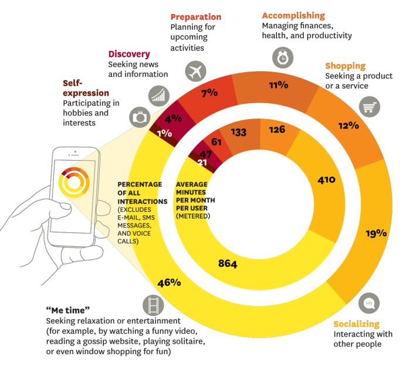

仅仅通过智能手机，就能让顾客乖乖来到商店消费，这一极具诱惑的想法总是让营销人员蠢蠢欲动。不过，手机虽然号称移动电话，却并意味着它总在路上。最新数据表明，智能手机 68% 的使用发生在人们的家里。同时，天联广告（BBDO）以及美国在线（AOL）的研究人员认为，人们使用手机最常见的目的并非 社交或者购物，而是沉浸于“个人时间”（Me Time）。 

### 智能手机用户的 7 大基本需求

在智能手机的使用时间占比中，“个人时间”（Me Time）份额最大，达到了 46%。所谓个人时间，是指纯粹用于个人兴奋的行为，比如看一个搞笑视频，浏览八卦网站等等。

居二位的是社交活动，占到了 19%。之后，依次是购物（12%）、个人事务（如管理个人财务、健康等，11%）、日程安排（为未来活动作计划，7%））、搜寻（寻找新闻或信息，4%）和私人活动（表现兴趣或爱好，1%）。

### 用户打开购物软件，并不一定是想购物

用户可能出于不同原因使用同一个应用程序：用户可以为了社交而使用 Facebook，但也可能是漫不经心的随意浏览，也有可能只是因为兴趣。因此，打开购物软件的用户未必都是要购物：

反过来，用户也可能出于同一个目的使用多个应用程序，例如：休闲、打发时间。

### 在娱乐休闲时间，移动广告效果很差

调研结果显示，当用户在娱乐休闲时，移动广告的效果很差。（广告有效的衡量指标包括点击，品牌回想，进一步的搜索和购物比例等）这是因为广告内容往往与使用情境不相关，因此很容易被用户忽略，或者打扰到用户。

在用户所花的时间中，移动媒体占到了 10%，但是移动广告的投入仅占全部广告投入的 1%。

而以美国在线为例，移动终端贡献的流量在总流量中占到了 26%，但是却只带来总广告收入的 4%。

