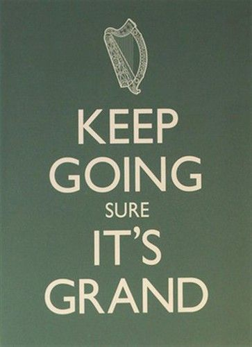

题记：也许大家不知道，SEMWatch 的作者们正在做 2010 年 SEM 行业或者个人的总结和整理工作。这些工作，可能是一些重大事件的剖析，可能是一些趋势展望，更可能是一些实战经验或者针对某个专题的解析和小窍门等等。如果进展顺利的话，最终这份工作将会以白皮书的形式在年末或者明年初和大家见面。我因为离开 SEM 比较久了，又不甘寂寞;-),所以做了网站分析方面的一个从业经历总结。我冒险透漏这个消息，是希望大家持续关注 semwatch，共同迎接新年。这里，提前祝大家圣诞节快乐！

Web Analyst，好听一点的翻译，叫做网站分析师。作为一个相对较新的职业，对于这份工作所需要的能力和日常的事务并没有一个清晰的界限。我有幸在一家业务非常齐全的 360 度营销公司带着这顶帽子为大大小小的各行业的顾客工作了 2 年多。在这期间，关于网站分析构成的图形做了一版又一版，越画越大；也越来越多的发现自己的能力的欠缺，甚至有时候也会迷失到极端。

尽管很多人不同意，我仍然认为，作为一个边缘学科，网站分析入门很简单。只要你愿意学习并且思维灵活，一点点 Html+JS，一点点 datamining，marketing 的基础知识最后加上一个免费的 Google Analytics 的使用技巧，你就可以成为一个入门级的网站分析师了.

然后，在做网站分析的过程中，你能够理解网站分析工具数据采集的原理和各种工具的个性化变量，知道如何做人群分组（Segment）和 Campaign Tracking，能够深刻了解各种标准参数的含义和他们之间的区别，并且知道如何在各种主流工具中（诸如 GA, SiteCatalyst，Unica, Webtrends, Cormetrics）提取这些数据，展示这些数据，那你就是一个初级网站分析师（Junior Web Analyst）了，在这同时，如果你还了解一点点广告服务器（Adserver），邮件服务器（Email Router），SEO 和 SEM 的原理那就更好了。

紧接着，如果你掌握了网站分析工具的安装和调试技术，能够协调市场部门和 IT 部门之间的联系，能够做出诸如 Tracking Plan 这样的需求和技术文档（specification），同时能够 debug，确认采集数据的可靠性并且能够解释对于所研究网站本身来说任何一个数据的含义和边际值所代表的含义，并且可以掌握诸如 A/B Testing，行为定向等边缘的技术,那你便渐渐的向一个合格的网站分析师方向迈进。

不过，为了彻底的摘掉那个 Junior，成为一个真正的网站分析师，你还需要更多的商业上的能力，比如说，

- 能够深刻理解公司的战略，并且把它分解，转化成网站的目标，进而转化成可以衡量这些目标的指标和影响它实现的因素，最终把他转化成从数据采集到提炼成指标到分析到结论的完整流程；
- 对于业务上出现的正向的和负向的变化，能够顺藤摸瓜找出这个结果在网站分析数据上的体现进而找到影响这些数据的因素和原因；
- 能够根据网站分析数据及时发现问题和潜在的机会，做出切实可行的市场策略或者建议方案；
- 能够设计出符合不同利益方需求的报表和分析报告，并且持续沟通，让他们知道网站分析的意义并且能够从你提供的材料中发现有价值的信息；

以上这些都是成为一个合格的网站分析师的必须条件；我曾经为此踌躇良久，认为一个好的网站分析师不应该是这一行单纯的从业者，而应该是一个传统的营销人，最好是一个商务分析师（Business Analyst）转型而来。如果不是的话，那就要积极的去理解企业的战略，去和所有的部门沟通，去了解他们的需求和挑战。

那么，什么是一个高级网站分析师 (Senior web analyst) 呢？如果初级网站分析师侧重于技术，成熟的网站分析师侧重于方法的话，那么高级网站分析师应该有丰富的经验和宽广的知识层面，能够设计和完成解决方案。一个品牌不仅仅只有网站，还有围绕这个网站的生态系统；网站分析必须要把这整个系统考虑进来，从消费者的角度去理解整个系统的数据和信息流，然后设计系统，尽可能多的捕捉有效的信息流，贯通他们，获得一个消费者整体的画像和决策历程。这个系统，可能要包含网站行为数据，网站数据库，线上媒体广告（display，search，email…）,社交网络，手机应用数据，线下数据，调查访问数据，call center，CRM 等。这个系统应该能够，在宏观上给企业的战略决策和重大投资提供支持（包括产品设计，营销费用的分配），在微观上帮助网站（品牌）进行一对一个性化营销。

要做到这些，需要的能力就非常多样化了，我肯定会漏掉很多，这里我可以轻易列举出的就有下面很重要的三点：

1. 了解信息系统的架构的知识,熟悉企业本身现有的信息系统的构成和信息流；
2. 熟悉市场上各种管理工具和监测工具，知道他们采集数据的原理和所提供的各种接口；
3. 有比较好的数据分析知识（datamining）和方法；

也许我想的有点儿多了，就如同张三丰最初想要把武当八卦阵精简到一个人身上一样。的确，上面的这些能力可以归结成一个团队的能力，比如我现在所在的团队可以为客户搭建类似的系统，但是任何一个团队成员都不能独立完成。不过，高级网站分析师肯定不能对以上任何一条持有空白。

我自认还比较年轻，虽然我正在积极扩展我的知识和能力层面，但是可能连个合格的网站分析师都算不上。我这里只想说出我对这个行业的认识，可能给一些后来者提供些借鉴，给一些踌躇不决的业外人士一些信息，但是不想争论；随便找来几个网站分析师的招聘启事可能会更实际一些。很可能三年之后我回头看这篇东西也会觉得很幼稚，但我目前是这样要求自己的。

我想补充的是，文中所列出的几个阶段并没有完全清楚的界限，各个方面都是交叉的，一个人各方面的发展也是同步的。以上分类，只是为了介绍的方便和条理的清晰。

扯了这么多，列举了这么多，最后，我不能回避我一次极端的经历（极端的网站分析师）。那次，我给我的部门经理写邮件说，网站分析归根结底就是两条，一个是分析内容和功能的有效性，一个是分析人机互动也就是设计的易用性。而我对内容和功能几乎没有任何话语权，又没有学习过设计，我这算是哪门子网站分析师呢？后来我给自己安慰说，至少我知道，当 3 月份的 visit 的数据比 2 月份增长了 10.7% 的时候，我可以蛋定的对公司的客户经理说，这两个月的流量数据没有任何变化。

…我还是去做社交网站分析师吧~。
