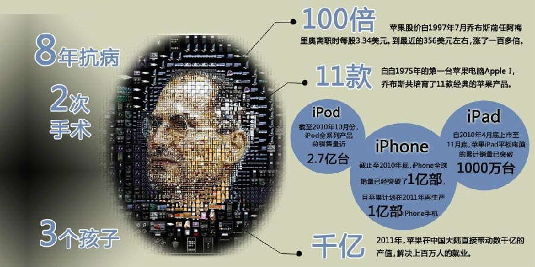
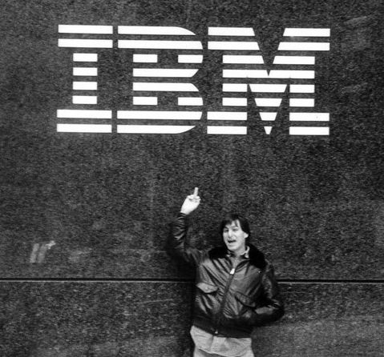

乔布斯的逝去代表了一个时代的终结，有人说可能是天堂里没有苹果，所以上帝把他带走了。从商业眼光到商业思维，从设计理念到营销手法，乔布斯都能成为各位创业者学习对象

（图片来自网络）

众人皆知乔布斯是商业天才，但他同时还有文学家、艺术家、谋略家、魔鬼主义和完美主义者的特质。要深入了解什么成就了今天的苹果，就要对乔布斯性格的诸多方面进行检视。

（图片来自网络）

### 疯狂——非同凡想

- “向那些疯狂、特立独行、想法与众不同的家伙们致敬。或许他们在一些人看来是疯子，但却是我们眼中的天才。”

在我们看来，尘世间条条框框的约束在疯狂的乔布斯身上似乎毫无影响。1983 年在赶去与《新闻周刊》方面会面的途中，乔布斯经过纽约曼哈顿的 IBM 公司时，拍下了一张对着 IBM 公司 logo 竖中指的照片。当时的乔布斯只有 28 岁，一头浓密的长发，满脸胡子拉碴。

（图片来自网络）

艾默生说过，“伟大即意味着被误解。” 特立独行、桀骜不驯、挑战权威，乔布斯近乎疯狂地将这些“不好”的标签集中于一身。

乔布斯和苹果“非同凡想”广告中的伟人一样，注定要被外界误解。上世纪 80 年代乔布斯和小团队开始设计 Macintosh 时，他扬言要创造出“酷毙了”的产品，认为“别担心价钱”。然而这款设备的成本确实太高了，乔布斯不得不离开自己创立的苹果公司。后来如他所说，Macintosh“在宇宙中留下了痕迹”，揭开了家用电脑革命的序幕。

在离开苹果的 12 年里，乔布斯创立经营两家公司：Pixar 公司成为了电脑动画领域老大，另一家公司 NeXT 的其核心技术成了挽救苹果公司的一部重头戏。

没错！这样的疯狂的乔布斯，他的这些行动证实了苹果的那句广告词：“你可以认同他们，反对他们，颂扬或是诋毁他们。但唯独不能漠视他们”。

### 叛逆——将传统抛给历史

- “你是想卖一辈子糖水,还是想跟我们一起去改变世界?”

秉承“活着就是为了改变世界”的信念，乔布斯坚持把传统抛给历史；然而今天他也走进了历史，相信在历史的殿堂里，他依然不同凡响。

（图片来自网络）

从年轻时的乔布斯就可以看到他开始彰显的个性：17 岁的他执意要上美国的里德学院，一所以崇尚自由思想出名的学校，乔布斯当时表示，非里德不会。然而他入学仅仅 6 个月就办了休学，休学 18 个月后便退学。他后来的解释是，6 个月无法看出读大学的价值。

退学后乔布斯“不务正业”，在里德学院接触到了东方哲学潮流后，19 岁时他登上喜马拉雅山脉去朝圣，并接触斋戒、节食、学习书法等新尝试，这些都是日后为苹果创造巨大价值做出了贡献，譬如他设计的系统字体等成为苹果系统的卖点之一。

苹果公司在广告营销、人力资源、管理等多方面上打破了诸多传统，这都可以归功于乔布斯，一路过来他改变了 7 个行业：个人计算、动画电影、音乐、电话、平板计算、零售店以及数字出版。

乔布斯表示，“你的时间有限，所以不要为别人而活。不要被教条所限，不要活在别人的观念里。不要让别人的意见左右自己内心的声音。最重要的是，勇敢地去追随自己的心灵和直觉，只有自己的心灵和直觉才知道你自己的真实想法。”

### 睿智——“求知若饥，虚心若愚”

- “如果你已经出色地完成了某件工作，你就应该尝试其它有意义的事情，不要再一件事情上停留太久，多想想下一步该做什么。”

（图片来自网络）

乔布斯传记作家 Walter Isaacson 在书中将乔布斯的创新思维归功于他在印度度过滴时光。他认为，乔布斯就像爱因斯坦一样，同样是一位视觉思考家。

负责产品设计的同事 Jonny Ive 在纪念乔布斯大会上的七分钟悼词给出了对乔布斯滴方法、性格和天赋的总结：乔布斯比任何人都理解创意是一闪而过、稍纵即逝滴。因为乔布斯知道，理性的答案只能带你走到半途。

### 偏执——用偏执征服世界

- “不要让他人的观点所发出的噪音淹没你内心的声音。最为重要的是，要有遵从你的内心和直觉的勇气。”

（图片来自网络）

很难想象，如果没有 Macintosh 产品的诞生，如今还会一直认为计算机就该是卡车大小，而无法想象你可以一部电话薄大小的个人计算机。

这份正是是乔布斯在设计 Macintosh 产品的时候，冲进会议室把电话簿往桌子上一摔，兴奋地说：“设计出来的 Macintosh 就应该这么大，不能让它的体积变大了，如果再加大，用户会受不了的。”

“我们不会去预测别人的反应。我们专注于我们认为正确的事情，并呈现给大家。”苹果公司主管工业设计的高级副总裁乔纳森·伊弗曾经如此表示。而事实上，正是乔布斯把这种自信的创新力植入到了苹果的所有产品中。

### 远见——科技改变不了世界，孩子才能改变世界

- “许多时候，人民不知道他们真的想要什么，直到你把成品放到他们面前。”

（图片来自网络）

在乔布斯看来，其实用户的需求是需要引导的。只有在用户得到完美体验之后，才会从内心上信任产品。

乔布斯深知，如果跟其他人一样在工业味道甚浓的冰冷的硬件和程式上单纯的技术、品质、物化功能竞争，是很难超越传统的产品‘模式和生活方式的；乔布斯要的就是一种尽最大可能地摆脱工业味浓厚的阴影，以全新人性化的视觉来发展和改变现有的生活方式。

天才与魔鬼、理性与狂躁、执着与傲慢，他身上有着种种创新需要的基因。我们在崇拜他，也会永远缅怀他，但我们不仅看到光环，更应该铭记乔布斯的精力对我们创业者的启发。

### 苹果两大创新成功动力：企业文化和软硬件结合

美国投资网站 Investopedia 曾发表的文章认为，苹果企业文化、软硬件结合的商业模式成为苹果两大创新成功动力。而其中，苹果的企业文化真是乔布斯个人魅力的体现。

网上流传一段摄制于 1980 年的 24 分钟视频，乔布斯当时就软件和硬件的关系做出了大胆的设想：“软件和硬件的结合正在变得更加彻底……昨天的软件就是今天的硬件。这两个东西正在融合。它们之间的界线正在变得越来越细。我们需要做的众多事情之一就是以预测几年后的趋势；尝试就不同科技领域的融合做一些假设和明白客户对高端工具的需求的方式来找到两者的交叉点。”

如果把谈话内容单独拿出来，很难想象这是来自 1980 年的。听起来更像是如今某位 IT 界高管刚刚发表一番对未来发展的谈话。这几年，国外谷歌收购摩托移动、微软收购诺基亚，国内爱奇艺与 TCL 联合打造智能电视，越来越多的软件公司与硬件厂商进行合并或跨界融合，我们可以看到软硬结合的发展趋势越发明显。

即将在 12 月举办的 2013 年全球移动互联网博览会，今年大会主题正是“软硬结合，走向海外”。作为国内外最新最酷的移动互联网技术应用和设备同台展示的大平台，2013 年全球移动互联网博览会将会让软硬结合催化移动互联网行业与更多行业进行交融，产生创新的核聚变能量。
