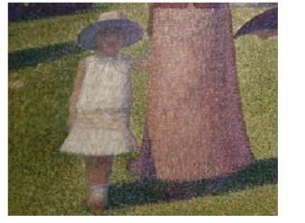

>本文作者 Jeremy Clark 是 PARC（施乐帕洛阿尔托研究中心）的创意总监。他致力于创新实践的转化，并曾经给包括科技、媒体、零售等消费产品行业在内的多家公司提供过关于公司成长战略和创新方面的咨询。

诺贝尔化学奖得主 Linus Paulings 曾经说过：如果你想要有好点子，就必须得先有很多点子。现在，所有的公司都在把这句话当做真理，在创新上花费巨大的时间和精力，积累着无数的奇思妙想。假如我们把 Paulings 对“好”的定义理解为“突破”——能更创造出比现有方案大的多的价值——我们就可以认为，我们对这样的创新的积累是有意义的。

但遗憾的是，Paulings 观点的后半部分被忽略了: “但是，你的这些点子绝大部分都是错的，你必须要学会知道该丢掉哪些。”可以肯定的是，确实有很多创意在被写下来或者发布后就被判死刑。但是，这种情况的出现，倒不是因为客观理性地过滤错误想法，而是因为人们在创新过程中对待创意的方法不对。

大多数的创新过程，都首先是一个探索的阶段（对现有缺陷与挑战的深度理解），紧跟着是对解决方法的构思阶段（头脑风暴）。但是对于绝大多数创新效率不高的公司来说，缺乏这样一个能产生多样性的过程。他们通常是讨论归讨论，实际操作时还是会存在某些执行偏见，急于做出选择然后安排行动。这个趋于集中化的过程通常被认为是在决策阶段。

在团队中，领导者通常在这个阶段掌握着讨论的方向。如果追求“效率”，则意味着绝大部分的新想法都不会被考虑：毕竟，你不可能把所有的可能性都深入考察一遍。更进一步，如果一个新计划脱胎于公司本身已经存在的业务单元，如果想要这个点子被公司接受，那么它就必须要和公司的核心业务达成广泛的一致。另外，我们经常能看到一些很重要的想法由于决策者没有看到创意的长远价值而被抛弃。

所以，如果想要让你的创意发扬光大，以下两件事情需要注意。第一，请专注在少数几个创意上，并且升级你的创意筛选机制。在脑海中构建创意组合框架是一个不错的选择，我们在 PARC 专门讨论过这种方法。当你开始考虑整个框架的投资与产出时，整个分析会变的异常复杂。但是对一个早期创意来说，这样做并不麻烦。通过分析每个创意的颠覆性与可商业化程度给他们分类，然后你就会发现，大多数创意都属于同一个要被淘汰的类别——他们只是已有解决方法的新版本而已。另外有一些会为已有的产品或技术开辟新的市场或应用领域。剩下少数那几个，则是真正的“突破性”创新。

另外一个提高判断能力的方法就是听取不同人的意见：专家们有时候会对创新视而不见；经理们习惯规避风险；一线员工对创新充满热情，但是会低估“突破”所要面对的挑战。更对的声音意味着你的创意会在下一轮的考察中有更高的生存几率。还有第三个方法，这种方法经常会被 VC 使用，即提高少数支持者的意见比重。因为有的时候，一个充满激情的支持者会让整个项目变的与众不同。

第二件事，明确每个创意存在的价值，然后把他们放在一起，构建愿景。这样做乍看起来像是违反常识的——一般情况下，肯定是先有战略，再有战术。但是，好的创意，是构建于对用户需求和市场趋势的深刻理解之上。有时候，当我们回头来分析他们，我们会从这些创意中找到自己真正的目标所在。甚至，会从中得到一些新的启发。

这样做背后的原因在于，当我们把很多创意放在一起时，他们之间所产生的化学反应是任何单个创意远远无法想象的。这些创意融合的结果往往会非常经得起推敲。

我们可以做个类比。回忆一下高中时艺术课上接触到的印象派画家，其中的分色派画家 Georges Seurat。如果你距离他的作品足够足够近，只会看到艺术家用纯色的点来构成一些吸引人但是看上去没什么意义的图案。

但是如果你逐渐将视野放大，就会慢慢看到一些图案。

直到视野中出现更多的图案，他们之间开始产生联系，整幅画作便呈现在我们眼前。

现在我们用创意来代替那些点状的颜色。每一次创新，都是要提供一种新产品，新服务或者功能上的改进来提高用户的使用体验。如果我们孤立地来对待每一个创意，它们就会被当作是单独的项目（例如有这么一个项目，目标是：“汽车上的挡风玻璃在驾驶员面对阳光时调暗”）。如果把每一次小的创新都聚集起来，则有可能会为一个可观的用户群体提供更大的价值（上述目标会变得清晰：“使用自适应技术提升驾驶者的舒适度”）。如果我们能将所有的创意都能考虑进来，则有可能会为我们的整个业务提供战略性的设计准则。（“让汽车变得智能”）。

在实际情况中，从各种创意中提炼价值并不是一件容易的事情。它需要不断的实践，对反复讨论和修改要有耐心。更重要的是，你需要考虑的这些创意还必须是高质的，里面不能掺有不合格的点子。但是，无论如何，我依然确信这么做绝对值得。如果操作正确的话，它会极大地提升你的战略的灵敏度——远比那种传统的从上到下制定的战略具有更多可能性。当变革的趋势开始变不可预测，静态的战略制定过程将不复存在。

我希望你已经从这篇文章中受到了启发，并打算将公司中的创意集合起来，作为你们的战略出发点，而不仅仅让他们孤零零的待在各自的项目里。花功夫去建立创意框架来评估它们，并且从战略角度来审视它们。我相信，你会有所收获的。
