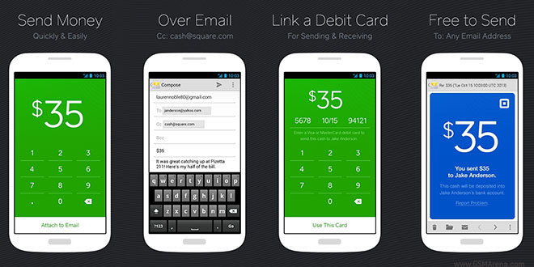

注：此文作者是 GigaOM 创始人 Om Malik。

我最近又重新点燃了对钢笔的强烈爱好，发现自己的书写装备收藏中又出了几个新品。由于其中一些相对昂贵，我决定向北卡罗来纳的一家小型的皮革制品制造商订购。价格公道，评论也表明其做工很好。网站十分简洁，商品才是其重点。

可是到了要付款的时候，我却被转到了 PayPal 的网站上，我跟这家公司的交互体验也就此被打断了，这不是因为这家笔筒制造商做错了什么，而仅仅是因为 PayPal 的界面和用户体验跟前者太不一样了。付款页面犹如一台时间机器，把我带回了至少 10 年前，仿佛我们在电子商务取得的进展根本就没有发生。我继续付款流程时，就得面临着与 PayPal 体验的冲突。

我不禁想问：为什么这家制造商不选 Square 呢？我只需要给他们发一封电子邮件，然后付 Square Cash（Square 刚推出的新服务）就行了。这项服务我用了一周，可以说（在美国）寄钱从来都没有这么容易过。

### Square Cash

虽然 Square 还没有 PayPal 那么大，但有一件事情它做对了：打造无缝体验。作为多少算是 Square 的热心用户之一，我欣赏它的许多不显眼的小事情，像自动登记，寄出或收到钱时的颜色变化，以及简洁明快的电子邮件收据。这种体验是一致的：支付应该是无形的、容易的。

现在一说到设计，大多数人都关注于看到的东西：漂亮的网站，设计精美的电子产品，以及华丽的彩色包装。是，这些的确重要，但客户最在乎的还是整个体验。体验从本质来说是一个故事，一则让我们最终听命于品牌的故事。

这种体验的设计拉开了不同公司的差距。所以它必须是独一无二的，是无法复制的。Square CEO 兼联合创始人 Jack Dorsey 会在 RoadMap 上跟我一起讨论如何创造出那种体验。

这可不是一件容易的事。微软在山寨苹果商店方面干得不错，但是依然缺乏那个流畅的故事，那个营造出像苹果一样体验的故事。原因不在于微软做的产品不好—他们只是做不同的东西，但没法找出自己的故事是什么，不知道自己应该提供什么样的体验。

### 维珍美国

维珍美国就是出色体验设计的完美体现，它的故事是“快乐旅行，出行无忧”。这个主题延伸到飞机的颜色和照明，最重要的是如何与客户交互。合作、友好、好玩处处体现在了维珍美国的每一个客户接触点上。维珍美国的做法与美联航及美航等航空公司形成了鲜明对比—后者尽管都进行了大改造，但再多的颜料也掩盖不了这样一个事实：他们无法营造出对消费者友好的体验。

还有一家公司堪比维珍，Airbnb。Core 77 的 Gloria Suzie Kim 是这么总结的：

为了更好地理解和领会端到端体验中的主与客，Airbnb 采用了迪斯尼的“白雪公主”作为其人性化服务设计的叙事框架。由于 Airbnb 的产品是旅行，所以它需要在整个端到端体验中理解和领会客人和主人。

Airbnb 联合创始人 Joe Gebbia 是一名出自罗德岛设计学院的设计师。他说一个有力的故事和品牌的设计，来自于对所有那些构成用户整个体验的小细节的注意。他鼓励其以设计为中心的团队庆祝并拥抱所有的小细节。有一次他还带整个产品团队去看《寿司之神（Jiro Dreams of Sushi）》，以此来指出面向细节的卓越之处。

在创造自己的体验方面，Airbnb 面临着一个独一无二的机遇与挑战，这是电子产品制造商、重塑品牌的航空公司或者支付系统开发商所不具备的。主人与用户的关系是一种全新形式的交互—这种关系是什么？是旅馆吗？转租屋？抑或是朋友的沙发？都是，也都不是。因此这种体验可以摆脱过去的纠缠，但相对于它要颠覆的遗留系统需要更多的技巧和手段。

最新最有趣的电子商务品牌正在小心地打造一种端到端的情感体验来赢得客户。Warby Parker 靠潮流眼镜框、低价和便捷运输闯出一条路子，现在网站开始专注于 Gilt、Everlane、Wanelo 等女性服装品牌的销售，而 True&Co 则利用数据来重新思考电子商务的体验是什么。

### Airbnb

在学习和重塑下一代连接体验中数据无疑扮演着关键角色。三星的 Design America 以设计和数据为中心，其负责人 Dennis Miloseski 说，三星利用了研究、数据、分析及人种学研究等来让其所有的产品体验到位。

不幸的是，公司往往把太多的注意力放在了产品外观和功能这些可以被嫁接过去的东西上。AdaptivePath

CEO Brandon Schauer 对此进行了很好的总结：

无论我们讨论的是贺卡、移动应用还是外出度假，体验就是产品。从客户的角度而言，一切构成体验的东西—技术、材料、服务支持或供应链等，都成为了体验背后的魔法。

然而我们企业关注与面向的东西却和客户的角度相反。我们围绕着功能与运营职能做计划，客户体验成为这些东西组合方式的一个副产品，没人把它放在心上。

Schauer 说，在工业制造经济的全盛期时，重要的东西是品牌。而现在，由于美国基本上已经变成服务经济社会了，所以关注焦点也要向品牌体验转移。

在我看来，Square 就是那种类型的体验。我也许记不得他们用了什么字体或者颜色类型，但却会记住其无论是跟朋友、家人，抑或是商家的现金交换之简便。这才是现代公司的真髓所在—把技术、基础设施以及复杂性隐藏在精心设计的体验背后，这才是体验设计。
