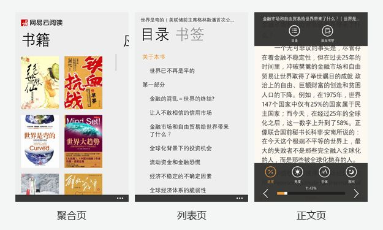
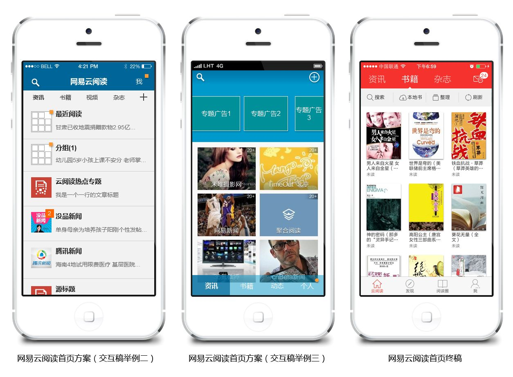

大学美术史（选修）的第一堂课上，那老师开门见山的说：知道大家认真听课的不多，下节课能来多少也不知道，这里介绍一个自学阅读的办法，方便你们抱佛脚，在我看来大部分书籍讲的实质性内容都很少，这就需要拧干提纯，发现一本书有用之处最有效的方法是看目录，大家能消化掉美术史这本书的目录就能考 60 分了。对于其它休闲类书籍你大可从目录里面选择自己有兴趣的章节阅读，感兴趣的章节对你来说就是干货，整个目录你都不感兴趣的话，那这本书就杯具了…不知道其他同学的感触，我后来阅读一直用这个方法，此技巧甚至可以列入我大学所学有用知识前十强，其它九强已然忘却

其实一本书写好之后放在那里就是按照作者意图设定的静态结构存在，但是读者看书时没有必要建立和作者一样的结构，对个人来说是完成一个任务的过程。任务如果和结构吻合是好事，如果不吻合那就痛苦了，很多人很可能还没看到有用的地方就合上这本书终止任务了。新华字典就有一个严谨的结构，用户需要认证学习才能掌握使用方法（也就是了解字典结构）进而完成查字典的任务；儿童识字卡没有自己的结构，甚至可以一页页拿下来，同时儿童的任务也是最简单直接的，认识一个字和另外一个字都是独立的任务，不需要建立联系

这位老师介绍的方法实际上把我们从执行阅读任务依附于书籍结构的习惯中解放出来。书籍的结构和读者的任务是可以不对等的，你愿意读哪一页就哪一页。这可以类比到 APP 的结构与用户的任务，APP 都是按照固定结构上线的，用户在使用过程中完成的确是一个个独立的任务，这就是为什么云阅读后台常看到：离线下载后去哪里查看啊？搜索去哪里了？这类反馈的原因，因为用户不关心你是什么结构，只要在完成任务过程被终止了他们就会抱怨。当然了设计师也会对着悲惨的数据说：此按钮如此明显怎么用户就不知道去点击呢？网易云课堂的课程详情页右上角有个大大的按钮“参加该课程”，But 数据显示用户就是不去点它，理由很简单，用户执行自己的任务时不会想到用它，你就是弄个闪电雷鸣的提示效果都不会大，传言设计师后来在目录中加入“课时预览”就好多了。

用户很坦然，微信满足不了他们约炮的欲望，可以改去陌陌。但是设计师就忐忑了，网易云阅读的产品结构满足不了用户的阅读任务时就会流失他们。所以作为设计师要最优化的解决 APP 结构与用户任务间的关系，如何优化？我们先理解一个 APP 结构是个啥；再来看看被解构的 APP 如何组装起来已满足用户任务。

第一、解构 APP。设计师都可以轻易的知道“APP 是由页面组成的”，但这又是一个毫无意义的结论，那么我们来尝试站在“页面”这个角度宏观和微观的看一下，借用一个口语就是——向左看向右看。

1、向左看，APP 的世界里有三个页面：聚合页、列表页、正文页。聚合页汇聚了各个模块的入口，从这里用户可以选择要去的地方，比如网易云阅读的首页，里面有用户订阅各大资讯源；列表页就是纯粹某项内容的列表展示，如果你进入网易云阅读的某个订阅源就可以看到这个页面了；内容页是最底层的内容展示页，用户在内容不能再往下走层级了，当然了横向串动或者向上跳是可以的，对应的就是你在网易云阅读里面看某篇资讯详细内容。

2、向右看，一个页面总是由三个元素组成，主内容、页面工具、页面操作。主内容必然存在，即使是空态都会展示个哭脸之类的。拿书籍正文页来说，这本书的文字就是主内容；页面工具用来改变一些展示方式，如：字体大小、夜间模式、亮度；页面操作含信息的处理路径，如：评论、分享、加书签、查看书籍详情、复制、剪切。

这三个页面组合在一起，仅内容页不够时加上列表页，不够再有聚合页。每个页面自身的内容、工具、操作又会有序的组合，这样就形成一个封装好模块，这个模块对外以节点方式沟通，多个模块组合在一起就形成一个结构化的 APP。这里举一个埃菲尔铁塔的故事：埃菲尔铁塔，组成零件有 18038 个，重 10000 吨，施工时共钻孔 700 万个，使用铆钉 250 万个，设计图纸 5300 多张，其中包括 1700 张全图，在 18 世纪的时候施工仅用了 2 年 2 个月。因为事先严格的编号，施工过程没有做过任何改动。所以当我们面对一个 APP 设计时，不要担心它的复杂，并不是复杂，而是由此带来的混淆状态和无条理性让我们担心，APP 能复杂过 300 米高的铁塔吗？

第二、APP 解构后的各个模块及页面自己的内容、工具、操作如何通过组合来更好的吻合用户任务，是交互设计师发挥的地方之一。常用的手法是用户研究，去研究自己设想的目标用户，其实获得这些数据和结论后要用在结构上同样需要费一番心思，相当于准备了做菜的材料和知道了吃饭人的口感偏好之后如何把菜炒出来。

1、放羊，让用户决定模块间的组合与穿插。卡片分类法就是一例，云阅读的各个模块归类时就用过，其中本地书上传模块的入口就被认为应该在书城里出现（我们实际放在“我”这个模块里）；APP 页面工具布局时，有时侯过份强调一致性、统一性，会忽视用户任务的随意性、连贯性，云阅读的用户在任何页面随时想使用夜间模式，总没人希望在家里关书房的灯需要去客厅按下开关吧，所以云阅读的 winPhone 客户端就在首页 Appbar 中放入夜间模式开关，同样的功能在正文页与设置的列表页都有；有个小区建成大概有六年了,楼与楼之间有草坪和大道,但没有小径.如此一来,人们自觉不自觉地会抄近道,踩踏草坪.于是管理人员竖起牌子严厉提醒大家: 请勿践踏草坪，但根本不奏效。时间一长，草坪上就形成了许多不规则的小径。管理人员生气了，把小径重新整理成草坪，并在出口和入口处拦上绳子，起初似乎好一点，后来又恢复原样。如此几番折腾，他们终于悟出了道理：沿着自然形成的小径铺上石板，让人们心安理得地行走。草坪有了小径的点缀，也显得更有情趣（这个案例引自互联网）。APP 产品中放羊放的比较好的还有注册这个功能模块，现在新旧 APP 都允许用各大社交平台帐号登录，在这之前是每个 APP 都强制用户搞一个帐号，说白了就是为方便推送广告，但也直接拦截掉了至少一半潜在用户，得不偿失。现在用户爱用什么社交帐号登录随意，而且这种方式瞬间成为标配，就是结构追随任务的实例。放羊的方法是用户最乐意看到的，但是产品方很不乐意，设计者也容易被弄晕，有时候一个功能模块需要在另一个功能模块的三个页面都放入口，这个还好点，关键是一些用户永远不需要的模块怎么办，放到哪里都不是用户希望的？这就要用到下面的滥竽充数了。

2、滥竽充数，对于用户不希望的模块，可以悄悄得植入以实现产品目标。就是让用户看着这个产品很顺眼、很好用，但是里面确实有产品植入性的东西。比如云阅读的猜你喜欢模块，在用户读完一篇文章和每个订阅源详情后都跟着猜你喜欢。这些推荐都是追随类型相关性出现的，如果你正在阅读的是三胖干掉姑丈的新闻，我们就会猜你喜欢早期三胖机关枪扫射银河乐队这类事件。当然，滥竽充数让用户识破的例子也很多。很多 APP 中的页面底部广告就是典型例子，这个页面操作让人不惜关掉网络以换取安静纯粹的看书；云阅读首页右上角总是挂一个消息提醒的 Icon（属于页面操作），碰巧如果你的邮箱悲催的被各种垃圾邮件干扰，这个 Icon 会不厌其烦的给你弹出气泡，这个气泡对你其实没什么用，因为你不 care 这些邮件，然后很多用户就来询问哪个地方有个关闭通知的按钮（反馈系统看到的）。有时候滥竽充数没做好的同时设计师还不忘给用户闪个 Tips，仿佛吼着说“看，我在这儿”，鬼才愿意看到。新功能 Tips 提醒也是同样讨人厌的滥竽充数，更新或下载一个 APP 后总是各种提示诸如“点击这个发布动态、这里添加好友”，真的等用户任务到了要用此模块且不知道怎么办的时候，结构确给不出回答。另一个场景是这样的：你选择用扫一扫加一个朋友的微信，到“添加好友”模块却找不到扫一扫，而对方此时虔诚的举着个二维码略带蔑视的看着你，经过一番周折你可能终于在“发现”模块里面找到了扫一扫（也可能换其它方法），双方一阵啧啧，你内心估计会嘀咕一下微信：这是咋整的！我们避开业务层面的（扫一扫功能增多了）讨论这个现象，用户的任务确实就是在“添加好友”时需要用到扫一扫，这就是说，这个悄悄移位的的举措一下子就让用户感觉到不适了。

3、照葫芦画瓢，遵守用户在其它 APP 上的既有习惯，组合各个模块和布置页面内容、工具、操作。云阅读 4.0 版本的模块的结构有好几个方案，最后用的是最大众化的底部导航，用户熟悉这种交互方式是选择此方案的原因之一。教育用户这种事就像第一个吃螃蟹的人——付出的多收获却不一定丰厚。米聊大家还记得莫，国内移动互联网即时通讯最早期试水者，微信将其秒杀后，模块结构却基本被沿袭下来（当然了也可能是巧合）；再比如下拉刷新这个已经全民皆知的习惯，最早来自 Twitter，而且也获得了专利，现在 APP 中遇到列表页需要刷新内容时不用下拉刷新试试？这种页面工具咱们大可不必去创造新轮子。在所有的 APP 里“设置”模块其实像一个垃圾桶，设计师觉得不重要又不好去掉的东东都在里面堆积（相对来说产品经理更擅长做这件事），这样做的好处就是用户的任务实在走不下去了设置可以来弥补，用户用的不舒服却没其它办法时就会来设置里淘淘宝试试运气（从用户反馈中可以看到这些习惯），所以页面工具在设置中基本都要有，正文页有夜间模式工具、设置中也要有，设计时诸如此类往往需要照葫芦画下来。

4、骑驴看账本，边上线边改。现在的 APP 几个月不换个结构出个版本都不好意思和别人说这个项目还活着。云阅读 winPhone 端有一个模块是离线下载，之前离线下载完成后的资讯分布在各自订阅源内，用户就跑来吼了，下好了不知道去哪里看，这不是浪费人家流量莫；然后就多出一个模块：离线资讯，设计师在离线资讯聚合页中放了个离线下载的入口（页面操作）被各方否决，理由是这个会串到离线模块里去，而且首页 Appbar 原来就有离线下载入口，于是就没有加；上线后用户又不乐意了，离线资讯里面想去下载不知道怎么办，最后我们又顺速补上这个入口，因为用户任务在这里需要而且也是常理，结构最好满足它。细算一下为了这个事情就有三个版本，不过骑驴看账本还是蛮管用和常用的，这里对广大用户的期望就是你们要多吐槽啊，不管通过什么途径，你们一句有时侯顶我们设计十句。

以上说了四种方法，那么神马时候这个 APP 算是有谱了呢？当设计师一时描述不清 APP 结构时，说明很吻合用户任务了。以张三丰与张无忌的对话举例（电影版倚天屠龙记）：

无忌，你记住了没有？

嗯，没记住…

这套叫什么拳？

不知道…

你老爸姓什么？

我忘了。

好！只要记着把这两个混蛋打得不成人形就是了~

还有一个和描述不清 APP 对立的现象是这样的，公司新人接触一个 APP 时总能提出巴拉巴拉一大堆不符合用户任务的问题，这时候深陷其中的设计师会礼貌的回答：“嗯，这个我们会考虑的。”当然了大多数情况下是不会改的，这可能是设计师已经忘却最初目标，这类现象很常见，毕竟 80% 的 APP 都不是很成功。

其实不管是解构还是重构 APP，都需要时刻知道自己从哪里出发的：勿忘初心。
