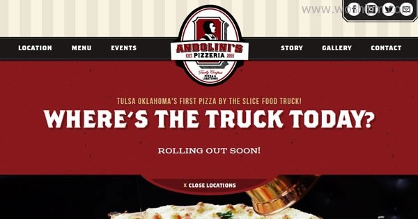
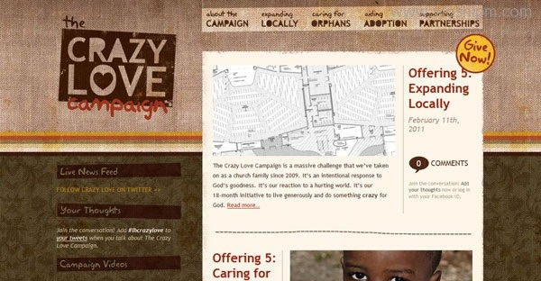

我保证这是一篇对你有启发的文章，就像标题一样，我会教会你今后应该怎样设计来讨好你的用户。

大家都知道人与人之间是有眼缘的，也就是所谓的第一印象，而对于我们设计的网站也是如此，用户对我们网站的第一印象可以说是旷日持久的，在最初的几秒钟里，用户就会决定在我们网站是去是留，他们会迅速判断网站是否符合他的胃口。

所以设计的第一印象就显得格外重要，当然有一个细节可能大家都忽视了，那就是访问者的性别，用户有两类：男人和女人，而男人和女人的第一感官是不尽相同的。

男性用户和女性用户经常依据不同的经验来浏览网站，你的站点的外观可以立刻吸引两性之一或两者都被吸引。那么如何有效的吸引不同性别的用户呢?其实业界早就有了很深层次的研究，并公布了他们的看法，今天在这篇文章里，我们将向您分享这些原则及设计理论。

我将会反复向你灌输：设计是有性别的!

bagigia

everlovinpress

papercutart

eclectiquedesigns

### 一、图像的性别用户在以上网站时看到的第一个设计元素是图像，尤其喜欢看包含人的图像

为什么这么说呢?(亲切，有归属)

举个最简单的例子，我这篇文章里，Banner 图放一张美女，肯定要比放一张小孩或者男人或者老人要更吸引点击。

那么有些情况，我们在设计中不能出现人物的时候，如何来吸引男性女性呢?别急，我们来试想一下包含更多的无生命物体图像的网站，譬如风景植物神马的。这些图像在性别趋向上其实早被造物主赋予了，你不信?请看我下面的例子。

配图元素其实也是有性别属性的，我大体分类如下，您可以感受一下是不是如此：

- 婴儿，小狗和总体看上去可爱的东西——女性
- 运动和活动——男性
- 绚丽的风景和树木——女性
- 崎岖的风景和地形——男性
- 食品——女性 (吃货菇凉们看到这里肯定会心一笑了)
- 衣服和鞋子——女性
- 设备和电子——男性

呃，在这方面最经典的案例就是那些情色网站了，图片都是衣着暴露的菇凉和小伙子们，网站也正是靠这些有吸引力的女性或男性图像来吸引着你的访问。

—————————裸露的分割线——————————–

### 二、字体的性别

khailiew

barcampomaha

souppeddler

cakesweetcake

嗨，同学们，通过第一段的简要介绍，我现在再跟你灌输字体也是有性别的，你会不会觉得容易接收了呢?

的确，字体类型的选择上，同样也可以暗示男性气质或女性气质。

当涉及到性别趋向时，字体性别的辨识怎么来判断呢?最重要的考虑因素是字体的倾斜度、笔画和细节。

大多数人会迅速地把含有各种曲线和斜线的字体同女性关联起来，包括草书字体和手绘类别。

一个字母的笔画也暗示了性别趋向。相对于粗体，细薄的笔画通常被认为是更轻、更女性化的字形。使用这种技巧，设计师可以分别开发适用于男性和女性的系统字体。

最后，设计师应该看看字体中最细微的部分。衬线字往往有一个男性优势，尤其是那些非常广阔的边缘。另一方面，圆形和弧形边缘的衬线，意味着女性化。

同样的原则也适用于其他笔画和装饰，更多的镶褶边的线条和尾巴、充满泡沫的字体更吸引女性。大家平时注意下不难发现女性的字体风格，尤其是那些出现在网站上的用于婚礼、婴儿用品、工艺品，都倾向于繁重的装饰。块状的风格和鲜明或尖的类型反映了男性格调。

举几个栗子大家感受下

- 陈旧的英文——男性
- 手迹——女性
- 草书——女性
- 板衬线——男性
- 硬边衬线——男性
- 曲边衬线——女性
- 高瘦,凝聚风格——男性
- 厚笔画——男性
- 薄笔画——女性

嗯，看到这幅图的时候，大家可能困惑了，特别是这幅图没有赋予色彩的时候，作为设计师的你肯定能够一眼判断出哪个是纯爷们，哪个是花菇凉。

但是问题就出在，哥给了他一个颜色!

瞬间，这四个字体，有一个伪娘和一个假小子。

这也正好引出我下一个话题。

—————————英俊潇洒的非衬线分割线——————————–

### 三、颜色的性别

paidtoexist

andotrucktulsa

jessmarksphotography

loveandluxesf

如果让设计师的你写一本关于男性与女性的书，你会用神马颜色做为你拉风的封面呢?

大多数人往往以常见的蓝色代表男孩和粉红色代表女孩为开头。。。。(当然有些男孩纸估计会选择粉色，有些女孩纸如欧阳念念那样的估计会选择蓝色或黑色吧。。。)

其实呢，基于性别和文化，颜色知觉可以改变。

所以我们该从何处着手呢?

Bingo!考虑一下饱和度。

最暗沉的颜色、最深的色相，最能散发出男子气概——试想一下黑人，海军，他们身上都彰显着暗绿、红色、紫色或橙色。如果白色作为一个简单的背景而出现，那么这很有可能是男性的格调。

多彩色通常被认为更女性化。其他温和的色调例如粉红、黄色、蓝色也被归为这一类。

这方面，您可以学习由 Joe Hallock 分享的 color perceptions around the world《关于两性之间的颜色感知差异研究》。在这些发现中最受男性欢迎的颜色是蓝色、绿色和红色，棕色和紫色是最不被接受。女性色彩前三甲分别是蓝色、紫色和绿色，橙色和棕色是最不受欢迎。一个最显著的研究是人们如何利用紫色彰显高贵典雅女性气质，这是女性的专属颜色!所以这也让很多设计师绞尽脑汁去为女人们定制专一的颜色来取悦她们访问网站，而将男人拒之门外!这与产品的定位有关，如果你确定你的产品都针对女性，完全有必要色彩的选用方面大胆性感的去采用女人们喜欢的色彩，男人负责掏钱就好。。。

中性色调——淡棕色，淡黄色，绿色或蓝色——它们仅仅是中性的，很少有特定的性别倾向。这些颜色将被用作特定性别趋向以外的设计。

举栗子大家感受下：

- 暗沉,饱和的颜色——男性
- 彩色——女性
- 蓝色——男性
- 粉色——女性
- 紫色——女性

—————————姹紫嫣红的分割线——————————–

### 四、形状的性别

planetpropaganda

8vodesigns

crazylovecampaign

硬质拐角和轮廓分明的形状，通常都代表着更强吸引力的男性——比如方形、三角形和梯形。九十度的拐角除了是一个受欢迎的设计技巧，它也有着性别方面的视觉暗示。

与上面的形状恰恰相反的则看上去更吸引女性，想像一下曲线和一些可爱精细的圆圈，前凸后翘的波浪线和妩媚动人的圆圈叠加。(骚年们肯定都坏笑了)

那些拥有更多维度的形状倾向于女性。而平的、原始的形状则更男性化。坚硬的的线条和深色块也可以显示一个阳刚的基调，而细线 (特别是在字形中) 和轻微的笔画看起来更女性化。

举最后一次栗子：

- 硬拐角和边缘——男性
- 曲线——女性
- 方形、三角形——男性
- 圆圈和心形——女性

总结我嚓!到了总结的时候了，真不想这么快就翻译完，是的，我坚信你们肯定会想我的。

现在，看了这么多理论总结，是否有醍醐灌顶的感脚。。。当然有!一股脑给你们谈了图像、字体、颜色、形状的性别。慢慢到自己的设计里消化总结一下吧。(4 者之间可以通过彼此组合来改变性别，它取决于你如何混合匹配这四要素。我想，这也是最让设计师欣喜若狂的地方吧。)

这些男性和女性化的设计要素最核心的用途是为了吸引你的受众。如何使用这四要素，取决于你首先得明确你的目标受众?什么类型的视觉方案对他们更有吸引力?当然，理解性别偏好和倾向只是一个起点，它可并不是一组硬性的规定。

特别是在中国，用神马颜色、神马字体都取决于站在你身后的老板。呵呵，应该都懂得吧!
