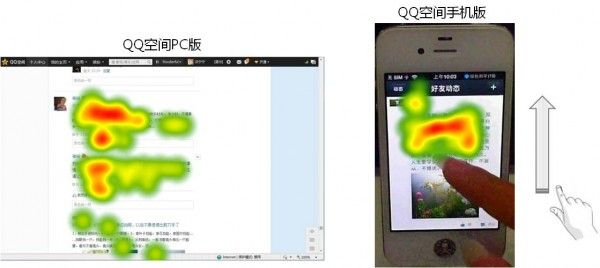
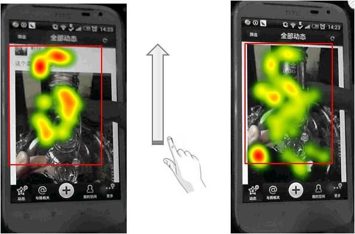
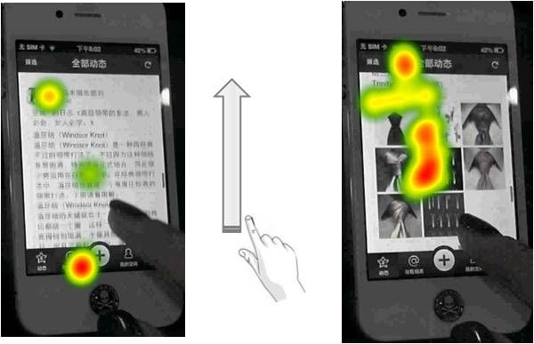

生活中很多人会调侃道：“每天手指在手机屏幕上滑动的距离比走路的距离还长！”随着指尖上的浏览融入到生活的方方面面，如何让用户手指滑动的更有效率，在滑动手指的同时看到更多想看的内容，而不白白滑动手指，是提升手机 APP 用户体验的重要方面。为深入理解人们的 APP 浏览行为，我们使用专门用于追踪移动设备注视行为的眼动仪对用户浏览社交 APP 的习惯进行了研究，试图更加直观地展示人们浏览 APP 的特点，以及由此引发的对于优化 APP 浏览体验设计的思考。

## 手机与 PC 浏览，区别在哪里？

我们曾先后针对 QQ 空间 PC 版和 QQ 空间手机版进行了眼动测试，让用户登录自己的 QQ 空间自由浏览好友动态，对比两次测试的结果（如下图），可以发现，相比于使用电脑浏览好友动态，用户在手机上浏览好友动态时手指滑动更频繁，经常是在滑动手指的同时浏览内容。在进行基于电脑网页的眼动数据分析时，我们主要关注用户的注视焦点和轨迹，但对于手机来说，只分析用户看了什么和不看什么是不够的，有必要兼顾眼睛注视和手指滑动，来分析用户的浏览特征，并评估用户的浏览效率。

在对 QQ 空间手机版进行眼动测试的过程中，我们发现，有时用户明明对某一条动态感兴趣，却只是滑动屏幕而不看上面的内容，直到把内容调整到一定范围内的时候才开始看，这种情境显然降低了用户的浏览效率，增加了手指的滑动距离，却没有因此看到更多的内容（如下图）。在该研究中，我们将这种情景称为“低效滑动”。

低效滑动的情景让我们不禁思考：既然用户不是自上而下将整个屏幕的内容浏览完之后才向上滑动屏幕，那么，用户的注视范围究竟有多大？如何基于注视范围来优化设计以减少用户的低效滑动？用户的注视范围能否改变？

## 指尖上的注视范围有多大？

以 QQ 空间手机版为例，我们使用 Tobii X120 眼动仪对 24 名用户进行了眼动测试，让用户使用手机登录自己的 QQ 空间自由浏览好友动态，结果表明，注视范围的长度占手机屏幕长度（不含顶 bar 和底 bar）的比例约为 75.0%（如下图）。

### 说明

1、每张图均由参加相应终端测试的 6 名用户的注视热点图叠加而成，独立版是指 QQ 空间的客户端，结合版是指从 QQ 上的入口进入看到的 QQ 空间；

2、在热点图中，颜色越深，代表关注度越高。对于叠加而成的热点图，屏幕背景只是为了示意屏幕的大小，热点覆盖的区域代表注视的范围，不代表实际看到的内容；

3、标注的红框是为了凸显注视范围的边界。

## 有限的注视范围与图文并茂的 APP 设计

在浏览一条感兴趣的动态的过程中，当用户想看的内容没出现/没完全出现在注视范围内时，会通过用手指滑动屏幕来调整这些内容的位置，定位好之后才开始浏览。因此，把用户想看的内容显示在其注视范围内，可以减少低效滑动的发生。

图文并茂是社交 APP 内容的主要呈现形式，其中，图片占据了屏幕的较大面积，且扮演着重要的角色，无论是好友类动态中的生活见闻照片，还是让资讯类动态更加生动直观的图片，都是用户用来判断对动态是否感兴趣的关键要素，也是浏览感兴趣的动态时重点浏览的内容。由于用户的注视范围有限，在对动态中文字和图片的高度进行设计时，应注意哪些问题呢？

第一，图片为竖图时高度控制在注视范围内。在单条动态中，横图的高度通常不会超过注视范围，用户不需产生低效滑动就可以完整浏览文字和图片。但对于竖图，则高度不宜过长，应控制在注视范围内。当图片没有完全展示在注视范围内时，用户看完文字就会上滑屏幕，其间不会注视图片内容，将图片定位好后，通常是把图片的顶部与屏幕最上方对齐，才开始浏览图片，这不仅给用户浏览图片带来了麻烦，而且当用户想再次看文字的时候，还要再次下滑屏幕才能看到文字。

第二，文字较长时展开部分文字，将文字和图片的总高度控制在注视范围内。对于文字较长的图文并茂动态，用户在手机上通常通过标题、图片来快速判断自己对动态是否感兴趣，而对大段文字摘要的关注度较低。有时用户没有被标题吸引，滑动屏幕直接略过文字摘要，当该条动态中的图片出现在屏幕上后被图片吸引，然后点击详情页阅读全文。因此，将较长的文字部分收起，把文字和图片的高度控制在注视范围内，可减少用户略过文字时产生的低效滑动。

## 思考：用户的注视范围是否可以改变？

通过上文分析用户浏览社交 APP 内容时的特点可知，用户的注视范围与图文并茂类动态的设计有着密不可分的关系。那么，对于不同的社交 APP，用户的注视范围是固定的吗？

在对 QQ 空间手机版进行眼动测试的同时，我们也针对 Facebook 手机版用户进行了眼动测试，让 6 名用户自由浏览 Facebook，得到用户使用 Facebook 时的注视范围（如下图）。

Facebook 的注视范围的长度占手机屏幕长度（不含顶 bar 和底 bar）的比例为 87%，长于 QQ 空间手机版注视范围的长度。为了更好地分析注视范围的形成，我们也对用户浏览单条动态时的注视情况进行了研究。Facebook 的动态是卡片式设计，两条动态之间的间隔较为明显，用户在浏览一条动态时，通常将其滑到屏幕顶端后开始浏览，加之文字和图片的总高度在一屏之内，用户可以在一屏内看到图片的底边，这使得用户在浏览一条自己感兴趣的动态的过程中，可以直接在一屏内完整地浏览文字和图片，很少发生看完文字便开始滑动屏幕来调整图片位置的情况，因而使得注视范围的长度增加。

由此，我们推断，在使用社交 APP 时，用户的注视范围并不是固定的，通过设计上的改变可以扩大用户的注视范围，这不仅可以更好地利用了屏幕的大小，也可以减少用户的低效滑动，提高浏览效率。当然，这只是对比 QQ 空间手机版和 Facebook 手机版得到的推论，注视范围受哪些设计元素的影响、设计上的改变对注视范围的具体影响机制如何都是值得进一步深入研究的问题。

小结：本文主要揭示了用户浏览社交 APP 的特点，并试图从浏览体验的视角为 APP 的设计带来一些启发。针对用户的注视范围和低效滑动问题，如何通过设计上的改变来扩大注视范围、减少低效滑动，是设计社交 APP 中动态的呈现方式时值得思考的问题。与此同时，对于其他类型的 APP（如资讯类等），用户的注视范围具有什么特点？与社交 APP 注视范围的异同在哪里？是否可以通过对比不同类型 APP 的注视范围总结出一些完善 APP 浏览体验设计的准则？对于这些问题，我们将会持续地开展相关研究去寻找答案。
