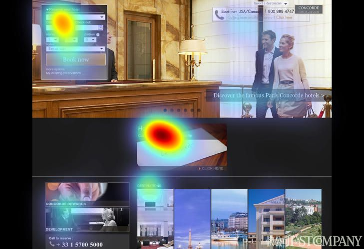
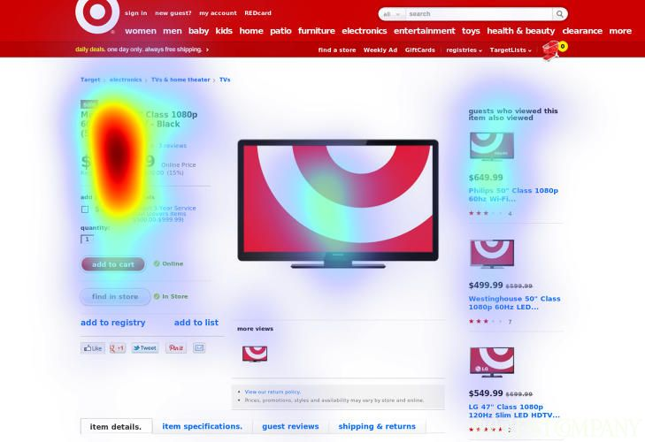

打開網頁時，我們第一眼看到的是什麼？灑滿網頁的廣告圖片？置頂的品牌 logo？還是商品搜尋列？

德國人工智慧軟體公司 EyeQuant 針對網購行為進行了一項眼球追蹤的實驗，研究人們打開網頁時，眼睛到底都在盯著哪裡看。而最新的結果顯示，一些過去關於網頁設計的黃金定律——比如人們注意力放在臉部位置，似乎都得重新改寫了。

這項實驗請來 46 位受試者協助 EyeQuant 公司改良關於網站吸睛元素的預測運算系統。受試者們前往德國奧斯納布呂克大學（University ofOsnabrueck）的神經科學實驗室，他們的購買意向包括最新 Levi's 牛仔褲、由塔吉特（Target）百貨商場出售的電視機或巴黎週末遊等 200 項產品。在瀏覽了這些產品的相應網頁後，由實驗人員利用熱地圖（heatmaps）呈現出最為吸睛的元素，而「吸睛」平均時間為 20 秒。以下是研究人員的發現：

### 1.「模特兒的臉」其實沒那麼重要

人們喜歡去注意他人的臉部，即使對無生命體也是如此。因此設計師常利用這點來設計廣告，例如讓照片中的模特兒盯著某一段文字看，讓看見廣告的人也往同樣的方向看去。然而，這次的研究顯示，比起佔了龐大篇幅的人臉，受試者對於標題文字或搜尋字段更感興趣。

### 2. 字體越大，不見得越吸睛

就算是用斗大的字體寫著「跳樓大拍賣」，也難以吸引受試者的目光。相反地​​，人們傾向去仔細閱讀較小的字體。比如人們在瀏覽如 EnglishProofread 寫作校對網站時，容易忽略佔據左方大量篇幅的公司名稱，而是尋找較詳細副標題（雖然這也比正文字體大些）。

### 3.「免費」不再是萬能詞

免費東西人人愛，對嗎？但人們似乎沒有我們想像中那麼受到「免費」兩字的吸引。當受試者瀏覽寫有「免費贈品」或「免運費」等字眼的網頁時，反而大多專注在閱讀產品資訊，又或是特定案例顯示的：都在盯著維多利亞的秘密（Victoria'sSecret）的內衣模特兒看。

### 4. 經營理念，誰在乎？

有些用戶在上網購物前，心中就已經有屬意的產品了，因此他們很少會去注意購物網頁中的品牌元素，例如公司 logo。「用戶常常忽略品牌元素」，EyeQuant 共同創辦人兼執行長費比安•施特爾策（FabianStelzer）表示，「他們只在乎與商品相關的資訊，只想快點結帳而已。」

儘管從數據上看，46 人並不是個龐大的實驗數目，但由於過去眼球追蹤實驗多以尋找資訊的網站瀏覽習慣——如尋找網站主題或閱讀文章為導向，因此這次實驗專注於更為具體的網購習慣，所具有的參考價值意義非凡。
